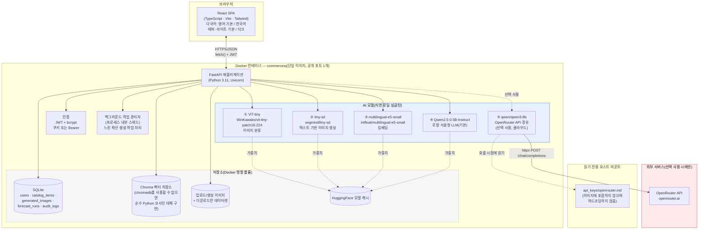
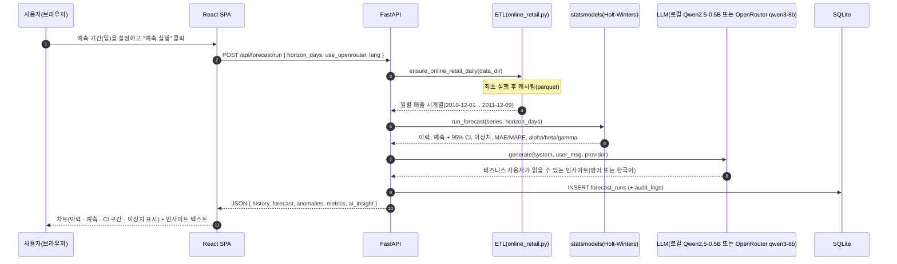
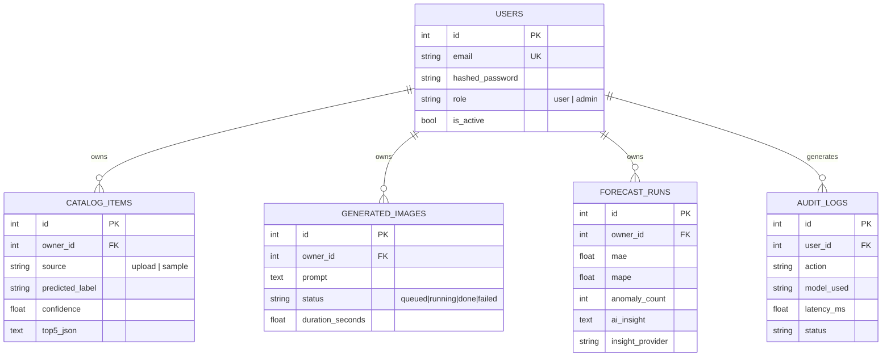
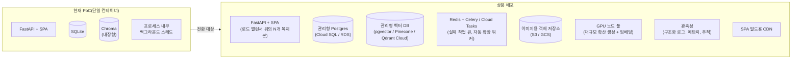

# CommerceIQ — 아키텍처

[English](architecture.md) | **한국어**

> PoC · AI 커머스 운영 플랫폼
> 이 문서는 동일한 다이어그램과 함께 [`docs/guide.html`](docs/guide.html)에도 포함되어 있습니다.

## 1. 시스템 개요

CommerceIQ는 단일 컨테이너로 실행되는 풀스택 애플리케이션입니다. React(TypeScript) 단일 페이지 앱을 FastAPI 백엔드가 정적 파일로 제공하고, 백엔드는 REST API 뒤에서 5개의 AI 모델(로컬 4개, 선택적 클라우드 1개)을 호스팅합니다. 구조화 데이터에는 SQLite를, 벡터 데이터에는 Chroma를 사용하며, 둘 다 파일 기반으로 Docker 명명 볼륨에 영구 저장됩니다.

## 2. 이 기술 스택을 선택한 이유

| 선택 | 근거 |
|---|---|
| **Streamlit 대신 FastAPI + React(TS)** | 요구 사항은 Streamlit만으로 충족하기 어려운 상용 수준 UI/UX를 명시했습니다. 클라이언트 측 라우팅, 사용자 정의 차트(Recharts), 낙관적 UI, 실제 디자인 토큰 체계는 React에서는 자연스럽지만 Streamlit에서는 구현이 까다롭거나 불가능합니다. FastAPI는 타입이 지정되고 문서화된(`/docs`) REST API를 제공하므로 모바일 앱이나 다른 서비스가 나중에 재사용할 수 있습니다. |
| **마이크로서비스 대신 단일 컨테이너** | 대상 하드웨어는 RAM 16GB의 학습자용 노트북입니다. SQLite와 Chroma가 모두 내장형/파일 기반이므로 PoC에서 데이터베이스 컨테이너를 따로 실행해도 운영상 이점이 없습니다. 실제 규모에서의 변경 사항은 §5를 참고하세요. |
| **Docker *빌드* 단계에서만 Node 사용** | `docker/Dockerfile`은 다단계 빌드입니다. `node:20-slim`이 SPA를 정적 파일로 컴파일하고, `python:3.11-slim` 런타임 이미지는 빌드된 결과물만 복사합니다. 실행 중인 컨테이너에는 Node가 포함되지 않아 이미지가 더 작고 RAM 사용량도 적습니다. |
| **로컬 모델 4개 + 선택적 클라우드 모델 1개** | "로컬 모델을 우선 사용하고 정당한 경우에만 클라우드 API를 사용"한다는 조건을 충족합니다. 로컬 모델 4개(ViT-tiny, tiny-sd, e5-small, Qwen2.5-0.5B)는 모두 1GB 미만이고 CPU 친화적이며, 이런 워크로드에 이미 검증된 선택지입니다. OpenRouter의 `qwen/qwen3-8b`는 예측 설명의 품질을 높이기 위해 사용자가 직접 켜는 선택적 업그레이드로 연결했습니다. 이 프로젝트 시리즈 전반에서 일관되게 사용한 "로컬 기본, 클라우드 선택 사용" 하이브리드 패턴과 같습니다. |
| **Postgres + pgvector/Pinecone 대신 SQLite + Chroma** | 설치할 외부 서비스가 없고 네트워크 의존성도 없으므로, 새 `git clone`과 셸 스크립트 하나만으로 완전히 재현할 수 있습니다. 실제 규모에서는 둘 다 대체할 수 있습니다(§5). |
| **Celery/Redis 대신 프로세스 내부 백그라운드 작업** | CPU 기반 확산 생성에는 수십 초가 걸립니다. PoC 규모에서는 Python `threading.Thread`와 폴링 엔드포인트만으로 충분하며 메시지 브로커 컨테이너를 추가하지 않아도 됩니다. |

## 3. 데이터 흐름 — 대표 요청 1개(수요 예측)

## 4. 저장소 모델

카탈로그 항목은 추가로 `intfloat/multilingual-e5-small`을 통해 임베딩되고 같은 `catalog_items.id`를 키로 사용하는 **Chroma** 컬렉션에 업서트됩니다. 따라서 SQL 행이 원본 데이터(source of truth)이고 벡터 저장소는 파생 색인입니다. 이는 실제 커머스 플랫폼에서 사용하는 표준적인 "기록 시스템 + 검색 색인" 분리 방식입니다.

## 5. 프로덕션/클라우드 확장 시 변경 사항

이 PoC는 의도적으로 하나의 호스트에서 단일 컨테이너로 모든 기능을 실행합니다. 실제 상용 배포에서는 다음과 같이 변경합니다.

| 영역 | PoC | 상용 규모 확장 |
|---|---|---|
| 앱 계층 | 컨테이너 1개 | 로드 밸런서 뒤에 N개의 무상태 복제본(JWT 인증 관점에서 앱이 이미 무상태이므로 코드 변경 불필요) |
| 관계형 DB | 볼륨 내 SQLite 파일 | 자동 백업과 읽기 복제본을 지원하는 관리형 Postgres(Cloud SQL/RDS) |
| 벡터 DB | 내장형 Chroma | 동일 Postgres의 pgvector 또는 카탈로그가 단일 노드 RAM 용량을 넘을 때 관리형 벡터 DB(Pinecone/Qdrant Cloud) |
| 백그라운드 작업 | Python 스레드 | Redis/Cloud Tasks + 자동 확장 워커 풀. 생성형 스튜디오의 트래픽 급증이 API 요청 스레드를 고갈시키지 않도록 분리 |
| 이미지 | 로컬 디스크 볼륨 | 객체 저장소(S3/GCS) + CDN, DB에는 URL만 저장 |
| GPU | 없음(CPU만 사용) | 요청량 때문에 CPU 추론이 병목이 되면 확산 생성과 배치 임베딩용 소형 GPU 노드 풀(예: L4/T4) 사용 |
| 비밀값 | 읽기 전용 파일 마운트 | 관리형 비밀 저장소(GCP Secret Manager/AWS Secrets Manager/Vault) |
| 관측성 | `audit_logs` 테이블 + `docker compose logs` | 구조화 로깅 + 메트릭 + 추적(예: OpenTelemetry → 호스팅 백엔드) |
| 프런트엔드 제공 | FastAPI에서 제공 | CDN에 정적 빌드 배포, API는 별도 서브도메인 사용 |

### 소규모 상용 환경의 월간 예상 비용

(일일 활성 사용자 약 500명, 모든 기능을 합쳐 하루 약 5,000회의 AI 호출. 아래 수치는 2026년 8월 기준 공개 정가를 바탕으로 한 참고치이므로 실제 예산을 편성하기 전에 공급자의 최신 가격을 반드시 다시 확인하세요.)

| 항목 | 가정 | 월간 예상 비용 |
|---|---|---|
| 앱 호스팅(Cloud Run/Fargate, 2 vCPU/4GB, 모델 워밍 유지를 위해 상시 실행) | 인스턴스 1~2개 | $70~140 |
| 관리형 Postgres(소형, 예: Cloud SQL db-custom-1-3840) | 인스턴스 1개 + 일일 백업 | $60~90 |
| 관리형 벡터 DB(동일 Postgres의 pgvector) 또는 Pinecone 스타터 | pgvector: 추가 $0 / Pinecone: $0부터(서버리스, 사용량 기반) | $0~50 |
| 객체 저장소 + CDN(S3/GCS + CloudFront/Cloud CDN) | 이미지 약 50GB, 보통 수준의 송신 트래픽 | $10~25 |
| 확산 생성용 GPU 버스트 용량(선택, 온디맨드 L4) | 월 약 20 GPU 시간 | $15~30 |
| OpenRouter(`qwen/qwen3-8b`, 선택적 인사이트에만 사용) | 일 약 15만 토큰, 100만 토큰당 $0.117/$0.455 | $10~25 |
| 모니터링/로깅 | 기본 관리형 요금제 | $0~20 |
| **합계(참고치)** | | **월 약 $165~380** |

이는 의도적으로 소규모 환경을 가정한 추정치입니다. 특정 배포의 정확한 비용을 예측하려는 것이 아니라 *어떤 비용 항목이 발생하는지* 보여주는 데 목적이 있습니다.

## 6. 배포 고려 사항

- **환경 일치성**: 로컬에서 실행하는 것과 동일한 `docker/Dockerfile` 이미지를 레지스트리에 푸시해 배포해야 합니다. 별도의 "프로덕션 Dockerfile"을 만들지 않습니다.
- **비밀값**: `api_keys/*.md` 파일 마운트 방식을 대상 플랫폼의 비밀 관리자로 교체합니다. 두 번째 코드 경로가 필요한 곳은 `config.py`의 `read_key_file()`뿐입니다. 예를 들어 파일 대신 비밀 관리자가 주입한 환경 변수에서 읽도록 변경할 수 있습니다.
- **데이터베이스 마이그레이션**: `DATABASE_URL`을 Postgres DSN으로 교체합니다. 코드가 SQLite 전용 원시 SQL이 아닌 SQLAlchemy Core/ORM을 사용하므로 연결 문자열 변경과 스키마 마이그레이션용 `alembic` 추가가 핵심입니다. PoC의 `Base.metadata.create_all`은 단일 작성자 SQLite 파일에는 적합하지만, 여러 Postgres 복제본이 동시에 스키마를 변경하는 환경에는 적합하지 않습니다.
- **세션/JWT 비밀값**: `SECRET_KEY`는 환경마다 별도로 생성한 실제 비밀값(32바이트 이상의 무작위 값)이어야 하며, `.env.example`의 자리표시자를 사용하지 말고 비밀 관리자를 통해 교체해야 합니다.
- **CORS**: PoC에서는 SPA와 API가 같은 오리진을 사용하므로 현재 `allow_origins=["*"]`입니다. 프런트엔드는 CDN, API는 서브도메인으로 분리하는 배포에서는 실제 프런트엔드 오리진만 허용해야 합니다.
- **수평 확장 및 모델 메모리**: 현재 각 복제본은 로컬 모델 4개를 모두 자체 RAM에 로드합니다(약 3~4GB, 측정값은 `docs/guide.html`의 하드웨어 섹션 참고). 복제본 수가 많아지면 API가 gRPC/HTTP로 호출하는 전용 추론 서비스 같은 공유 모델 서빙 계층을 사용하거나 복제본별 RAM 비용을 감수해야 합니다. 이는 코드 변경 문제가 아니라 실제 용량 계획상의 결정입니다.
- **요청 제한 및 악용 방지**: PoC 범위를 벗어나므로 구현하지 않았습니다. 상용 배포에서는 특히 실제 한계 비용과 지연 시간이 발생하는 확산 생성 및 OpenRouter 기반 엔드포인트에 사용자별 요청 제한을 적용해야 합니다.
