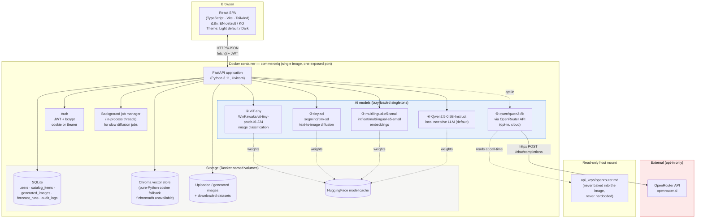
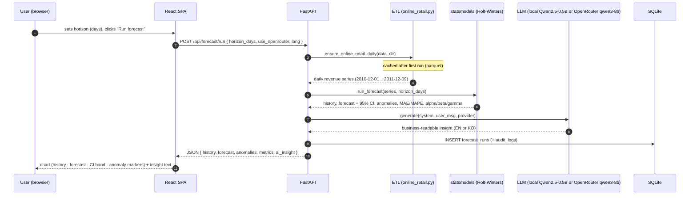
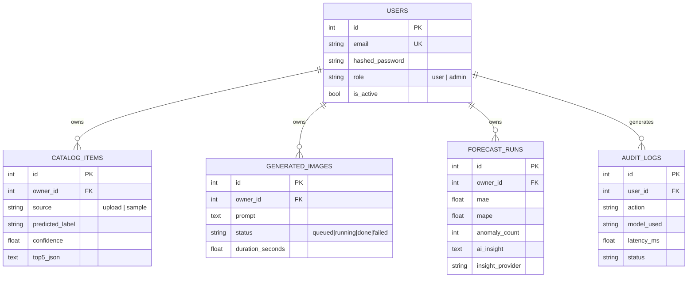

# CommerceIQ — Architecture

**English** | [한국어](architecture.ko.md)

> PoC · AI Commerce Operations Platform
> This document is also embedded (with the same diagrams) inside [`docs/guide.html`](docs/guide.html).

## 1. System overview

CommerceIQ is a single-container full-stack application: a React (TypeScript) single-page app served as static files by a FastAPI backend, which in turn hosts five AI models (four local, one optional cloud) behind a REST API, backed by SQLite (structured data) and Chroma (vector data) — both file-based and persisted in a Docker named volume.

## 2. Why this stack

| Choice | Reasoning |
|---|---|
| **FastAPI + React (TS) instead of Streamlit** | The brief explicitly asked for commercial-grade UI/UX where Streamlit falls short — client-side routing, custom charts (Recharts), optimistic UI, and a real design-token system are all straightforward in React but awkward-to-impossible in Streamlit. FastAPI gives a typed, documented (`/docs`) REST API that a mobile app or another service could reuse later. |
| **Single container, not microservices** | Target hardware is a 16GB-RAM student laptop. SQLite + Chroma are both embedded/file-based, so there is no operational win to running separate DB containers for a PoC — see §5 for how this changes at real scale. |
| **Node only in the Docker *build* stage** | `docker/Dockerfile` is a multi-stage build: `node:20-slim` compiles the SPA to static files, then a `python:3.11-slim` runtime image copies only the built assets. The running container never contains Node — smaller image, smaller RAM footprint. |
| **4 local models + 1 optional cloud model** | Satisfies "local models as the primary approach, cloud API only when justified." The four local models (ViT-tiny, tiny-sd, e5-small, Qwen2.5-0.5B) are all sub-1GB, CPU-friendly, well-established choices for this kind of workload. OpenRouter's `qwen/qwen3-8b` is wired in as a strictly optional, user-toggled upgrade for the forecast narrative — the same "hybrid: local default, cloud opt-in" pattern used consistently across this project series. |
| **SQLite + Chroma instead of Postgres + pgvector/Pinecone** | Zero external services to install, zero network dependency, fully reproducible from a fresh `git clone` + one shell script. Both are swap-in-replaceable at real scale (§5). |
| **In-process background jobs instead of Celery/Redis** | Diffusion generation on CPU takes tens of seconds; a Python `threading.Thread` + polling endpoint is sufficient at PoC scale and avoids adding a message broker container. |

## 3. Data flow — one representative request (Demand Forecasting)

## 4. Storage model

Catalog items are additionally embedded (`intfloat/multilingual-e5-small`) and upserted into a **Chroma** collection keyed by the same `catalog_items.id`, so the SQL row is the source of truth and the vector store is a derived index — a standard "system of record + search index" split used in real commerce platforms.

## 5. Production / cloud scaling — what would change

The PoC intentionally runs everything in one container on one host. A real commercial deployment would change:

```mermaid
flowchart LR
    subgraph PoC["This PoC (single container)"]
        A1["FastAPI + SPA"]
        A2[("SQLite")]
        A3[("Chroma\n(embedded)")]
        A4["In-process\nbackground threads"]
    end
    subgraph Prod["Commercial deployment"]
        B1["FastAPI + SPA\n(N replicas behind a load balancer)"]
        B2[("Managed Postgres\n(Cloud SQL / RDS)")]
        B3[("Managed vector DB\n(pgvector / Pinecone / Qdrant Cloud)")]
        B4["Redis + Celery / Cloud Tasks\n(real task queue, autoscaled workers)"]
        B5[("Object storage\n(S3 / GCS) for images")]
        B6["GPU node pool\n(diffusion + embedding at scale)"]
        B7["Observability\n(structured logs, metrics, tracing)"]
        B8["CDN for the SPA build"]
    end
    PoC -.would migrate to.-> Prod
```

| Area | PoC | Commercial scale-out |
|---|---|---|
| App tier | 1 container | N stateless replicas behind a load balancer (the app is already stateless w.r.t. JWT auth, so this needs no code change) |
| Relational DB | SQLite file in a volume | Managed Postgres (Cloud SQL / RDS) with automated backups, read replicas |
| Vector DB | Chroma embedded | pgvector on the same Postgres, or a managed vector DB (Pinecone / Qdrant Cloud) once catalog size exceeds single-node RAM |
| Background jobs | Python threads | Redis/Cloud Tasks + autoscaled worker pool, so a traffic spike in Generative Studio doesn't starve API request threads |
| Images | Local disk volume | Object storage (S3/GCS) + CDN, DB stores only the URL |
| GPU | None (CPU only) | A small GPU node pool (e.g. L4/T4) for diffusion + batch embedding once request volume makes CPU inference the bottleneck |
| Secrets | Read-only file mount | A managed secret store (GCP Secret Manager / AWS Secrets Manager / Vault) |
| Observability | `audit_logs` table + `docker compose logs` | Structured logging + metrics + tracing (e.g. OpenTelemetry → a hosted backend) |
| Frontend delivery | Served by FastAPI | Static build on a CDN, API on its own subdomain |

### Estimated monthly cost at small commercial scale
(~500 daily active users, ~5k AI calls/day total across all features; figures below are indicative public list prices as of Aug 2026 — always re-check current provider pricing before budgeting for real)

| Item | Assumption | Est. monthly cost |
|---|---|---|
| App hosting (Cloud Run / Fargate, 2 vCPU / 4GB, always-on for warm models) | 1–2 instances | $70–140 |
| Managed Postgres (small, e.g. Cloud SQL db-custom-1-3840) | 1 instance + daily backup | $60–90 |
| Managed vector DB (pgvector on same Postgres) or Pinecone starter | pgvector: $0 extra / Pinecone: from $0 (serverless, usage-based) | $0–50 |
| Object storage + CDN (S3/GCS + CloudFront/Cloud CDN) | ~50GB images, moderate egress | $10–25 |
| GPU burst capacity for diffusion (optional, on-demand L4) | ~20 GPU-hours/month | $15–30 |
| OpenRouter (`qwen/qwen3-8b`, opt-in insight only) | ~150k tokens/day @ $0.117/$0.455 per M | $10–25 |
| Monitoring/logging | Basic managed tier | $0–20 |
| **Total (indicative)** | | **≈ $165 – 380 / month** |

This is deliberately a small-scale estimate — it is meant to show *what line items appear*, not to be a precise forecast for any specific deployment.

## 6. Deployment considerations

- **Environment parity**: the same `docker/Dockerfile` that runs locally should be the exact image pushed to a registry and deployed — no separate "prod Dockerfile."
- **Secrets**: replace the `api_keys/*.md` file-mount convention with the target platform's secret manager; `config.py`'s `read_key_file()` is the only place that would need a second code path (e.g. read from an env var injected by the secret manager instead of a file).
- **Database migration**: swap `DATABASE_URL` to a Postgres DSN; because the code uses SQLAlchemy Core/ORM (not raw SQLite-specific SQL), this is a connection-string change plus adding `alembic` for schema migrations (the PoC uses `Base.metadata.create_all`, which is fine for a single-writer SQLite file but not for a multi-replica Postgres deployment under concurrent schema changes).
- **Sessions/JWT secret**: `SECRET_KEY` must become a real per-environment secret (32+ random bytes), rotated via the secret manager, not the `.env.example` placeholder.
- **CORS**: currently `allow_origins=["*"]` because the SPA and API share an origin in the PoC; a split frontend-on-CDN / API-on-subdomain deployment must restrict this to the real frontend origin.
- **Horizontal scaling & model memory**: each replica currently loads its own copy of all 4 local models into RAM (~3–4GB, see `docs/guide.html`'s hardware section for measured numbers). At higher replica counts this either needs a shared model-serving layer (e.g. a dedicated inference service the API calls over gRPC/HTTP) or accepting the per-replica RAM cost — a real capacity-planning decision, not a code change.
- **Rate limiting & abuse protection**: not implemented in the PoC (out of scope); a commercial deployment needs per-user rate limits especially on the diffusion and OpenRouter-backed endpoints, which have real marginal cost/latency.
