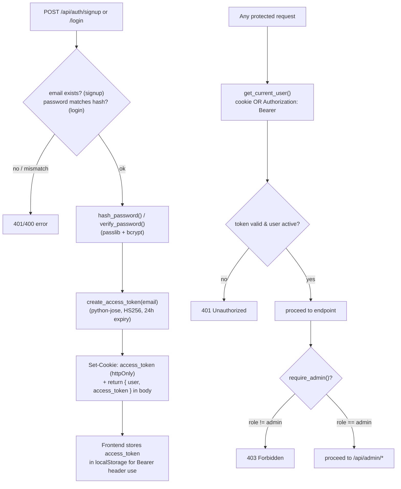
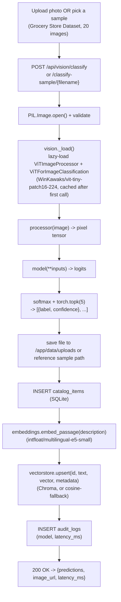
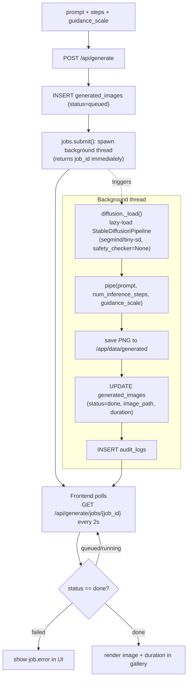
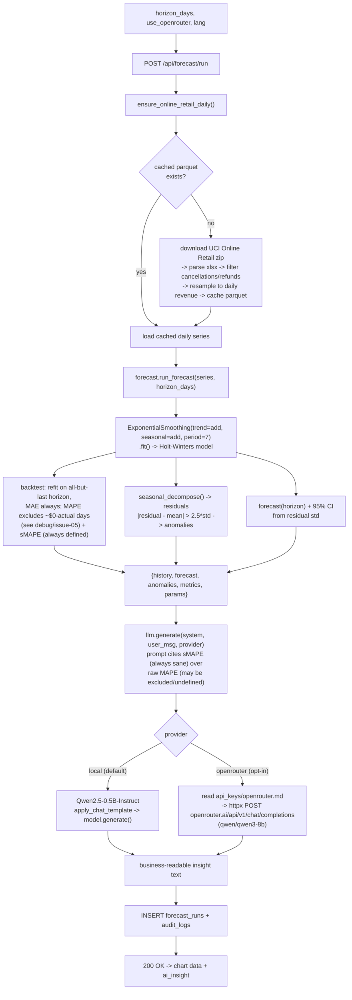
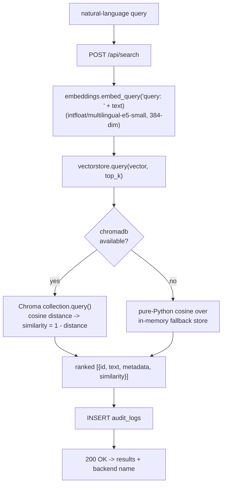
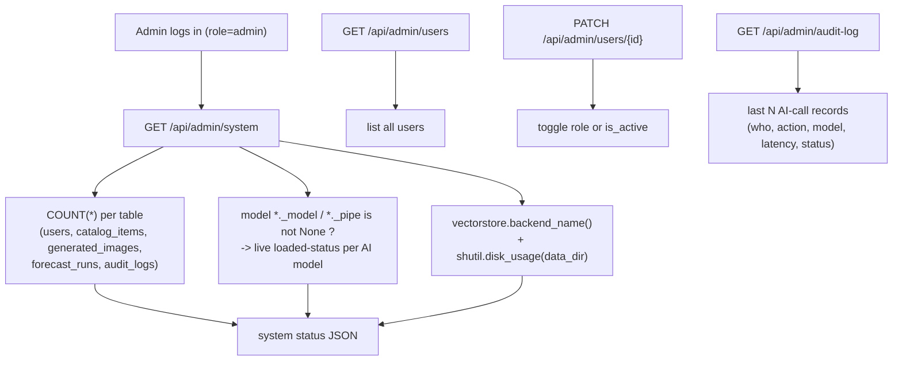

# CommerceIQ — Function & Model Flowcharts

> Companion to [`architecture.md`](architecture.md). Also embedded in [`docs/guide.html`](docs/guide.html).
> Each diagram traces one feature end-to-end through the actual function names in `backend/app/`.

## 1. Authentication (`routers/auth.py`, `security.py`)



## 2. Catalog Vision — image classification (`ml/vision.py`, `routers/vision.py`)



## 3. Generative Studio — text-to-image (`ml/diffusion.py`, `jobs.py`, `routers/generate.py`)



## 4. Demand Forecasting & Anomaly Radar (`etl/online_retail.py`, `ml/forecast.py`, `ml/llm.py`)



## 5. Semantic Catalog Search (`ml/embeddings.py`, `vectorstore.py`, `routers/search.py`)



## 6. Admin Console (`routers/admin.py`)



## 7. Container bootstrap sequence (`main.py`)

```mermaid
sequenceDiagram
    autonumber
    participant D as Docker (docker compose up)
    participant U as Uvicorn / FastAPI
    participant BG as background thread
    participant HF as HuggingFace Hub
    participant UCI as UCI ML Repository
    participant GH as GitHub (GroceryStoreDataset)

    D->>U: start container, run CMD
    U->>U: Base.metadata.create_all() (SQLite tables)
    U->>U: _seed_admin() (idempotent)
    U->>BG: spawn _warm_cache() thread
    U-->>D: /api/health responds 200 immediately

    Note over BG: each step below runs in its own\ntry/except (_warm_step) — see debug/issue-06.\nOne step failing never blocks the others.
    BG->>UCI: ensure_online_retail_daily() (first run only)
    UCI-->>BG: online+retail.zip (22.6MB) [isolated step]
    BG->>GH: ensure_sample_images() (first run only)
    GH-->>BG: 20 sample product photos [isolated step]
    BG->>HF: load ViT-tiny, e5-small, Qwen2.5-0.5B, tiny-sd\n(4 independently-isolated steps, in that order)
    HF-->>BG: model weights (cached to named volume)
    BG->>U: log per-step result; "all warm" only if all 6 steps succeeded

    Note over D,U: docker-compose healthcheck polls /api/health\nthroughout — API is usable immediately.\nGET /api/health/ready reports real per-model +\nper-step status; a failed step self-heals the next\ntime a real request needs it (both ETL functions\nare idempotent/resumable).
```
