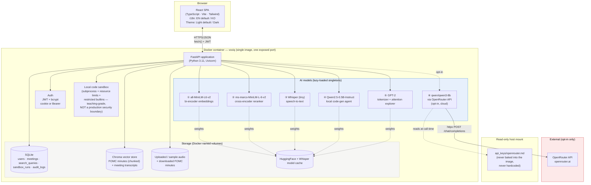
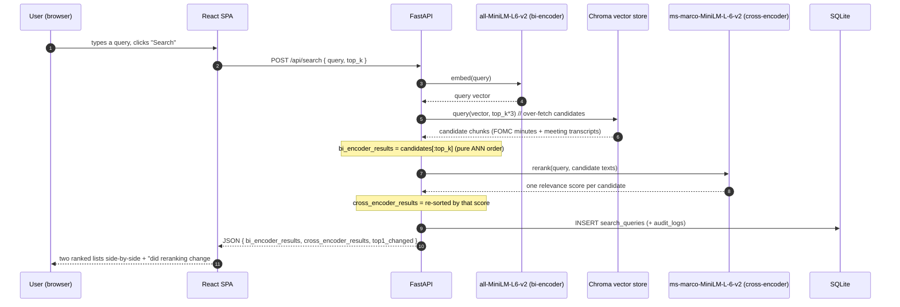
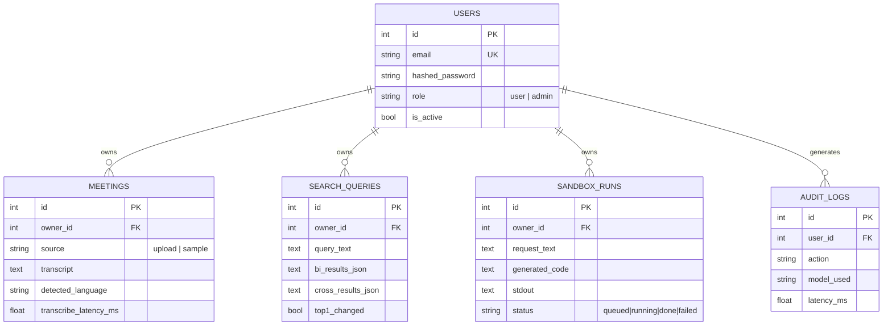

# VoxIQ — 아키텍처

> AI 회의·지식 인텔리전스 플랫폼
> 이 문서는 [`docs/guide.html`](docs/guide.html) 안에도 동일한 다이어그램과 함께 임베드되어 있습니다.

## 1. 시스템 개요

VoxIQ는 단일 컨테이너 풀스택 애플리케이션입니다: React(TypeScript) 단일 페이지 앱이 FastAPI 백엔드에 의해 정적 파일로 서빙되며, 이 백엔드는 REST API 뒤에 6개의 AI 모델(로컬 5개, 옵션 클라우드 1개)을 호스팅하고 SQLite(구조화 데이터)와 Chroma(벡터 데이터)로 저장소를 구성합니다 — 이 시리즈의 이전 제품인 CommerceIQ와 동일하게 검증된 형태를, VoxIQ 고유의 4대 기술 축(임베딩/리랭킹, 오디오 ASR, 코드 실행 샌드박스, LLM 내부구조)에 적용한 것입니다.

## 2. 이 스택을 선택한 이유

| 선택 | 근거 |
|---|---|
| **CommerceIQ와 동일한 FastAPI + React 템플릿** | 이미 검증되고 하드닝된 아키텍처(인증, 관리자, Docker, 준비 상태 프로빙, 격리된 부트스트랩 단계)를 새로 발명하지 않고 의도적으로 재사용했습니다 — 구체적으로 어떤 하드닝을 이어받았는지는 §5 참고. |
| **4개의 분리된 데모 탭이 아니라 하나의 "회의 인텔리전스" 제품** | 임베딩/리랭킹, 오디오 ASR, 코드 샌드박스, 토큰화는 흔히 서로 분리된 별개의 주제로 다뤄지고 시연됩니다; VoxIQ는 이들을 실제 운영/지식 팀이 사용할 법한 하나의 일관된 워크플로로 엮습니다: 녹음 → 전사 → 검색 → 분석. |
| **검색 코퍼스로 실제 FOMC 회의록 사용** | 일반적인 채움용 텍스트는 아무것도 증명하지 못합니다; 이것들은 문자 그대로 실제 회의록(미국 연방준비제도, 공개 도메인)으로, "지식 검색" 기능에 검색할 만한 진짜 실질적 콘텐츠를 제공하고 청킹이 필요한 정당한 이유(문서당 약 9,000단어)도 함께 제공합니다. |
| **사이드바이사이드로 보여주는 cross-encoder 리랭킹, 조용히 적용만 하지 않음** | bi-encoder vs. cross-encoder 트레이드오프는 구체적인 전후 비교 예시로 가장 잘 전달됩니다; UI는 이를 단일 "스마트 검색" 박스 뒤에 숨기지 않고 직접 재현합니다. |
| **로컬 샌드박스가 기본값, E2B는 스캐폴딩만** | 이 프로젝트에는 E2B API 키가 없습니다; 브리프의 "클라우드 API는 실제로 사용 가능하고 필요할 때만" 원칙에 따라, 로컬 subprocess 기반 샌드박스(이런 기능에서 흔히 쓰이는 "로컬 폴백" 설계)가 기본값이자 유일하게 검증된 실행 경로입니다. |
| **로컬 모델 5개 + 옵션 클라우드 모델 1개** | 5개 로컬 모델(MiniLM bi-encoder, MiniLM cross-encoder, Whisper-tiny, Qwen2.5-0.5B, GPT-2) 모두 각자의 작업에 대해 이미 널리 검증되고 안정적으로 쓰이는 선택지입니다 — 새롭고 검증되지 않은 선택은 없습니다. OpenRouter의 `qwen/qwen3-8b`는 유일한 클라우드 경로로, 옵션이며 이번 라운드에서 실제 키로 검증했습니다. |

## 3. 데이터 흐름 — 대표 요청 하나 (지식 검색)

## 4. 저장소 모델

회의 전사록과 FOMC 회의록 청크는 추가로 임베딩되어(`all-MiniLM-L6-v2`) **Chroma** 컬렉션에 upsert됩니다 — SQL 행이 시스템의 원본 기록(system of record)이고 벡터 저장소는 그로부터 파생된 검색 인덱스입니다. CommerceIQ에서도 사용한 것과 동일한 "원본 + 인덱스" 분리 구조입니다.

## 5. CommerceIQ PoC로부터 이어받은 하드닝 (처음부터 이 빌드에 적용됨)

같은 부류의 버그를 다시 발견하는 대신, VoxIQ의 초기 빌드는 CommerceIQ PoC가 후속 패스에서야 찾아냈던 모든 수정 사항을 처음부터 포함하고 있습니다:

| CommerceIQ에서 발견된 문제 | 여기서는 처음부터 적용됨 |
|---|---|
| 배송 가능성까지 검사하는 `EmailStr`가 `.local` 관리자 로그인을 깨뜨림 | 인증은 `EmailStr`가 아니라 형태만 검사하는 동일한 이메일 정규식 검증기를 사용 |
| 콜드스타트 시 기능 타임아웃이 버그처럼 보임 | `GET /api/health/ready` + `verify_e2e.py`의 워밍업 대기 단계가 첫 빌드부터 존재 |
| 부트스트랩 단계 하나가 실패하면 나머지도 조용히 건너뜀 | `_warm_step()`이 6개 시작 단계(데이터셋 2개 + FOMC 색인 호스팅 + 모델 5개... main.py 참고) 각각을 처음부터 격리 |
| `run.sh`가 이미 실행 중인 컨테이너를 불필요하게 재생성 | "이미 실행 중이면 URL만 알려주기" 검사가 처음부터 `run.sh`에 존재 |
| `api_keys/`를 보호하는 저장소 루트 `.gitignore` 부재 | 저장소 루트에 이미 존재(CommerceIQ 후속 작업 때 추가됨) — 여기서 새로 필요한 것 없음 |

## 6. 프로덕션 / 클라우드 확장 — 무엇이 달라질까

CommerceIQ와 동일한 형태입니다(전체 표와 다이어그램은 그 PoC의 `architecture.md` §5 참고) — 앱 계층 다중화, 관리형 Postgres, 관리형/확장된 벡터 DB, 오디오 파일용 오브젝트 스토리지 + CDN, 대량 처리를 위한 Whisper/리랭킹용 GPU 노드풀, 그리고 VoxIQ 고유의 항목으로 — **분석 에이전트를 신뢰할 수 없는 사용자에게 대규모로 노출하기 전에 로컬 샌드박스를 E2B 또는 동등한 관리형·진짜 격리된 코드 실행 서비스로 교체**하는 것이 추가됩니다; 여기서의 로컬 subprocess 샌드박스는 명시적으로 교육용 경계이며 프로덕션용이 아닙니다(`docs/guide.html`의 한계 섹션 참고).

### 소규모 상용 스케일에서의 예상 월 비용
(일일 활성 사용자 약 500명, 전체 기능 합산 하루 약 3,000회 AI 호출 가정 · 아래 수치는 2026년 8월 기준 공개 정가 참고치입니다 — 실제 예산 수립 전 반드시 최신 공급자 가격을 재확인하세요)

| 항목 | 가정 | 월 예상 비용 |
|---|---|---|
| 앱 호스팅 (Cloud Run / Fargate, 2 vCPU / 4GB) | 1–2개 인스턴스, 모델 워밍 유지를 위해 상시 구동 | $70–140 |
| 관리형 Postgres | 인스턴스 1개 + 일일 백업 | $60–90 |
| 관리형 벡터 DB (같은 Postgres 위의 pgvector, 또는 관리형 서비스) | pgvector: 추가 비용 $0 / 관리형: 사용량 기반 | $0–50 |
| 오브젝트 스토리지 + CDN (오디오 파일) | 약 30GB 오디오, 중간 수준 egress | $8–20 |
| 관리형 코드 실행 샌드박스 (E2B 또는 동등 서비스, 로컬 샌드박스 대체) | 하루 약 500회 분석 실행 | $30–80 |
| OpenRouter (`qwen/qwen3-8b`, 옵션 코드 생성 전용) | 하루 약 100k 토큰 @ $0.117/$0.455 per M | $8–20 |
| 모니터링/로깅 | 기본 관리형 티어 | $0–20 |
| **합계 (참고치)** | | **≈ $175 – 420 / 월** |

## 7. 배포 시 고려사항

CommerceIQ와 동일한 핵심 항목입니다(로컬과 동일한 Dockerfile을 통한 환경 일치, 파일 마운트 대신 실제 시크릿 매니저를 통한 시크릿 관리, Postgres + alembic 마이그레이션, 실제 프론트엔드 오리진으로 제한된 CORS) — 여기에 VoxIQ 고유의 항목 하나가 추가됩니다: **신뢰할 수 없는 사용자가 분석 요청 텍스트를 통제할 수 있는 실제 배포 전에는 로컬 코드 샌드박스를 반드시 교체해야 합니다**. 충분히 동기가 있는 사용자라면 제한된 builtins 경계가 실제로 막지 못하는 무언가를 생성된 코드가 시도하도록 LLM 프롬프트를 설계할 수 있기 때문입니다(로컬 폴백 샌드박스가 무엇이 아닌지를 솔직하게 밝힌다는 같은 취지로, `docs/guide.html`의 한계 섹션에 명시되어 있습니다).
