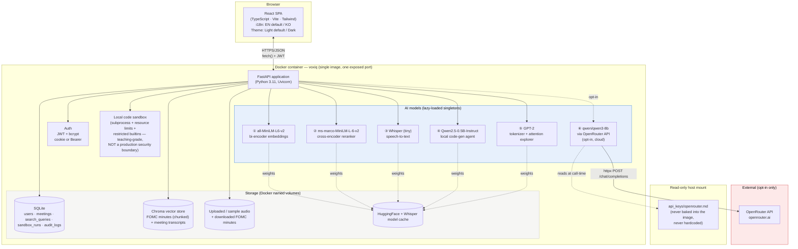
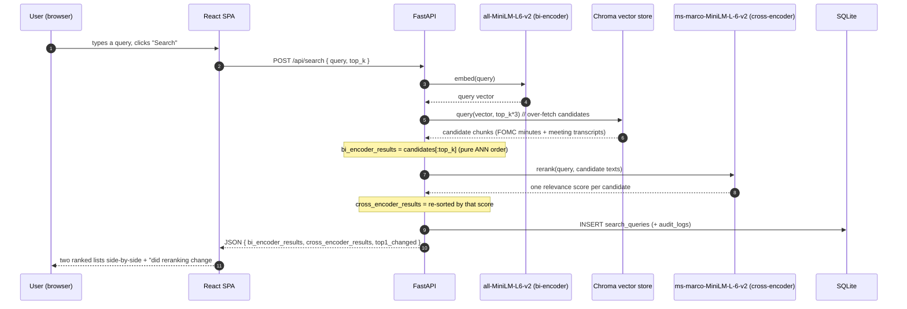
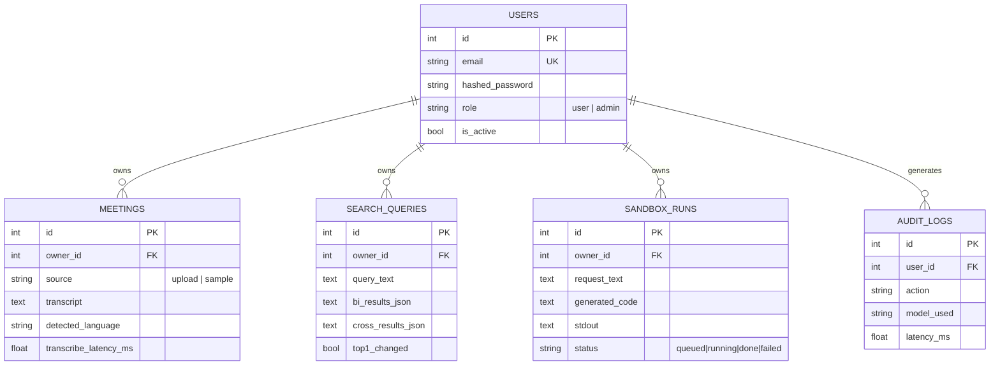

# VoxIQ — Architecture

> AI Meeting & Knowledge Intelligence Platform
> This document is also embedded (with the same diagrams) inside [`docs/guide.html`](docs/guide.html).

## 1. System overview

VoxIQ is a single-container full-stack application: a React (TypeScript) single-page app served as static files by a FastAPI backend, which hosts six AI models (five local, one optional cloud) behind a REST API, backed by SQLite (structured data) and Chroma (vector data) — the same proven shape as an earlier product in this series, CommerceIQ, applied to VoxIQ's own four technical pillars (embeddings/reranking, audio ASR, code-execution sandboxing, LLM internals).

## 2. Why this stack

| Choice | Reasoning |
|---|---|
| **Same FastAPI + React template as CommerceIQ** | A proven, already-hardened architecture (auth, admin, Docker, readiness probing, isolated bootstrap steps) is reused deliberately rather than reinvented — see §5 for the specific hardening carried over. |
| **A "meeting intelligence" product, not 4 disconnected demo tabs** | Embeddings/reranking, audio ASR, code sandboxes, and tokenization are often taught and demoed as separate, disconnected topics; VoxIQ ties them into one coherent workflow a real ops/knowledge team would use: record → transcribe → search → analyze. |
| **Real FOMC meeting minutes as the search corpus** | Generic filler text doesn't demonstrate anything; these are literally real meeting minutes (U.S. Federal Reserve, public domain), giving the "Knowledge Search" feature genuine, substantive content to search — and a legitimate reason to need chunking (each document is ~9,000 words). |
| **Cross-encoder reranking shown side-by-side, not just applied silently** | The bi-encoder vs. cross-encoder trade-off is best taught through a concrete before/after example; the UI reproduces that directly instead of hiding it behind a single "smart search" box. |
| **Local sandbox as the default, E2B scaffolded only** | This project has no E2B API key; per the brief's "cloud API only when actually available and needed," the local subprocess-based sandbox (a common "local fallback" design for this kind of feature) is the default and only validated execution path. |
| **5 local models + 1 optional cloud model** | All five local models (MiniLM bi-encoder, MiniLM cross-encoder, Whisper-tiny, Qwen2.5-0.5B, GPT-2) are well-established, widely-used choices for their respective tasks — no new, unvalidated choices. OpenRouter's `qwen/qwen3-8b` is the one cloud path, opt-in and validated with a real key this round. |

## 3. Data flow — one representative request (Knowledge Search)

## 4. Storage model

Meeting transcripts and FOMC-minutes chunks are additionally embedded (`all-MiniLM-L6-v2`) and upserted into a **Chroma** collection — the SQL rows are the system of record, the vector store is a derived search index, the same "record + index" split used in Week1's CommerceIQ.

## 5. Hardening carried over from the Week1 PoC (applied from day one here)

Rather than rediscover the same classes of bug, VoxIQ's initial build already incorporates every fix the Week1 PoC needed a follow-up pass to find:

| Week1 finding | Applied here from the start |
|---|---|
| Deliverability-checking `EmailStr` broke `.local` admin logins | Auth uses the same shape-only email regex validator, not `EmailStr` |
| Cold-start feature timeouts looked like bugs | `GET /api/health/ready` + a `verify_e2e.py` wait-for-warm step exist from the first build |
| One failed bootstrap step silently skipped the others | `_warm_step()` isolates each of the 6 startup steps (2 datasets + hosting the FOMC index + 5 models... see main.py) from the start |
| `run.sh` needlessly recreated an already-running container | The "already running? just report the URL" check is in `run.sh` from the start |
| No repo-root `.gitignore` protecting `api_keys/` | Already exists at the repo root (added during the Week1 follow-up) — nothing new needed here |

## 6. Production / cloud scaling — what would change

Same shape as Week1's CommerceIQ (see that PoC's `architecture.md` §5 for the full table and diagram) — app-tier replication, managed Postgres, a managed/scaled vector DB, object storage + CDN for audio files, a GPU node pool for Whisper/reranking at volume, and — specific to VoxIQ — **replacing the local sandbox with E2B or an equivalent managed, genuinely-isolated code-execution service** before ever exposing the Analytics Agent to untrusted users at scale; the local subprocess sandbox here is explicitly a teaching-grade boundary, not a production one (see `docs/guide.html`'s limitations section).

### Estimated monthly cost at small commercial scale
(~500 daily active users, ~3k AI calls/day across all features; figures below are indicative public list prices as of Aug 2026 — always re-check current provider pricing before budgeting for real)

| Item | Assumption | Est. monthly cost |
|---|---|---|
| App hosting (Cloud Run / Fargate, 2 vCPU / 4GB) | 1–2 instances, always-on for warm models | $70–140 |
| Managed Postgres | 1 instance + daily backup | $60–90 |
| Managed vector DB (pgvector on same Postgres, or a managed service) | pgvector: $0 extra / managed: usage-based | $0–50 |
| Object storage + CDN (audio files) | ~30GB audio, moderate egress | $8–20 |
| Managed code-execution sandbox (E2B or equivalent, replacing the local one) | ~500 analytics runs/day | $30–80 |
| OpenRouter (`qwen/qwen3-8b`, opt-in code-gen only) | ~100k tokens/day @ $0.117/$0.455 per M | $8–20 |
| Monitoring/logging | Basic managed tier | $0–20 |
| **Total (indicative)** | | **≈ $175 – 420 / month** |

## 7. Deployment considerations

Same core list as Week1's CommerceIQ (environment parity via the same Dockerfile, secrets via a real secret manager instead of a file mount, Postgres + alembic migrations, CORS restricted to the real frontend origin) — with one VoxIQ-specific addition: **the local code sandbox must be replaced before any real deployment that lets untrusted users control the analysis request text**, since a sufficiently motivated user could craft an LLM prompt designed to make the generated code attempt something the restricted-builtins boundary doesn't actually stop (documented plainly in `docs/guide.html`'s limitations section, in the same spirit of being upfront about what a local-fallback sandbox is not).
