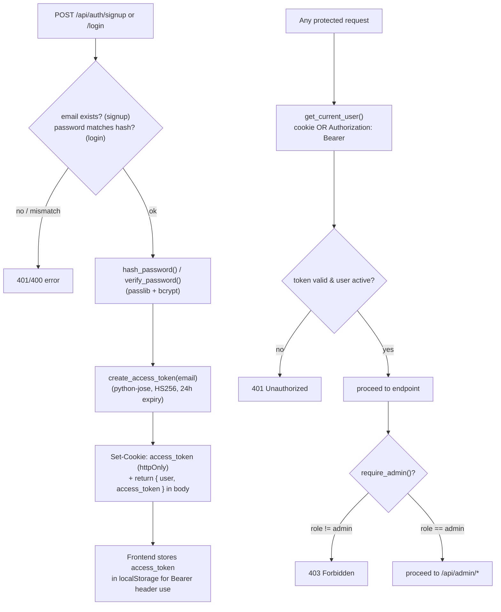
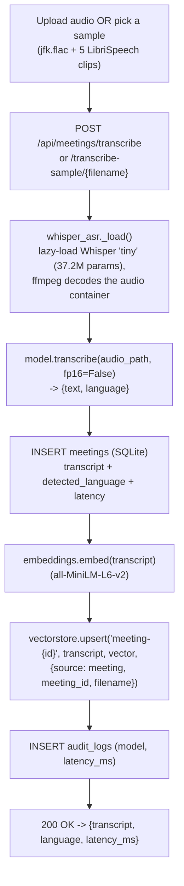
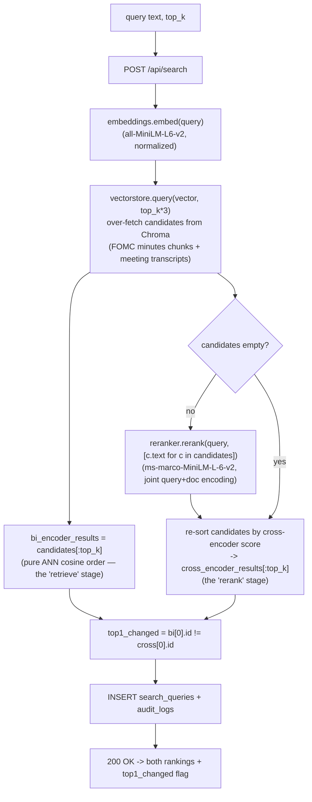
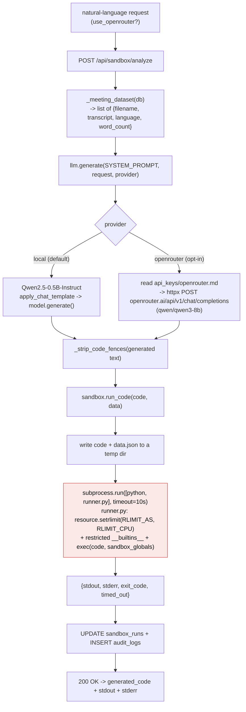
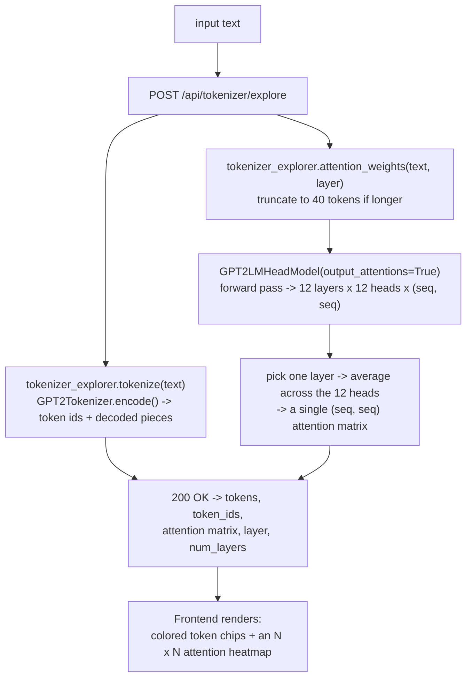
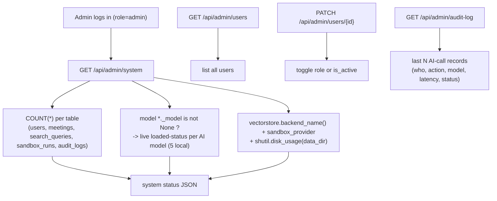

# VoxIQ — Function & Model Flowcharts

> Companion to [`architecture.md`](architecture.md). Also embedded in [`docs/guide.html`](docs/guide.html).
> Each diagram traces one feature end-to-end through the actual function names in `backend/app/`.

## 1. Authentication (`routers/auth.py`, `security.py`)

Identical to the Week1 PoC ("CommerceIQ") — same JWT + bcrypt design, same shape-only email validator (not `EmailStr`, which broke `.local` admin logins there — see that project's `debug/issue-02`), reused here from the start rather than rediscovered.



## 2. Meeting Transcription (`ml/whisper_asr.py`, `routers/meetings.py`)



## 3. Knowledge Search — bi-encoder vs. cross-encoder (`ml/embeddings.py`, `ml/reranker.py`, `routers/search.py`)



## 4. Analytics Agent — LLM-generated code in a sandbox (`ml/llm.py`, `ml/sandbox.py`, `routers/sandbox.py`)



> The red box is a deliberate callout: this is a **teaching-grade** isolation boundary (subprocess + resource limits + restricted builtins), not a production security boundary — see `ml/sandbox.py`'s module docstring and `docs/guide.html`'s limitations section for what a real deployment needs instead (E2B / container-per-execution / microVMs).

## 5. Tokenizer & Attention Explorer (`ml/tokenizer_explorer.py`, `routers/tokenizer.py`)



## 6. Admin Console (`routers/admin.py`)



## 7. Container bootstrap sequence (`main.py`)

```mermaid
sequenceDiagram
    autonumber
    participant D as Docker (docker compose up)
    participant U as Uvicorn / FastAPI
    participant BG as background thread
    participant GH as GitHub (jfk.flac) + HF (LibriSpeech dummy)
    participant FED as federalreserve.gov (FOMC minutes)
    participant HF as HuggingFace Hub

    D->>U: start container, run CMD
    U->>U: Base.metadata.create_all() (SQLite tables)
    U->>U: _seed_admin() (idempotent)
    U->>BG: spawn _warm_cache() thread
    U-->>D: /api/health responds 200 immediately

    Note over BG: each step below runs in its own\ntry/except (_warm_step) — an unrelated\nstep's failure never blocks the others.
    BG->>GH: ensure_sample_audio() [isolated step]
    GH-->>BG: jfk.flac + 5 LibriSpeech clips
    BG->>FED: index_fomc_minutes() -> ensure_fomc_minutes()\n+ chunk_text() + embed() + vectorstore.upsert() [isolated step]
    FED-->>BG: 7 real FOMC minutes documents, chunked + indexed
    BG->>HF: load embeddings, reranker, whisper, local_llm,\ntokenizer_explorer (5 independently-isolated steps)
    HF-->>BG: model weights (cached to named volume)
    BG->>U: log per-step result; "all warm" only if every step succeeded

    Note over D,U: GET /api/health/ready reports real per-model +\nper-step status; a failed dataset step self-heals\nthe next time a real request needs it.
```
