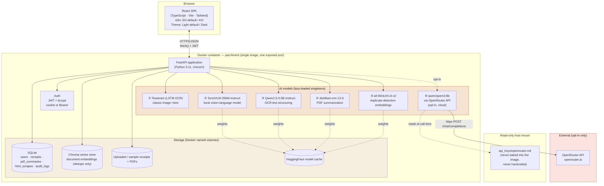
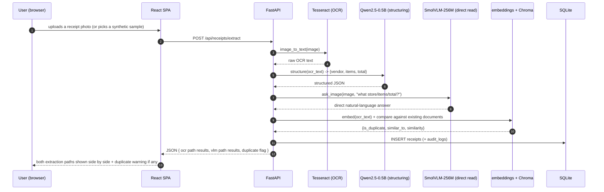
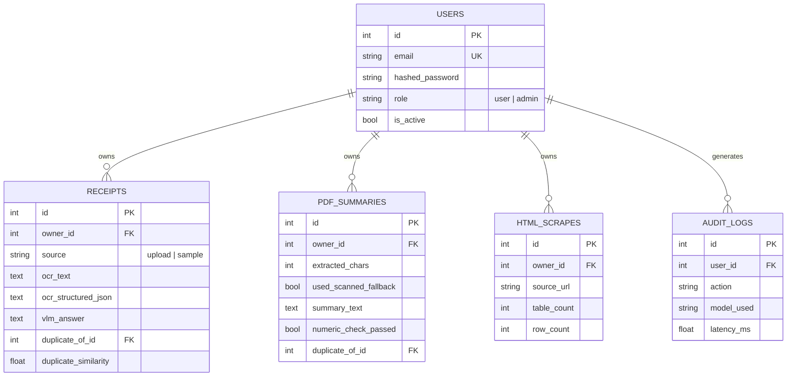

# Parchment — Architecture

> Week3 PoC · AI Document Intelligence Workspace
> This document is also embedded (with the same diagrams) inside [`docs/guide.html`](docs/guide.html).

## 1. System overview

Parchment is a single-container full-stack application: a React (TypeScript) single-page app served as static files by a FastAPI backend, which hosts six AI models (five local, one optional cloud) behind a REST API, backed by SQLite (structured data) and Chroma (vector data, used for duplicate detection) — the same proven shape as the Week1/2 PoCs, applied to three technical pillars (computer vision/multimodal document reading, PDF parsing + summarization, HTML table scraping).

## 2. Why this stack

| Choice | Reasoning |
|---|---|
| **Same FastAPI + React template as the Week1/2 PoCs** | A proven, already-hardened architecture (auth, admin, Docker, readiness probing, isolated bootstrap steps) is reused deliberately rather than reinvented — see §5 for the specific hardening carried over. |
| **A "document intake desk," not 3 disconnected demo tabs** | Image/multimodal extraction, PDF parsing/summarization, and HTML table scraping are each interesting on their own; Parchment ties them into one coherent workflow a back-office/finance team would use: receipts, reports, and web tables all become clean, de-duplicated records. |
| **A genuinely different visual identity this round** | The Week1/2 PoCs (`CommerceIQ`, `VoxIQ`) share an identical Tailwind config, color palette, and sidebar+card layout (verified by diffing their `tailwind.config.js`/`index.css` — 100% identical). Per this round's explicit request, Parchment uses a warm parchment/terracotta palette, a serif display face (Newsreader) for headings, a top-tab layout instead of a sidebar, and soft "paper stack" shadows instead of flat bordered cards — see `reference_skills/interface-craft`'s typography/layout guides for the specific patterns applied. |
| **OCR (Tesseract) *and* a local VLM shown side by side** | The central point worth demonstrating here is "use a pretrained multimodal model instead of training your own CNN." Rather than only narrate that, the Receipts tab runs a real classical-OCR pipeline and a real local vision-language model (SmolVLM-256M) on the same image and shows both — the same "don't just explain the concept, show the comparison" pattern the Week2 PoC used for bi-/cross-encoder search. |
| **Duplicate detection instead of RAG for the vector-DB feature** | This project's brief calls for a vector database. A full embeddings + ChromaDB + retrieve-then-answer (RAG) search feature is a substantial project of its own — building that here would mean building a second, half-finished product instead of one finished one. Parchment instead uses the same embedding + Chroma stack for a narrower, genuinely different purpose: flagging re-submitted/near-duplicate documents (a real back-office concern), see §4. |
| **6 AI models, 5 local + 1 optional cloud** | Tesseract (LSTM OCR engine), SmolVLM-256M-Instruct, Qwen2.5-0.5B-Instruct (reused from Week1/2), distilbart-cnn-12-6, and all-MiniLM-L6-v2 (reused from Week2) are all local and verified to exist/run before being chosen. OpenRouter's `qwen/qwen3-8b` is the one cloud path, opt-in and validated with a real key this round. |

## 3. Data flow — one representative request (Receipt Extraction)

## 4. Storage model

Every receipt's OCR text and every PDF's extracted text are additionally embedded (`all-MiniLM-L6-v2`) and upserted into a **Chroma** collection (`documents`), scoped per document type — the SQL rows are the system of record, the vector store exists solely to answer "have we seen something like this before?" (`ml/dedupe.py`), never to power a search UI or feed an LLM's context window. This is a deliberate scope boundary: full retrieve-then-answer semantic search is a substantial feature in its own right, and this PoC deliberately avoids growing into a second, half-built product (see `README.md`'s note on the Document Library).

## 5. Hardening carried over from the Week1/2 PoCs (applied from day one here)

Rather than rediscover the same classes of bug, Parchment's initial build already incorporates every pattern the earlier PoCs needed a follow-up pass (or a first pass) to establish:

| Prior finding | Applied here from the start |
|---|---|
| Deliverability-checking `EmailStr` broke `.local` admin logins (Week1) | Auth uses the same shape-only email regex validator, not `EmailStr` |
| Cold-start feature timeouts looked like bugs (Week1) | `GET /api/health/ready` + a `verify_e2e.py` wait-for-warm step exist from the first build |
| One failed bootstrap step silently skipped the others (Week1) | `_warm_step()` isolates each of the 7 startup steps (2 sample-data steps + 5 models) from the start |
| `run.sh` needlessly recreated an already-running container (Week1) | The "already running? just report the URL" check is in `run.sh` from the start |
| No repo-root `.gitignore` protecting `api_keys/` (Week1) | Already exists at the repo root — nothing new needed here |
| A small local LLM can misread a data shape without an explicit example in its prompt (Week2) | `routers/receipts.py`'s structuring prompt explicitly states the field shape and provides a fallback (regex) path if the LLM's JSON output fails to parse |

See `history/v1.0.0.md` for this build's actual `verify_e2e.sh` pass/fail results, and `debug/` for any real bugs found this round.

## 6. Production / cloud scaling — what would change

Same shape as the Week1/2 PoCs (see those projects' `architecture.md` §5/§6 for the full table and diagram) — app-tier replication, managed Postgres, a managed/scaled vector DB, object storage + CDN for uploaded documents, a GPU node pool for the VLM/summarizer at volume, and — specific to Parchment — running Tesseract/pdf2image page-rendering as a separate worker pool, since OCR and page-rasterization are CPU-bound and would otherwise compete with the API process for resources under load.

### Estimated monthly cost at small commercial scale
(~500 daily active users, ~2k AI calls/day across all features; figures below are indicative public list prices as of Aug 2026 — always re-check current provider pricing before budgeting for real)

| Item | Assumption | Est. monthly cost |
|---|---|---|
| App hosting (Cloud Run / Fargate, 2 vCPU / 4GB) | 1–2 instances, always-on for warm models | $70–140 |
| Managed Postgres | 1 instance + daily backup | $60–90 |
| Managed vector DB (pgvector on the same Postgres, or a managed service) | pgvector: $0 extra / managed: usage-based | $0–50 |
| Object storage + CDN (uploaded receipts/PDFs) | ~20GB, moderate egress | $6–15 |
| OpenRouter (`qwen/qwen3-8b`, opt-in summarization only) | ~80k tokens/day @ $0.117/$0.455 per M | $6–18 |
| Monitoring/logging | Basic managed tier | $0–20 |
| **Total (indicative)** | | **≈ $140 – 335 / month** |

## 7. Deployment considerations

Same core list as the Week1/2 PoCs (environment parity via the same Dockerfile, secrets via a real secret manager instead of a file mount, Postgres + alembic migrations, CORS restricted to the real frontend origin) — with one Parchment-specific addition: **uploaded receipts and PDFs may contain real PII** (names, amounts, account-adjacent numbers) once real users start uploading their own documents, even though this build's bundled samples are synthetic/public-domain by design — a real deployment needs a data-retention policy and encryption-at-rest for the uploads volume before accepting real user documents.
