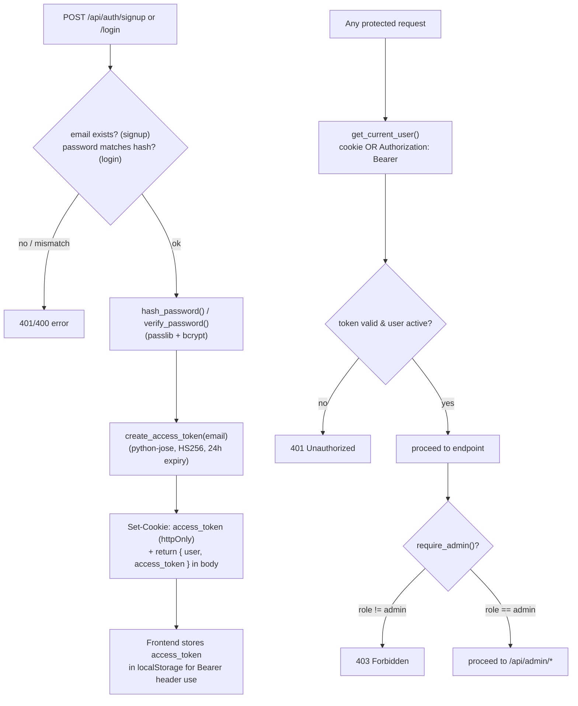
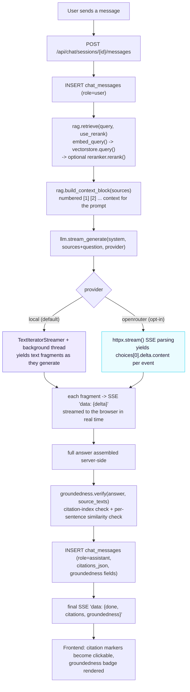
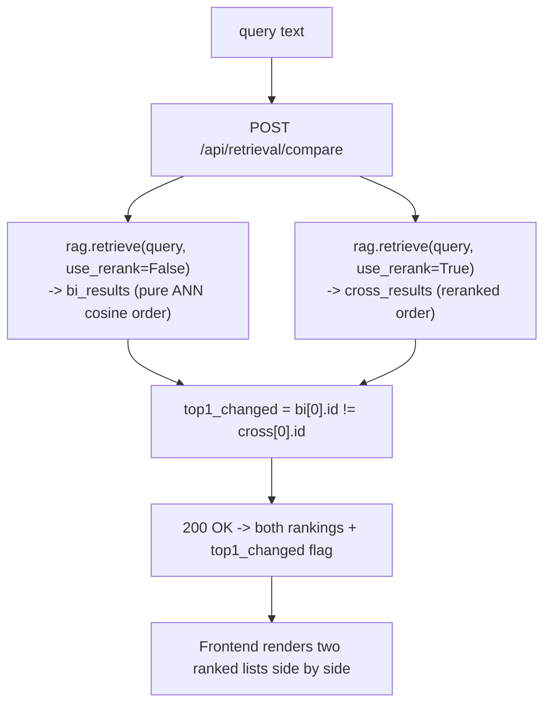
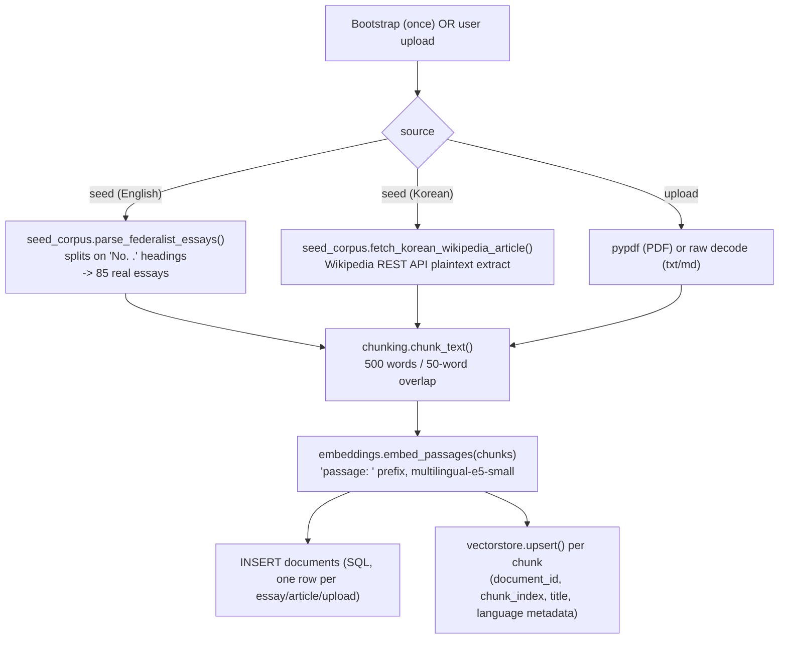
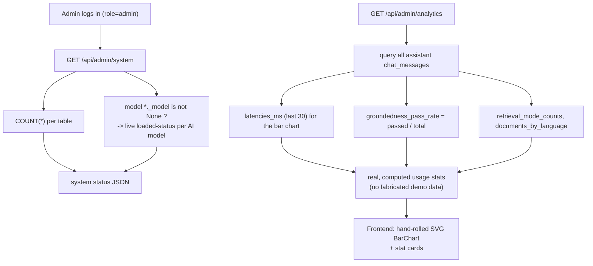

# Lucent — Function & Model Flowcharts

> Companion to [`architecture.md`](architecture.md). Also embedded in [`docs/guide.html`](docs/guide.html).
> Each diagram traces one feature end-to-end through the actual function names in `backend/app/`.

## 1. Authentication (`routers/auth.py`, `security.py`)

Identical to the Week1-3 PoCs — same JWT + bcrypt design, same shape-only email validator (not `EmailStr`, which broke `.local` admin logins in the Week1 PoC — see that project's `debug/issue-02`), reused here from the start rather than rediscovered.



## 2. Streaming RAG Chat (`rag.py`, `ml/llm.py`, `ml/groundedness.py`, `routers/chat.py`)



## 3. Retrieval Lab — bi vs. bi+cross comparison (`rag.py`, `routers/retrieval.py`)



## 4. Document indexing — seed corpus + uploads (`etl/seed_corpus.py`, `etl/chunking.py`, `routers/documents.py`)



## 5. Admin Console + Analytics (`routers/admin.py`)



## 6. Container bootstrap sequence (`main.py`)

```mermaid
sequenceDiagram
    autonumber
    participant D as Docker (docker compose up)
    participant U as Uvicorn / FastAPI
    participant BG as background thread
    participant HF as HuggingFace Hub
    participant GB as gutenberg.org (Federalist Papers)
    participant WP as ko.wikipedia.org (REST API)

    D->>U: start container, run CMD
    U->>U: Base.metadata.create_all() (SQLite tables)
    U->>U: _seed_admin() (idempotent)
    U->>BG: spawn _warm_cache() thread
    U-->>D: /api/health responds 200 immediately

    Note over BG: each step below runs in its own\ntry/except (_warm_step) — an unrelated\nstep's failure never blocks the others.
    BG->>HF: load multilingual-e5-small [isolated step]
    HF-->>BG: embedding model weights
    BG->>GB: index_seed_corpus() -> parse 85 Federalist essays [isolated step]
    GB-->>BG: The Federalist Papers, full text
    BG->>WP: fetch Korean Wikipedia article
    WP-->>BG: plaintext extract
    BG->>HF: load reranker + local LLM (2 more isolated steps)
    HF-->>BG: model weights (cached to named volume)
    BG->>U: log per-step result; "all warm" only if every step succeeded

    Note over D,U: GET /api/health/ready reports real per-model +\nper-step status; a failed corpus-indexing step self-heals\nthe next time ./scripts/download_data.sh runs.
```
