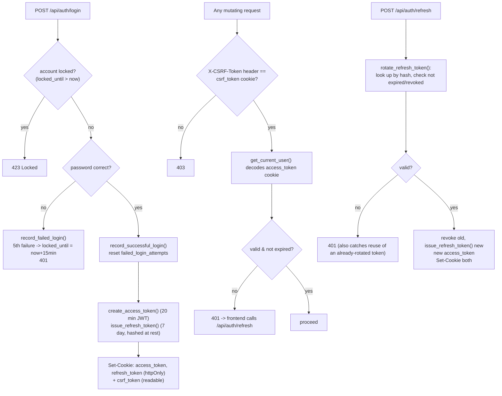
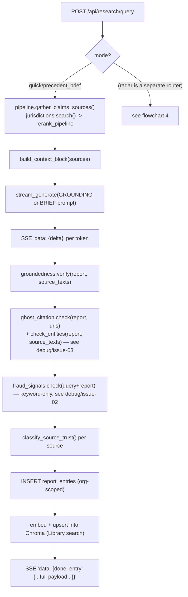
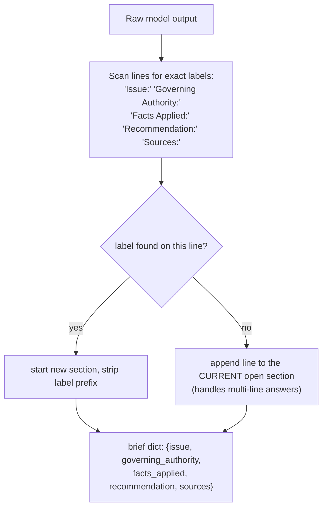
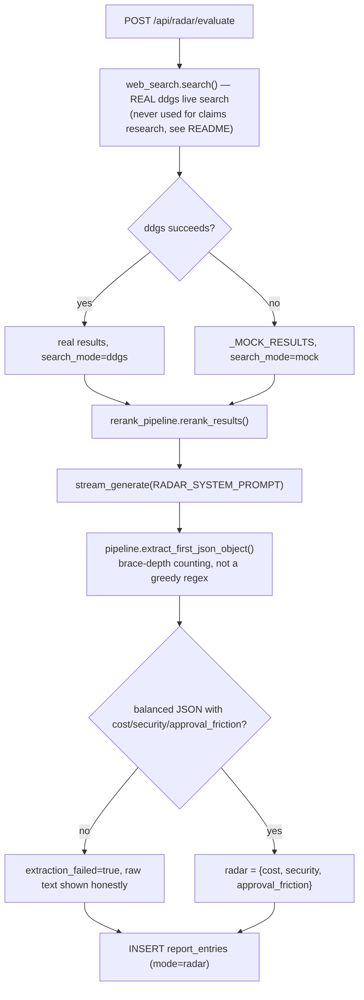
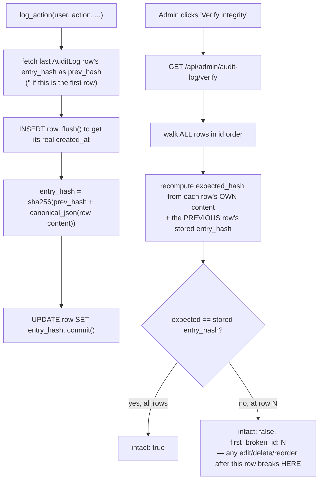
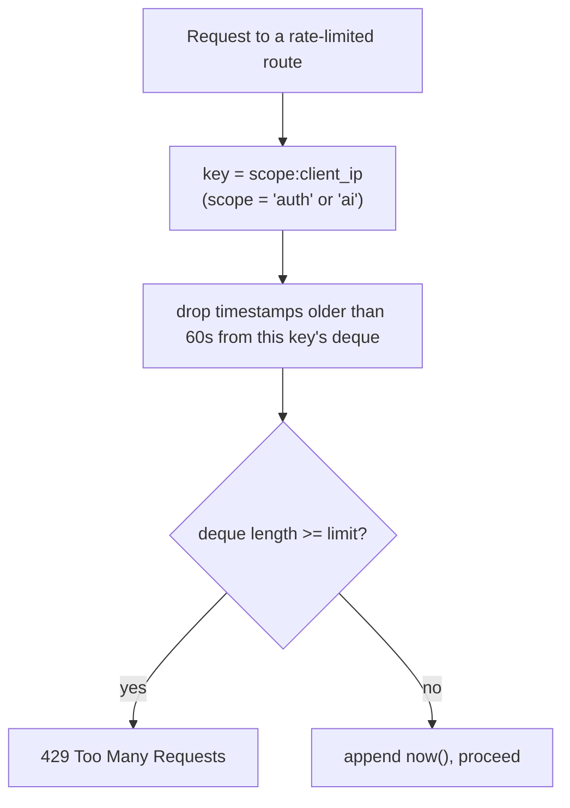
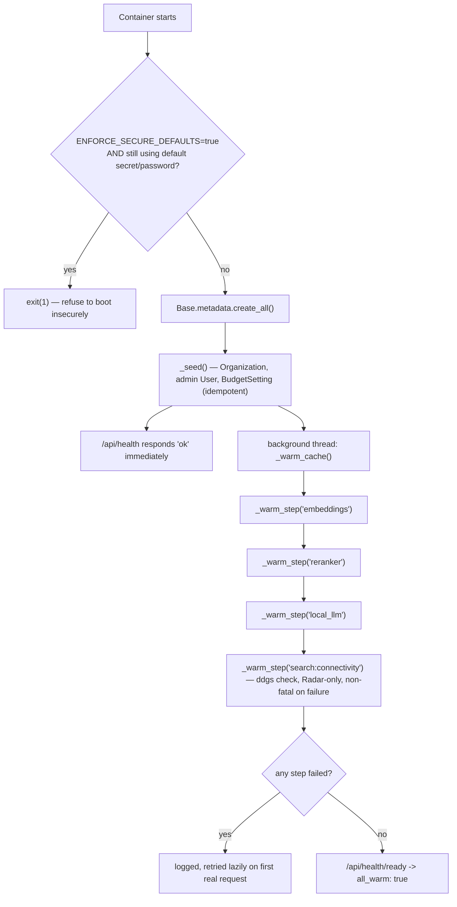

# Verity — Function & Model Flowcharts

> Companion to [`architecture.md`](architecture.md). Also embedded in [`docs/guide.html`](docs/guide.html).

## 1. Authentication — access+refresh rotation, CSRF, lockout (`security.py`, `routers/auth.py`)

## 2. Grounded research streaming (`pipeline.py`, `ml/llm.py`, `routers/research.py`)

## 3. Precedent Brief parsing (`routers/research.py::_parse_brief`)

## 4. Vendor & Tool Adoption Radar (`search/web_search.py`, `routers/radar.py`)

## 5. Hash-chained audit log (`audit.py`)

## 6. Rate limiting (`rate_limit.py`)

## 7. Container bootstrap sequence (`main.py`)

