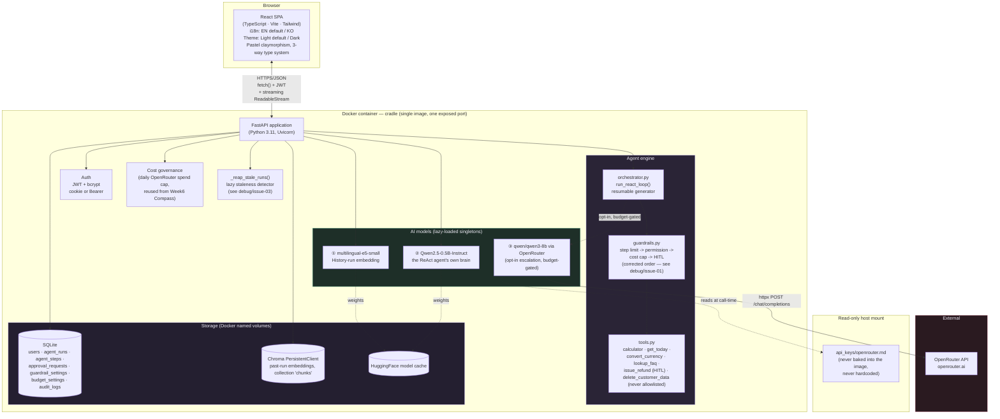
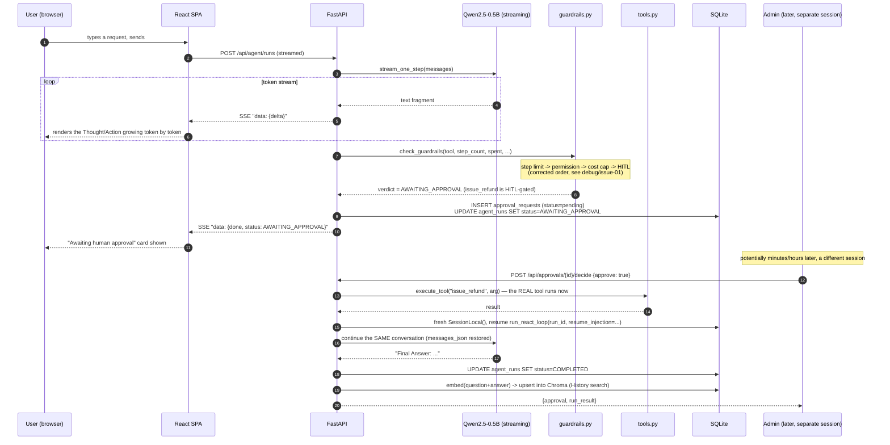
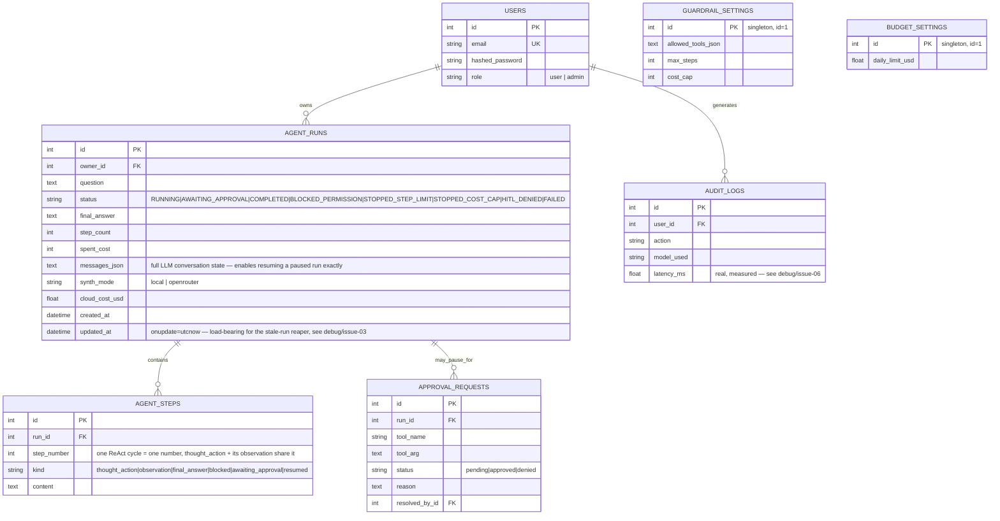

# Cradle — Architecture

> Week7 PoC · A Local ReAct Agent Console with Real Safety Guardrails
> This document is also embedded (with the same diagrams) inside [`docs/guide.html`](docs/guide.html).

## 1. System overview

Cradle is a single-container full-stack application: a React (TypeScript) single-page app served
as static files by a FastAPI backend, which hosts two local AI models (embeddings + a local ReAct
agent LLM) plus one optional cloud escalation model behind a REST + streaming API, backed by SQLite
(structured data) and Chroma (vector data) — the same proven shape as the Week1-6 PoCs.

The key structural difference from every prior week: **an agent run is not necessarily a single
request/response cycle.** A run can pause mid-execution — waiting on a real human's approve/deny
decision — and resume later, potentially long after the original HTTP connection that started it
has closed. `agent/orchestrator.py::run_react_loop()` is written as one shared generator consumed
two different ways (live-streamed for a fresh run, drained synchronously to resume a paused one) so
neither path can drift out of sync with the other.

## 2. Engineering depth beyond a typical baseline implementation

It's worth being exact about what "actually wiring the guardrails in for real use" requires beyond
a minimal, illustrative first pass at this pattern:

| Dimension | Typical baseline implementation | Cradle |
|---|---|---|
| Integration | **Two separate demo pieces that never talk to each other** — an illustrative ReAct agent and a separate guardrail class are shown side by side, but the agent you actually chat with is not the one wrapped by the guardrails being demonstrated. | One agent, one loop, guardrails always in the path — every real tool call passes through `guardrails.py` before it executes, not a separate illustration. |
| Guardrail check order | **An easy mistake to make**: a naive implementation might check the cost cap *before* checking tool permission. An unauthorized-tool call that also exceeds the cost cap then gets mislabeled `STOPPED_COST_CAP` instead of `BLOCKED_PERMISSION` — a security event miscategorized as a routine budget event. | The correct order (step limit → permission → cost cap → HITL), implemented from the start, with a dedicated regression test (`step_guardrail_order_regression`) proving the correct `BLOCKED_PERMISSION` outcome for exactly that scenario. See `debug/issue-01`. |
| Human-in-the-Loop | An `approval_required_tools`-style concept can exist as an isolated class feature that a demo never actually populates — it stays an empty set, so HITL never actually triggers. | A real, persisted `ApprovalRequest` queue: a gated tool call genuinely pauses the run, an admin's approve/deny decision genuinely resumes it (executing the real tool on approval, injecting a denial observation the agent then reacts to on denial) — potentially long after the original request ended. |
| Persistence | **None** — no DB; an in-memory-only session is gone on refresh. | SQLite (runs/steps/approvals/guardrails/budget/audit) + Chroma `PersistentClient` (History index) — both survive restarts. |
| Resumability | Not applicable — there is nothing to resume; a paused run has no meaning in a stateless script. | `AgentRun.messages_json` snapshots the exact LLM conversation state needed to resume a paused run with full fidelity, driven by the same `run_react_loop()` generator whether the run is live or being resumed. |
| Model routing | Not implemented — one model, one path, always. | An opt-in, budget-gated escalation to OpenRouter's `qwen/qwen3-8b` for one best-effort final-answer synthesis when the local agent stalls (`STOPPED_STEP_LIMIT`) or completes — a real implementation of the "small model by default, escalate only when needed" routing pattern, reusing Week6 Compass's exact daily-budget-cap governance pattern. |
| Audit trail | None. | A real `audit_logs` table recording every AI call and tool-execution decision — who, what, how long (a real defect in this — see `debug/issue-06` — found and fixed this round), success/failure. |
| UI | Minimal, single language/theme, flat widgets. | Custom pastel-claymorphism React UI, bilingual, light/dark (both pastel), a genuine mouse-reactive 3D tilt component, a layered 3D card stack visualizing the reasoning trace. |

This isn't a criticism of any minimal reference implementation of this pattern — scoping a guardrail
class as an isolated, inspectable demo (rather than buried inside a live agent loop) is a legitimate,
defensible teaching choice for a short exercise. Cradle is scoped as a PoC meant to show what actually
*wiring the guardrails in* looks like once built out for real use.

## 3. UI design — pastel claymorphism with genuine spatial depth

This round's explicit brief called for three things beyond a normal visual refresh: (a) real 3D and
a sense of spatial depth, not just decoration; (b) a high-lightness, low-saturation, light pastel
color feel; (c) a UI that reads as deliberately designed, not simply built.

| Element | Week6 "Compass" | Week7 "Cradle" |
|---|---|---|
| Palette | Navy + brass + teal (dark-default, saturated) | **High-lightness, low-saturation pastel**: dusty lilac `#8b7cc7` / sage green `#2f7a5c` on a soft off-white ground (light); the same hues lifted, not inverted, for dark (`#b6a8e8` / `#7fc9a8`) |
| Depth model | Flat cards, one drop-shadow layer | **Claymorphism**: a two-directional shadow recipe — a light-side highlight (`-10px -10px 22px rgba(255,255,255,0.9)`) plus a hue-tinted soft shadow (`12px 14px 28px rgba(139,124,199,0.18)`) — makes surfaces read as puffy/extruded, not flat-with-a-shadow |
| Real 3D interaction | None | `TiltCard.tsx` tracks the pointer and sets CSS custom properties (`--rx`/`--ry`) consumed by a `perspective` + `rotateX`/`rotateY` transform on `pointermove` — a genuinely spatial response to the user's cursor, not a static illusion. Deliberately reserved for a few hero surfaces (the login card, a stat highlight) rather than applied to every element — "spend boldness in one place, keep everything around it quiet" |
| Reasoning trace | (no equivalent feature) | A "stacked cards" visualization (`.step-card`): each Thought/Action/Observation card gets a small alternating `rotate()` by index and lifts/straightens on hover — the ReAct loop's own "steps stack up" structure made spatially literal |
| Typography | Serif + geometric sans + mono (3-way) | **Quicksand** (rounded, soft display headlines) + **Plus Jakarta Sans** (UI body/chrome) + **Space Mono** (audit/data) — a third distinct 3-way pairing, chosen for roundness to match the claymorphism's soft-surface language |
| Navigation | Fixed command-console + icon-rail | A floating, centered, pill-shaped top nav bar — rounded-full, distinct from every prior week's pattern (Week1/2's flush sidebar, Week3's top tabs, Week4's floating glass sidebar, Week6's console+rail) |
| Default theme | Dark (first in the series) | **Light**, reverting deliberately — pastel claymorphism's soft highlight/shadow pairing depends on a light key surface to read as "puffy"; the dark variant lifts the same hues rather than inverting them, so it stays visibly the same design language, not a photonegative |

**Accessibility, measured not assumed**: as in every prior week, running text always uses the
separately-verified 4.5:1+ `--text-*` tokens; the accent hues (`--accent`/`--accent-2`) intentionally
sit at only ~3:1 contrast against their surfaces, which is why they're restricted to icons, borders,
and large headings — never small body text. Verified with the same Python WCAG contrast-ratio script
used every prior week.

## 4. Data flow — one representative request (a live agent run, HITL-gated tool)

## 5. Storage model

Every completed run is additionally embedded (`multilingual-e5-small`) and upserted into a
**Chroma** `PersistentClient` collection — the SQL rows are the system of record, the vector store is
the derived, restart-surviving semantic index that powers History search.

## 6. Hardening carried over from the Week1-6 PoCs (applied from day one here)

| Prior finding | Applied here from the start |
|---|---|
| A dependency-injected DB session closes when a route handler *returns*, before a `StreamingResponse` body finishes (Week4) | `orchestrator.py::run_react_loop()` opens its own fresh `SessionLocal()` rather than a `Depends(get_db)` session |
| One failed bootstrap step silently skipped the others (Week1; recurred Week4) | `_warm_step()` isolates each of the 2 startup model-load steps |
| A live SSE event and its REST-reload endpoint returned differently-shaped JSON (Week4) | `AgentStep` rows use the same `kind`/`content` shape whether streamed live or reloaded — the one place this still needed a fix (a client-side step-numbering mismatch, not a shape mismatch) is `debug/issue-04`, found and corrected this round |
| A greedy regex over-matched a real small-model output (Week6) | Not directly applicable this week (no JSON-extraction step) — `react_loop.py`'s `truncate_generation()` uses an explicit stop-sequence scan, not a greedy regex, for the same reason |

## 7. New hardening this week (found and fixed during this build, not inherited)

| # | Finding | Fix |
|---|---|---|
| 1 | A naive guardrail check order is easy to get wrong (cost cap before permission) | Implemented the corrected order from the start; regression-tested against the exact scenario that would trigger the mislabeling |
| 2 | The terminal Final Answer step never emits a `step_complete` event, causing a stale streaming box on live completion and a duplicated answer on reload | Both symptoms traced to the one shared root cause and fixed together |
| 3 | A client disconnect mid-stream leaves a run stuck `RUNNING` forever — uncompletable, unescalatable, invisible to History | A lazy "reap stale runs" check (180s threshold) on every runs-list/runs-detail request; required adding `onupdate=utcnow` to `AgentRun.updated_at`, which had only ever been stamped once at creation |
| 4 | The same completed run showed different step numbers live vs. reopened — the live view invented its own per-card counter instead of the backend's real per-cycle number | The backend now sends its real `step_count` in every `step_complete` event; the frontend uses it instead of `prev.length + 1` |
| 5 | The E2E suite's own stale-run regression test attached its synthetic data to the real admin account (picked "whichever user has the lowest id") | Attributed to the suite's own disposable `e2e-*` test user instead |
| 6 | The audit trail's own `latency_ms` column was hardcoded to `0.0` at every call site — the "how long did this take" field was dead weight despite existing specifically for it | Real elapsed time measured for the OpenRouter escalation call; a run's real total duration (`updated_at - created_at`) used for the per-run audit entry |

See `debug/README.md` for full write-ups of all six, plus three non-bug screenshot-tooling findings
kept separate from product defects.

## 8. Why this stack

| Choice | Reasoning |
|---|---|
| **Same FastAPI + React template as the Week1-6 PoCs** | A proven, already-hardened architecture (auth, admin, Docker, readiness probing, isolated bootstrap steps, streaming SSE infrastructure) is reused deliberately. |
| **A hand-rolled ReAct parser, not a framework** | The ReAct pattern itself (Thought→Action→Observation via prompt structure and string parsing) is the point of this build — reaching for LangChain here would skip the part worth implementing by hand, and would also collide with **Week8's own stated scope** (the same agent, framework-ized in LangChain with added conversational memory). Cradle deliberately stays a pure, framework-free ReAct implementation so next week's LangChain upgrade has real, meaningful contrast to build against. |
| **A hand-rolled, DB-persisted resumable generator over a task queue** | A full task-queue system (Celery/RQ) would be real infrastructure overkill for a single-container PoC; a shared generator function consumed two ways (live SSE, synchronous drain-on-resume) gets genuine resumability with no new moving parts, at the cost of the orchestrator needing to manage its own DB session lifecycle explicitly (see §6). |
| **Two local models, one optional cloud escalation** | `Qwen2.5-0.5B-Instruct` is a well-suited small instruction-tuned model for a local ReAct agent's own reasoning brain — chosen deliberately for that fit. `multilingual-e5-small` is reused verbatim from the Week2/4/14_1 PoCs. OpenRouter's `qwen/qwen3-8b` fills the same "opt-in, budget-gated cloud upgrade" role Week6 Compass validated, now applied to a well-documented model-routing pattern (escalate from a small local model to a larger paid one only when needed) instead of a search feature. |
| **A fifth, distinct visual identity — and the first with real spatial-depth interaction** | Per this round's explicit request: high-lightness/low-saturation pastel claymorphism, a genuine pointer-reactive 3D tilt component, and a layered card-stack trace visualization — see §3. |

## 9. Production / cloud scaling — what would change

Same shape as the Week1-6 PoCs (see those projects' `architecture.md` for the full
table/diagram) — app-tier replication, managed Postgres, a managed/scaled vector DB, a GPU node pool
for the local LLM at volume, session affinity for streaming responses — plus two Cradle-specific
items: **a real task queue** (Celery/RQ/similar) to replace the hand-rolled resumable-generator
pattern once approval delays could plausibly span hours/days at real scale rather than a demo's
seconds/minutes, and **an atomic tool-execution audit** — this PoC's guardrail check-then-execute
sequence is adequate for a single-process demo but would need a DB-level atomic reservation under
real concurrent load, the same caveat Week6 Compass's own architecture.md raises for its budget
cap.

### Estimated monthly cost at small commercial scale
(~500 daily active users, ~2k agent runs/day; figures below are indicative public list prices as of
Aug 2026 — always re-check current provider pricing before budgeting for real)

| Item | Assumption | Est. monthly cost |
|---|---|---|
| App hosting (Cloud Run / Fargate, 2 vCPU / 4GB) | 1–2 instances, always-on for warm models | $70–140 |
| Managed Postgres | 1 instance + daily backup | $60–90 |
| Managed vector DB (pgvector on the same Postgres, or a managed service) | pgvector: $0 extra / managed: usage-based | $0–50 |
| GPU burst (local LLM at volume) | ~15 GPU-hours/mo (lighter than Compass's search-grounded generation) | $10–25 |
| OpenRouter (`qwen/qwen3-8b` escalation, opt-in, only on stall/second-opinion) | ~15% of runs escalate, ~1k tokens/escalation @ $0.117/$0.455 per M | $2–6 |
| Task queue (Redis + workers, for real long-delay HITL at scale) | Small managed Redis + 1-2 worker instances | $15–30 |
| Monitoring/logging | Basic managed tier | $0–20 |
| **Total (indicative)** | | **≈ $157 – 361 / month** |

Notably lower than Week6 Compass — no licensed search API and no per-request managed web-search
metering, since this week's tools are all free, local Python functions.

## 10. Deployment considerations

Same core list as the Week1-6 PoCs (environment parity, secrets via a real secret manager,
Postgres + alembic migrations, CORS restricted to the real frontend origin, no proxy buffering on
streaming endpoints) — with one Cradle-specific addition: **a production HITL queue needs a real
notification path** (email/Slack/webhook to the on-call reviewer) — this PoC's queue is
pull-based (an admin has to visit the Approvals page), which is adequate for a demo but would leave
a paused run waiting indefinitely in real use without a push notification.
