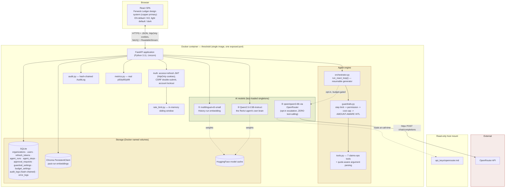
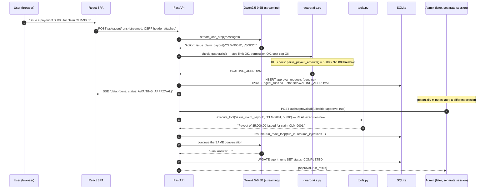
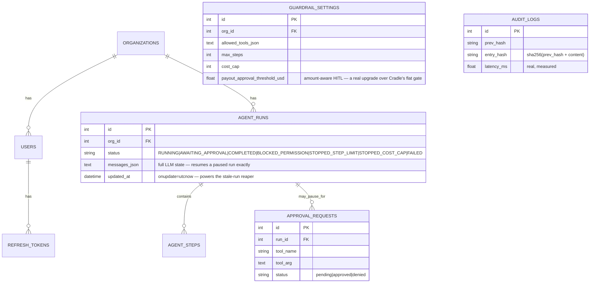

# Threshold — Architecture

> Week7 PoC_v2 · Guardrailed ReAct Agent Console for Fenwick Mutual
> This document is also embedded (with the same diagrams) inside [`docs/guide.html`](docs/guide.html).

## 1. System overview

Threshold is a single-container full-stack application: a React (TypeScript) SPA served as static
files by a FastAPI backend, hosting two local AI models plus one optional cloud escalation model
behind a REST + streaming API, backed by SQLite and Chroma. The structural shape — including the
resumable ReAct loop, the corrected guardrail order, and the security/observability architecture —
is shared with Verity (Week6's companion rebuild) and the predecessor Cradle PoC, extended with
Threshold-specific business logic: a claims-processing tool set and amount-aware HITL.

## 2. Engineering depth — beyond a typical first-pass implementation

A typical naive first-pass implementation of this pattern looks like a working 2-tab Streamlit app —
functional, but stopping well short of what's needed for real use:

| Dimension | Typical baseline implementation | Threshold |
|---|---|---|
| Integration | Two demo tabs that never talk to each other — the ReAct agent tab and the guardrail-runner tab are separate demos | One agent, one loop, guardrails always in the path |
| Guardrail check order | **A common, reproducible bug**: a naive guardrail runner checks the cost cap before permission, so an unauthorized-tool attempt gets mislabeled as a budget event once the budget happens to already be exhausted | The corrected order, made visible in the Admin UI, with a direct regression test reproducing that exact scenario |
| Human-in-the-Loop | A feature scaffolded in the code but never wired into the shipped app — stays an empty set | A real, persisted, amount-aware queue: a payout over threshold genuinely pauses, an admin's decision genuinely resumes it |
| HITL granularity | Not applicable — HITL never triggers in the shipped demo | **Amount-aware**: a $500 payout auto-approves, a $9,000 payout requires a human — not every payout, unconditionally |
| Persistence | None — every Streamlit session is in-memory | SQLite + Chroma, `org_id`-scoped, both survive restarts |
| Security | None | Access+refresh JWT rotation, CSRF, account lockout, rate limiting, tamper-evident audit log |
| Observability | None | Real p50/p95/p99 latency, structured error log, public status page |
| Target/positioning | No stated target audience | A named persona (Priya Nakamura) and company, on a public landing page |

## 3. Design — sharing "Fenwick Ledger" with Verity

Per this round's explicit request, Threshold and Verity are one connected company's product suite,
not two independent weekly builds — they share one design system rather than each inventing its own
sixth/seventh distinct identity. See Verity's own `architecture.md` §3 for the full rationale and
accessibility measurements (identical methodology applies here; both palettes were verified together
with the same Python WCAG contrast-ratio script).

| Element | Shared with Verity | Threshold's own distinction |
|---|---|---|
| Color | Ivory/bone (light) / espresso-charcoal (dark) ground, brick-red for blocked/critical states | **Copper (`#a85d2e` light / `#d18a53` dark) as the primary accent** — Verity's own bottle-green becomes Threshold's shared secondary |
| Type | Fraunces (display) + IBM Plex Sans (body) + IBM Plex Mono (data) | — |
| Navigation | The "dossier tab-binder" pattern | — |
| Trace visualization | — | **Ledger-entry cards**: each ReAct step gets a colored left rule by kind (copper=thought/action, green=observation, amber=awaiting-approval, red=blocked) — a distinct visual grammar from the predecessor Cradle PoC's claymorphism card-stack, fitting this identity's own "ledger/case-log" metaphor rather than reusing the prior week's treatment verbatim |

## 4. Threshold's tool set — risk tiers and cost rationale

| Tool | Replaces (Cradle) | Risk tier | Cost |
|---|---|---|---|
| `check_filing_deadline(jurisdiction, loss_date)` | `get_today` | Safe | 2 |
| `lookup_policy_coverage(policy_number)` | *(new)* | Safe | 5 |
| `estimate_claim_payout(expression)` | `calculator` | Safe | 5 |
| `convert_reinsurance_currency(amount, currency)` | `convert_currency` | Safe | 5 |
| `lookup_claims_procedure(keyword)` | `lookup_faq` | Safe | 10 |
| `issue_claim_payout(claim_id, amount)` | `issue_refund` | **HITL — amount-aware** | 35 |
| `close_and_purge_claim_file(claim_id)` | `delete_customer_data` | **Never allowlisted (decoy)** | 50 |

`lookup_policy_coverage` is a genuinely new tool, not a reskin — it reflects a real, distinct job
(checking a policy's coverage limit/deductible/status) that none of Cradle's original six tools
covered.

**Model routing security invariant**: the OpenRouter escalation path has zero tool-calling
capability — it can only synthesize a best-effort answer from the existing trace text. It cannot
itself call `issue_claim_payout`; any real payout must flow back through the local ReAct loop and
the full guardrail engine.

## 5. A real bug found this build, and what it reveals about tool-argument robustness

See `debug/issue-01` for the full write-up. In brief: the few-shot example only demonstrates a bare
numeric argument, so the model reasonably improvised quoting conventions for string/multi-part
arguments — both a whole-argument quote (`lookup_claims_procedure("subrogation")`) and separately-
quoted comma-separated parts (`check_filing_deadline("Belmont Bay", "2025-01-01")`). `tools.py`'s
`clean_arg()`/`split_args()` helpers clean quote characters from each *final* token independently
(after any comma-splitting), which is the one approach that handles both real conventions correctly
— stripping quotes from the whole raw string before splitting fixes one and breaks the other.

## 6. Data flow — a Human-in-the-Loop payout request

## 7. Storage model

## 8. Production / cloud scaling

Same shape and caveats as Verity's own architecture.md §7 (app-tier replication, managed Postgres, a
managed vector DB, GPU burst, a shared-state rate limiter and a coordinated audit-log writer for
multi-instance deployment) — plus one Threshold-specific item: **a real HITL notification path**
(email/Slack/webhook to the on-call reviewer). This PoC's queue is pull-based — an admin has to
visit the Approvals page — which is adequate for a demo but would leave a paused payout waiting
indefinitely in real use without a push notification.

### Estimated monthly cost at small commercial scale
(~500 DAU, ~2k agent runs/day; indicative Aug 2026 list prices)

| Item | Assumption | Est. monthly cost |
|---|---|---|
| App hosting (2 vCPU/4GB) | 1-2 instances | $70–140 |
| Managed Postgres | 1 instance + backup | $60–90 |
| Managed vector DB / pgvector | usage-based | $0–50 |
| GPU burst (local LLM) | ~12 GPU-hours/mo | $8–20 |
| OpenRouter (opt-in escalation) | ~10% of runs | $2–6 |
| Redis (rate limiting, multi-instance) | small managed instance | $10–20 |
| Metrics/logging | basic managed tier | $10–30 |
| **Total (indicative)** | | **≈ $160 – 356/month** |

## 9. Deployment considerations

Same core list as Verity's own architecture.md §8 (`ENFORCE_SECURE_DEFAULTS`/`COOKIE_SECURE` behind
real TLS, shared-state rate limiting/metrics before multi-instance) plus the HITL notification-path
gap noted above.
