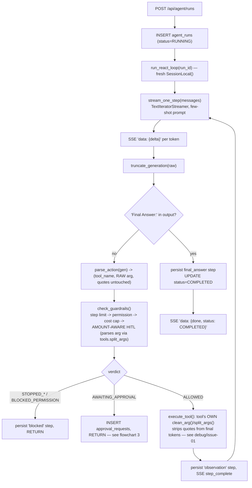
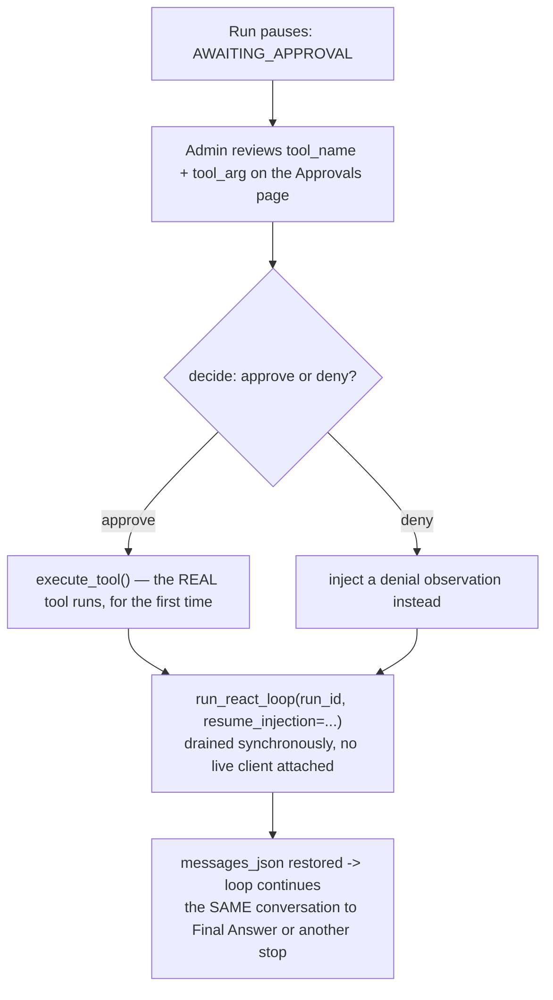
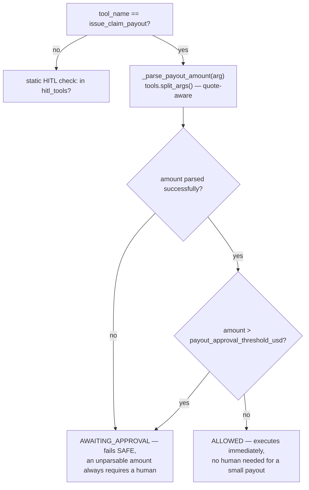
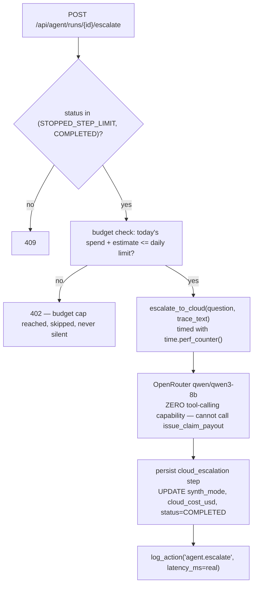
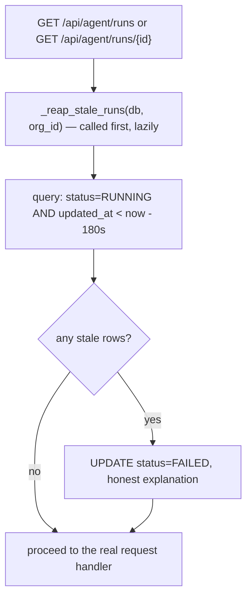
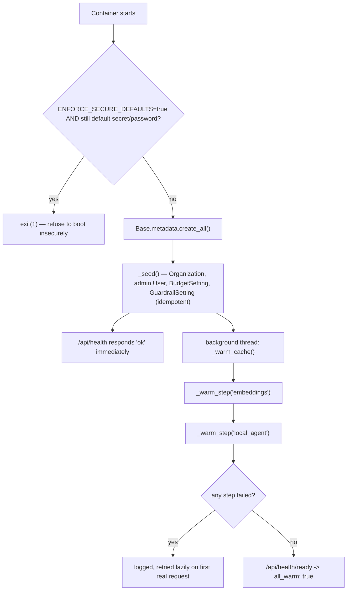

# Threshold — Function & Model Flowcharts

> Companion to [`architecture.md`](architecture.md). Also embedded in [`docs/guide.html`](docs/guide.html).

## 1. Authentication (`security.py`, `routers/auth.py`)

Identical architecture to Verity's own — see that project's `flowchart.md` §1 for the diagram
(access+refresh rotation, CSRF double-submit, account lockout); the mechanism is shared verbatim,
only the seeded org/company data differs.

## 2. The ReAct + guardrail streaming loop (`agent/react_loop.py`, `agent/guardrails.py`, `agent/orchestrator.py`)

## 3. The approval-resume flow (`routers/approvals.py`)

## 4. Amount-aware HITL (`guardrails.py::check_guardrails`, `_parse_payout_amount`)

## 5. Model routing / cloud escalation (`ml/llm.py`, `routers/agent.py`)

## 6. Hash-chained audit log (`audit.py`)

Identical mechanism to Verity's own — see that project's `flowchart.md` §5 for the diagram
(per-row `entry_hash = sha256(prev_hash + content)`, and the admin "Verify integrity" walk that
pinpoints the first broken row).

## 7. The stale-run reaper (`routers/agent.py::_reap_stale_runs`)

## 8. Container bootstrap sequence (`main.py`)

