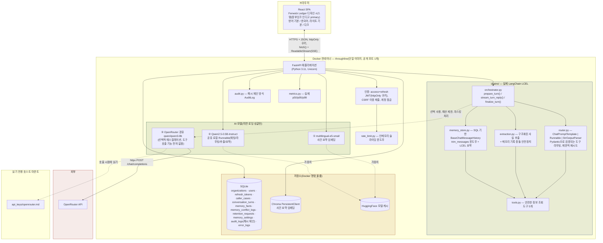
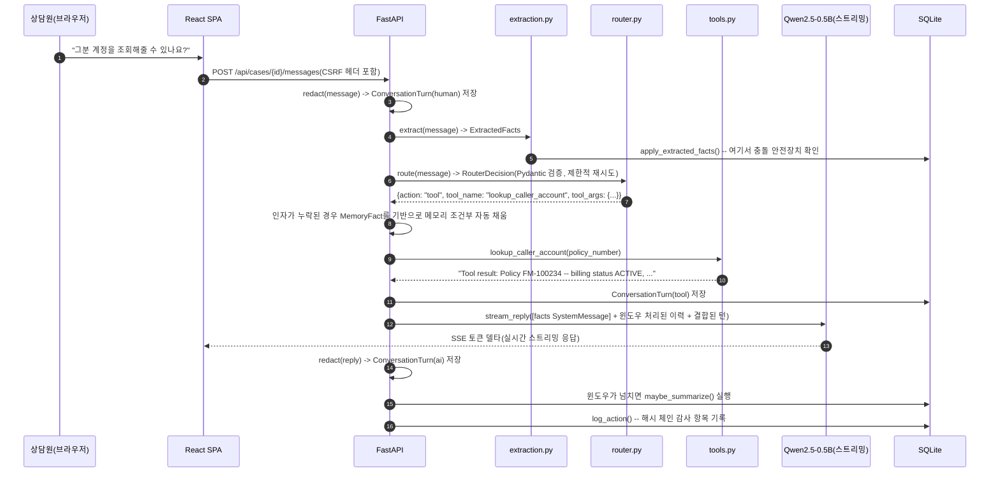

# Throughline — 아키텍처

[English](architecture.md) | **한국어**

> Week8 PoC · Fenwick Mutual를 위한 LangChain 기반 대화 메모리 코파일럿
> 이 문서는 동일한 다이어그램과 함께 [`docs/guide.html`](docs/guide.html)에도 포함되어 있습니다.

## 0. 보안/관측성 계층을 세 번째로 새로 설계하지 않고 재사용한 이유

`security.py`, `audit.py`, `rate_limit.py`, `metrics.py`, `database.py`는 Threshold(그 자체로 Verity와 동일한 아키텍처를 공유)에서 그대로 복사했습니다. 이는 지름길이 아니라 의도적인 선택입니다. 실제 회사의 내부 도구 제품군이 각자 자기만의 인증/감사/관측성 플랫폼 계층을 새로 만드는 대신 하나의 검증된 계층을 공유하는 것 자체가 상용 수준의 신호입니다. 이 제품에서 진짜로 새로운 부분은 전부 `chains/`와 `models.py`의 도메인 테이블 안에 있습니다.

## 1. 시스템 개요

Throughline은 단일 컨테이너로 실행되는 풀스택 애플리케이션입니다. React(TypeScript) SPA를 FastAPI 백엔드가 정적 파일로 제공하고, 백엔드는 REST + 스트리밍 API 뒤에서 로컬 AI 모델 2개와 선택적 클라우드 에스컬레이션 모델 1개를 호스팅하며, SQLite와 Chroma를 저장소로 사용합니다. Verity(그라운딩된 리서치)나 Threshold(안전장치가 걸린 ReAct 도구 루프)와 달리, Throughline 고유의 메커니즘은 라우팅되는 LCEL 턴입니다: 메시지 하나가 직접적인 LLM 응답이 되거나 실제 도구 호출이 되며, 매 턴마다 구조화된 메모리가 추출되어 저장됩니다.



## 2. 일반적인 초기 구현보다 실제로 더 발전된 부분

동일한 LangChain 에이전트 패턴의 일반적인 초기 구현은 실제로 동작하는 Streamlit 앱입니다 — `agent.py`/`llm.py`/`app.py` 형태의 모듈 위에 직접 만든 단순한 "LangChain 어시스턴트"입니다.

| 차원 | 일반적인 초기 구현 | Throughline |
|---|---|---|
| LangChain 사용 방식 | `PromptTemplate`을 임포트하지만 `.format()`만 호출할 뿐 진짜 `\|` 파이프는 한 번도 쓰지 않음 | 전체에 걸쳐 실제 LCEL 조합(`ChatPromptTemplate \| Runnable \| StrOutputParser()`)을 사용하며, 사용 전에 실제로 설치된 `langchain-core==0.3.86`을 기준으로 검증함 |
| 도구 라우팅 | 정규식 매처(`_route()`) — 알려진 오탐 사례: "12에 8을 곱하면?"은 리터럴 `*`가 없어서 `calc`를 전혀 트리거하지 않음 | Pydantic 스키마를 통한 구조화된 출력 라우팅, 측정되고 정직하게 문서화된 첫 시도 성공률과 제한적 재시도(`debug/` 참고) |
| 메모리 | RAM 전용 `self.history`, 재시작하면 사라짐 — 이런 초기 구현에서는 "아직 구현하지 못함"이라고 스스로 명시하는 부분 | SQL에 저장되는 이중 전략(그대로 보존하는 윈도우 + LCEL 롤링 요약), 재시작 후에도 유지됨 |
| 메모리 범위 | 구조화되지 않은 단순 리스트 | 그라운딩 검사(값이 실제로 원본 턴에 있는지)를 거치는 구조화된 `MemoryFact` 추출과, 절대 조용히 덮어쓰지 않는 충돌 안전장치 |
| 계산기 | 원시 `eval()` | 실제 `ast` 화이트리스트 기반 평가기 — §5 참고, 흔한 입문용 조언에 대한 정정도 포함 |
| PII 처리 | 다루지 않음 | 저장 시점, OpenRouter 경계 지점, 실시간 UI에서의 패턴 기반 마스킹 — 함수 하나, 호출 지점 세 곳 |
| 보안 | 없음 | Access+refresh JWT 로테이션, CSRF, 계정 잠금, 요청 속도 제한, 위변조 감지가 가능한 감사 로그 |
| 관측성 | 없음 | 실제 p50/p95/p99 지연 시간, 구조화된 오류 로그, 공개 상태 페이지 |
| 타깃/포지셔닝 | 명시된 타깃 고객 없음 | 이름을 가진 페르소나(Marcus Webb)와 회사, 공개 랜딩 페이지 |

## 3. 디자인 — Verity·Threshold와 "Fenwick Ledger"를 공유

이번 라운드의 명시적 요구에 따라, Fenwick Mutual의 세 제품 모두 서로 무관한 세 개의 주차별 빌드가 아니라 하나로 연결된 회사의 스위트입니다 — 각자 독자적인 아이덴티티를 새로 만드는 대신 하나의 디자인 시스템을 공유합니다. 정확한 색상 값은 이 프로젝트 시리즈의 모든 이전 아이덴티티에 사용한 것과 동일한 Python WCAG 대비율 스크립트 방법론으로 검증했습니다: `--accent`(새로운 "장부잉크" 인디고)는 두 테마 모두에서 모든 배경 토큰에 대해 6.9:1 이상을 확보하며, 이는 아이콘/테두리/제목 기준인 3:1과 본문 텍스트 기준인 4.5:1을 모두 여유 있게 넘습니다.

| 요소 | Verity/Threshold와 공유 | Throughline만의 차별점 |
|---|---|---|
| 색상 | 아이보리/본(라이트) / 에스프레소 차콜(다크) 바탕, 위험 상태에는 브릭레드 | **"장부잉크" 인디고(`#2d4a7a` 라이트 / `#7fa3d6` 다크)를 주 강조색으로 사용** — 구리색은 Throughline의 공유 보조색이 됨(둘 다 직원용 업무 도구) |
| 타이포그래피 | Fraunces(디스플레이) + IBM Plex Sans(본문) + IBM Plex Mono(데이터) | — |
| 내비게이션 | "도시에(dossier) 탭 바인더" 패턴 | — |
| 콘텐츠 문법 | — | 워크스페이스 채팅 로그에는 **메시지 카드**(찢어진 메모지 느낌, 모노스페이스 칩으로 역할 표시), 실시간 메모리 사이드바에는 **인덱스 카드**(줄이 그어진 작은 기록 카드 느낌)를 사용 — Verity의 판례 브리프 카드나 Threshold의 장부 항목 스텝 트레이스와는 구별됨 |

## 4. Throughline의 도구 세트

| 도구 | 위험 등급 | 데이터 형태 | Threshold와의 차이 |
|---|---|---|---|
| `lookup_caller_account(policy_number)` | 안전 | 청구 상태, 다음 납부일, 선호 연락 방식, 마지막 연락일 | Threshold의 `lookup_policy_coverage`는 보장 한도/공제액을 반환합니다 — 완전히 다른 데이터 축이며, 이름만 바꾼 도구가 아닙니다. |
| `estimate_premium_adjustment(expression)` | 안전 | 실제 `ast` 화이트리스트 기반 산술 연산(§5 참고) | 일반적인 초기 구현과 Threshold 모두가 갖고 있던 `eval()` 지름길을 실제로 없앤 이 제품군 최초의 도구 |
| `lookup_billing_faq(keyword)` | 안전 | 청구/계정 관리 절차만 다룸(자동이체, 전자 청구서, 주소 변경, 미납 유예 기간) | Threshold의 `lookup_claims_procedure`는 청구 처리 절차를 다룹니다 — 별개의 영역입니다. |
| `check_callback_availability(department, preferred_window)` | 안전 | 고정된 결정론적 슬롯 표, 메모리 조건부 반영 | Threshold에는 대응 기능이 없습니다 — 메커니즘 수준에서의 핵심 차별점입니다(`README.md` §0 참고). |
| `flag_for_escalation(reason)` | 안전 | 감사 로그 기록만 수행 | Threshold에는 대응 기능이 없습니다. |

이 도구들 중 실제 지급이 가능한 것은 하나도 없습니다 — 그 위험 영역은 전적으로 Threshold의 몫이며, Threshold는 이미 실제 자금 이동을 위한 안전장치 걸린 금액 인지형 HITL을 구현하고 있습니다. Throughline 자체의 안전장치 축은 (아래의) 메모리 기록 충돌 검사이지, 빌려온 HITL 게이트가 아닙니다.

## 5. 실제 수정 사항과 흔한 입문용 조언에 대한 정정

사용자가 입력한 산술식을 "안전하게" 평가하는 흔한 입문 기법은 `eval()`의 상용 수준 대체재로 `ast.literal_eval`을 권장합니다 — 하지만 직접 검증해보면 이는 계산기에는 실제로 작동하지 않습니다. `ast.literal_eval("12 * 8")`은 `ValueError: malformed node or string`을 발생시키는데, `literal_eval`은 리터럴 상수(그리고 부호 있는 숫자에 대한 좁은 예외)만 파싱할 뿐, 곱셈 같은 `BinOp`는 절대 처리하지 못하기 때문입니다. `ml/safe_eval.py`는 그 권장 방법이 완전히 해결하지 못하는 부분을 실제로 고칩니다: 표현식을 진짜 AST로 파싱한 뒤(`ast.parse(expr, mode="eval")`) 직접 순회하면서 숫자 상수와 `+ - * /`, 단항 +/-만 허용하고, 입력에 대해 `eval()`, `exec()`, `literal_eval()`을 전혀 호출하지 않습니다.

## 6. 데이터 흐름 — 메시지 턴 1회



## 7. 저장소 모델

```mermaid
erDiagram
    ORGANIZATIONS ||--o{ USERS : has
    ORGANIZATIONS ||--o{ CALLER_CASES : has
    USERS ||--o{ REFRESH_TOKENS : has
    CALLER_CASES ||--o{ CONVERSATION_TURNS : contains
    CALLER_CASES ||--o{ MEMORY_FACTS : has
    CALLER_CASES ||--o{ MEMORY_CONFLICT_LOGS : may_produce

    CALLER_CASES {
        int id PK
        int org_id FK
        string status "open|closed"
        text case_summary "이중 전략 메모리 중 롤링 요약 절반"
        int summarized_through_turn_id
        datetime updated_at "onupdate=utcnow"
    }
    MEMORY_FACTS {
        int id PK
        int case_id FK
        string field_name "caller_name|policy_number|preferred_callback_window|topic"
        text field_value
        string confidence "stated|inferred -- 원본 턴에 대해 그라운딩 확인됨"
    }
    MEMORY_CONFLICT_LOGS {
        int id PK
        int case_id FK
        string field_name
        text old_value
        text new_value
        string resolution "pending_confirmation|kept_old|accepted_new"
    }
    RETENTION_REQUESTS {
        int id PK
        int case_id "FK 아님 -- 이 값을 읽는 시점에는 이미 사건 행이 삭제됨"
        int turns_deleted
        int facts_deleted
        note "삭제된 내용 자체는 절대 저장하지 않음"
    }
    AUDIT_LOGS {
        int id PK
        string prev_hash
        string entry_hash "sha256(prev_hash + content)"
        float latency_ms "실제로 측정된 값"
    }
```

## 8. PII 및 보존 범위 — 솔직하게 밝히는 한계

패턴 기반 마스킹(주민등록번호 형태, 전화번호 형태, 긴 카드번호 형태의 숫자열, 이메일 주소)은 콘텐츠가 신뢰 경계를 넘는 모든 지점에 적용됩니다: 저장 전, OpenRouter 에스컬레이션 호출 전, 실시간 워크스페이스 사이드바 렌더링 시점까지 — 함수 하나(`ml/redaction.py::redact()`), 호출 지점 세 곳으로 구성되어 있어 세 지점이 서로 어긋날 수 없습니다. 이는 명시적으로 **인증된 PII 탐지 엔진이 아닙니다** — 자유 서술형 이름, 주소, 간접 식별자 등은 알려진 오탐지 누락 사례이며, 이를 얼버무리지 않고 명확히 밝힙니다. `purge_case()`는 실제 하드 삭제 캐스케이드(대화 턴, 메모리 사실, 충돌 로그)를 수행하고 감사 항목을 정확히 1건 기록하지만(`case_id`, 타임스탬프, 실행자 — 삭제된 내용 자체는 절대 기록하지 않음), 해당 사건이 진행되는 동안 이미 OpenRouter 에스컬레이션 경로로 전송된 내용은 되돌릴 수 없으며, 실제 데이터 보호 컴플라이언스 프로그램을 대체하지도 않습니다. 앱 내에 표시되는 전체 고지 사항은 `docs/guide.html`을 참고하세요.

## 9. 프로덕션/클라우드 확장

Verity와 Threshold 자체의 architecture.md와 동일한 구조와 주의 사항입니다(앱 계층 복제, 관리형 Postgres, 관리형 벡터 DB, GPU 버스트, 멀티 인스턴스 배포를 위한 공유 상태 요청 속도 제한기와 조율된 감사 로그 기록기) — 여기에 Throughline만의 항목이 하나 추가됩니다: 마스킹 처리는 정규식 패턴 기반이며 단일 프로세스로 동작합니다. 실제 보험 가입자의 PII를 대규모로 다루는 실제 프로덕션 배포라면 이를 단순히 수평 확장하는 것이 아니라, 전용의 감사 가능한 PII 탐지 서비스로 교체하거나 보강해야 합니다.

### 소규모 상용 환경의 월간 예상 비용
(일일 활성 사용자 약 500명, 하루 약 2,000건의 대화 턴. 2026년 8월 기준 공개 정가 참고치)

| 항목 | 가정 | 월간 예상 비용 |
|---|---|---|
| 앱 호스팅(2 vCPU/4GB) | 인스턴스 1~2개 | $70–140 |
| 관리형 Postgres | 인스턴스 1개 + 백업 | $60–90 |
| 관리형 벡터 DB / pgvector | 사용량 기반 | $0–50 |
| GPU 버스트(로컬 LLM) | 월 약 12 GPU 시간 | $8–20 |
| OpenRouter(선택적 에스컬레이션) | 턴의 약 10% | $2–6 |
| Redis(요청 속도 제한, 멀티 인스턴스) | 소형 관리형 인스턴스 | $10–20 |
| 메트릭/로깅 | 기본 관리형 요금제 | $10–30 |
| **합계(참고치)** | | **월 약 $160–356** |

## 10. 배포 고려 사항

Verity와 Threshold 자체의 architecture.md와 핵심 항목이 동일합니다(실제 TLS 뒤에서의 `ENFORCE_SECURE_DEFAULTS`/`COOKIE_SECURE`, 멀티 인스턴스 이전에 필요한 공유 상태 요청 속도 제한/메트릭) — 여기에 위에서 언급한 마스킹 서비스 공백이 더해집니다.
