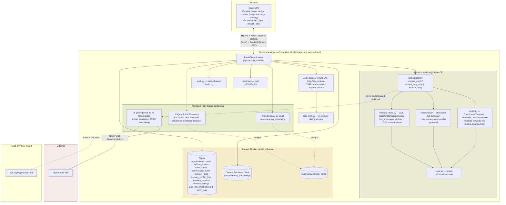
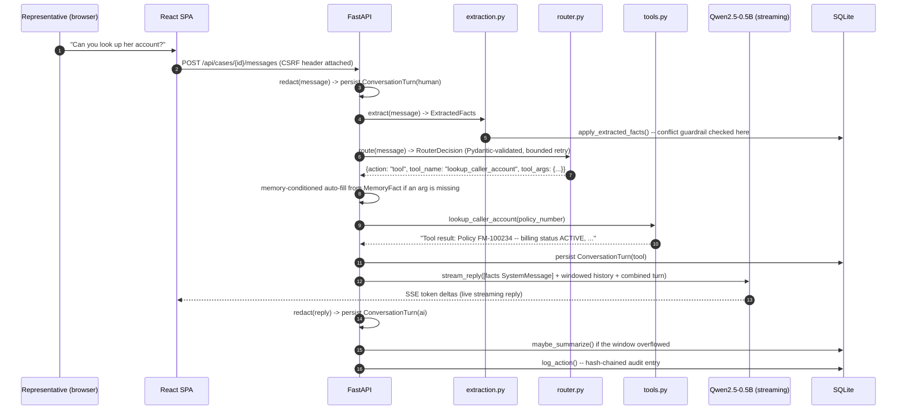

# Throughline — Architecture

> Week8 PoC · LangChain Conversational-Memory Copilot for Fenwick Mutual
> This document is also embedded (with the same diagrams) inside [`docs/guide.html`](docs/guide.html).

## 0. Why the security/observability layer is reused, not redesigned a third time

`security.py`, `audit.py`, `rate_limit.py`, `metrics.py`, and `database.py` are copied verbatim from
Threshold (itself sharing the identical architecture with Verity). This is a deliberate choice, not a
shortcut: a real company's internal tool family sharing one proven auth/audit/observability platform
layer — rather than each app reinventing its own — is itself a commercial-grade signal. What's
genuinely new in this product lives entirely in `chains/` and the domain tables in `models.py`.

## 1. System overview

Throughline is a single-container full-stack application: a React (TypeScript) SPA served as static
files by a FastAPI backend, hosting two local AI models plus one optional cloud escalation model
behind a REST + streaming API, backed by SQLite and Chroma. Unlike Verity (grounded research) and
Threshold (a guarded ReAct tool loop), Throughline's own mechanism is a routed LCEL turn: a single
message either becomes a direct LLM reply or a real tool call, with structured memory extracted and
persisted every turn.



## 2. What's genuinely more advanced than a typical baseline implementation

A typical baseline implementation of this same LangChain-agent pattern is a real, working Streamlit
app — a simple "LangChain assistant" built directly on `agent.py`/`llm.py`/`app.py`-style modules:

| Dimension | Typical baseline implementation | Throughline |
|---|---|---|
| LangChain usage | Imports `PromptTemplate`, only ever calls `.format()` on it — never a real `\|` pipe | Real LCEL composition throughout (`ChatPromptTemplate \| Runnable \| StrOutputParser()`), verified against the actual installed `langchain-core==0.3.86` before use |
| Tool routing | A regex matcher (`_route()`) — documented false negative: "12에 8을 곱하면?" never triggers `calc` since there's no literal `*` | Structured-output routing via a Pydantic schema, with a measured, honestly-documented first-try reliability and a bounded retry (see `debug/`) |
| Memory | RAM-only `self.history`, lost on restart — a self-documented "not yet done" extension in that kind of baseline | SQL-persisted, dual-strategy (verbatim window + LCEL rolling summary), survives restarts |
| Memory scope | A flat list, no structured facts | Structured `MemoryFact` extraction with a grounding check (is the value actually in the source turn?) and a conflict guardrail that never silently overwrites |
| Calculator | Raw `eval()` | A real `ast`-whitelist evaluator — see §5, including a correction to a common piece of introductory material |
| PII handling | Not addressed | Pattern-based redaction at persistence, at the OpenRouter boundary, and in the live UI — one function, three call sites |
| Security | None | Access+refresh JWT rotation, CSRF, account lockout, rate limiting, tamper-evident audit log |
| Observability | None | Real p50/p95/p99 latency, structured error log, public status page |
| Target/positioning | No stated target audience | A named persona (Marcus Webb) and company, on a public landing page |

## 3. Design — sharing "Fenwick Ledger" with Verity and Threshold

Per this round's explicit request, all three Fenwick Mutual products are one connected company's
suite, not three unrelated weekly builds — they share one design system rather than each inventing
its own distinct identity. Exact hex values verified via the same Python WCAG contrast-ratio script
methodology used for every prior identity in this project series: `--accent` (the new "ledger ink" indigo)
clears 6.9:1+ against every background token in both themes — well past the 3:1 icon/border/heading
threshold and the 4.5:1 body-text threshold.

| Element | Shared with Verity/Threshold | Throughline's own distinction |
|---|---|---|
| Color | Ivory/bone (light) / espresso-charcoal (dark) ground, brick-red for critical states | **"Ledger ink" indigo (`#2d4a7a` light / `#7fa3d6` dark) as the primary accent** — copper becomes Throughline's shared secondary (both are employee-operational tools) |
| Type | Fraunces (display) + IBM Plex Sans (body) + IBM Plex Mono (data) | — |
| Navigation | The "dossier tab-binder" pattern | — |
| Content grammar | — | **Message cards** (a torn-memo-slip look, role-labeled by a monospace chip) for the Workspace chat log, and **index cards** (a small ruled record-card look) for the live memory sidebar — distinct from Verity's precedent-brief cards and Threshold's ledger-entry step trace |

## 4. Throughline's tool set

| Tool | Risk tier | Data shape | Distinction from Threshold |
|---|---|---|---|
| `lookup_caller_account(policy_number)` | Safe | Billing status, next payment due, preferred contact, last contact date | Threshold's `lookup_policy_coverage` returns coverage limit/deductible — a different data axis entirely, not a renamed reskin |
| `estimate_premium_adjustment(expression)` | Safe | Real `ast`-whitelist arithmetic (see §5) | The first tool in the suite to actually close the `eval()` shortcut both a typical baseline implementation and Threshold carry |
| `lookup_billing_faq(keyword)` | Safe | Billing/account-administration procedures only (autopay, paperless billing, address change, nonpayment grace period) | Threshold's `lookup_claims_procedure` covers claims-processing procedures — a separate domain |
| `check_callback_availability(department, preferred_window)` | Safe | Deterministic fixed slot table, memory-conditioned | No equivalent in Threshold — the mechanism-level pillar differentiator (see §0 of `README.md`) |
| `flag_for_escalation(reason)` | Safe | Audit-logged only | No equivalent in Threshold |

No tool here is payout-capable — that risk surface belongs entirely to Threshold, which already
implements guarded, amount-aware HITL for real fund movement. Throughline's own guardrail axis is
the memory-write conflict check (§ below), not a borrowed HITL gate.

## 5. A real fix, and a correction to a common piece of introductory advice

A common introductory technique for "safely" evaluating a user-supplied arithmetic expression
recommends `ast.literal_eval` as a production-grade replacement for `eval()` — verified directly,
this doesn't actually work for a calculator: `ast.literal_eval("12 * 8")` raises `ValueError:
malformed node or string`, because `literal_eval` only parses literal constants (plus a narrow
carve-out for signed numbers), never a `BinOp` like multiplication. `ml/safe_eval.py` implements the
fix that recommendation doesn't quite deliver: parse the expression as a real AST
(`ast.parse(expr, mode="eval")`), then walk it directly, allowing only numeric constants, `+ - * /`,
and unary +/- — never calling `eval()`, `exec()`, or `literal_eval()` on the input at all.

## 6. Data flow — one message turn



## 7. Storage model

```mermaid
erDiagram
    ORGANIZATIONS ||--o{ USERS : has
    ORGANIZATIONS ||--o{ CALLER_CASES : has
    USERS ||--o{ REFRESH_TOKENS : has
    CALLER_CASES ||--o{ CONVERSATION_TURNS : contains
    CALLER_CASES ||--o{ MEMORY_FACTS : has
    CALLER_CASES ||--o{ MEMORY_CONFLICT_LOGS : may_produce

    CALLER_CASES {
        int id PK
        int org_id FK
        string status "open|closed"
        text case_summary "the rolling-summary half of dual-strategy memory"
        int summarized_through_turn_id
        datetime updated_at "onupdate=utcnow"
    }
    MEMORY_FACTS {
        int id PK
        int case_id FK
        string field_name "caller_name|policy_number|preferred_callback_window|topic"
        text field_value
        string confidence "stated|inferred -- grounded against the source turn"
    }
    MEMORY_CONFLICT_LOGS {
        int id PK
        int case_id FK
        string field_name
        text old_value
        text new_value
        string resolution "pending_confirmation|kept_old|accepted_new"
    }
    RETENTION_REQUESTS {
        int id PK
        int case_id "not a FK -- the case row is gone by the time this is read"
        int turns_deleted
        int facts_deleted
        note "never stores the purged content itself"
    }
    AUDIT_LOGS {
        int id PK
        string prev_hash
        string entry_hash "sha256(prev_hash + content)"
        float latency_ms "real, measured"
    }
```

## 8. PII & retention scope — the honest boundary

Pattern-based redaction (SSN-like, phone-like, long card-like digit runs, email addresses) applies at
every point content crosses a trust boundary: before persistence, before the OpenRouter escalation
call, and in the live Workspace sidebar render — one function (`ml/redaction.py::redact()`), three
call sites, so the three can't drift apart. This is explicitly **not** a certified PII-detection
engine — known false negatives include free-text names, addresses, and indirect identifiers, stated
plainly rather than implied away. `purge_case()` performs a real hard-delete cascade (conversation
turns, memory facts, conflict logs) and records exactly one audit entry (`case_id`, timestamp, actor
— never the purged content itself), but cannot retract anything already sent to the OpenRouter
escalation path during that case's lifetime, and is not a substitute for a real data-protection
compliance program. See `docs/guide.html` for the full disclaimer as shown in-app.

## 9. Production / cloud scaling

Same shape and caveats as Verity's and Threshold's own architecture.md (app-tier replication, managed
Postgres, a managed vector DB, GPU burst, a shared-state rate limiter and a coordinated audit-log
writer for multi-instance deployment) — plus one Throughline-specific item: the redaction pass is
regex-pattern-based and single-process; a real production deployment handling genuine policyholder
PII at scale would need this replaced or augmented with a dedicated, auditable PII-detection service,
not just horizontally scaled as-is.

### Estimated monthly cost at small commercial scale
(~500 DAU, ~2k conversation turns/day; indicative Aug 2026 list prices)

| Item | Assumption | Est. monthly cost |
|---|---|---|
| App hosting (2 vCPU/4GB) | 1-2 instances | $70–140 |
| Managed Postgres | 1 instance + backup | $60–90 |
| Managed vector DB / pgvector | usage-based | $0–50 |
| GPU burst (local LLM) | ~12 GPU-hours/mo | $8–20 |
| OpenRouter (opt-in escalation) | ~10% of turns | $2–6 |
| Redis (rate limiting, multi-instance) | small managed instance | $10–20 |
| Metrics/logging | basic managed tier | $10–30 |
| **Total (indicative)** | | **≈ $160 – 356/month** |

## 10. Deployment considerations

Same core list as Verity's and Threshold's own architecture.md (`ENFORCE_SECURE_DEFAULTS`/
`COOKIE_SECURE` behind real TLS, shared-state rate limiting/metrics before multi-instance) plus the
redaction-service gap noted above.
