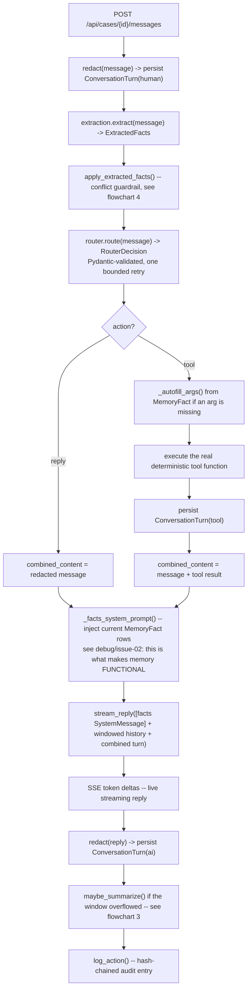
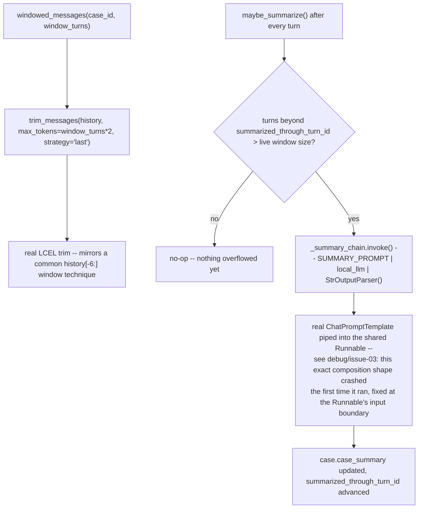
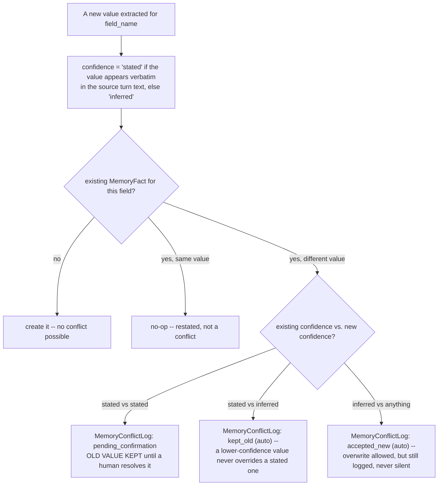
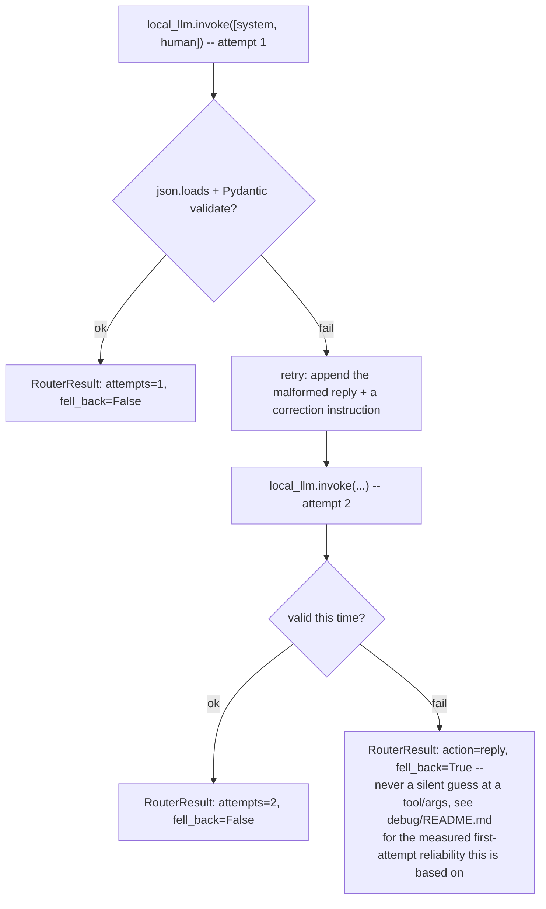
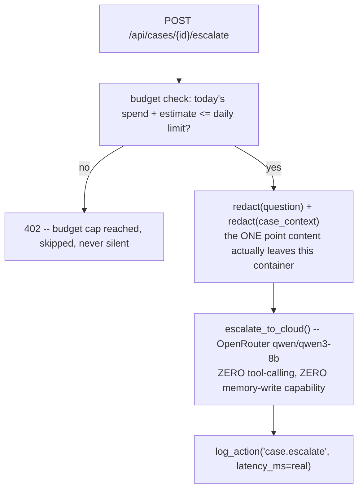
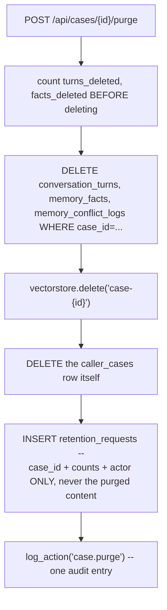
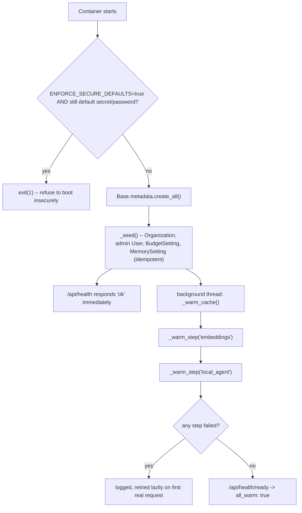

# Throughline — Function & Model Flowcharts

> Companion to [`architecture.md`](architecture.md). Also embedded in [`docs/guide.html`](docs/guide.html).

## 1. Authentication (`security.py`, `routers/auth.py`)

Identical architecture to Verity's and Threshold's own — see either project's `flowchart.md` §1 for
the diagram (access+refresh rotation, CSRF double-submit, account lockout); the mechanism is shared
verbatim, only the seeded org/company data differs.

## 2. One message turn (`chains/orchestrator.py::prepare_turn` / `finalize_turn`)

## 3. Dual-strategy memory (`chains/memory_store.py`)

## 4. The memory-write conflict guardrail (`chains/extraction.py::apply_extracted_facts`)

## 5. Structured-output tool routing (`chains/router.py::route`)

## 6. Model routing / cloud escalation (`ml/llm.py`, `routers/cases.py::escalate_case`)

## 7. Purge / right-to-erasure (`chains/orchestrator.py::purge_case`)

## 8. Hash-chained audit log (`audit.py`)

Identical mechanism to Verity's and Threshold's own — see either project's `flowchart.md` for the
diagram (per-row `entry_hash = sha256(prev_hash + content)`, and the admin "Verify integrity" walk
that pinpoints the first broken row).

## 9. Container bootstrap sequence (`main.py`)

