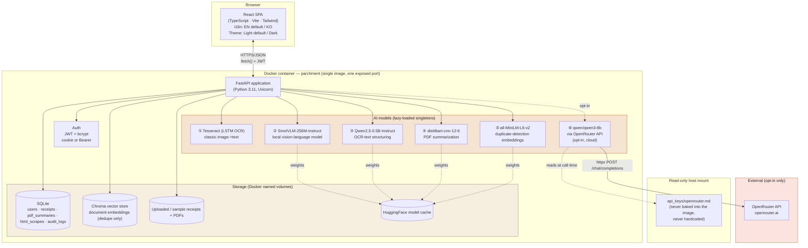
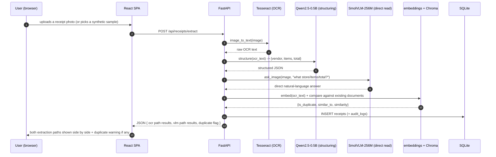
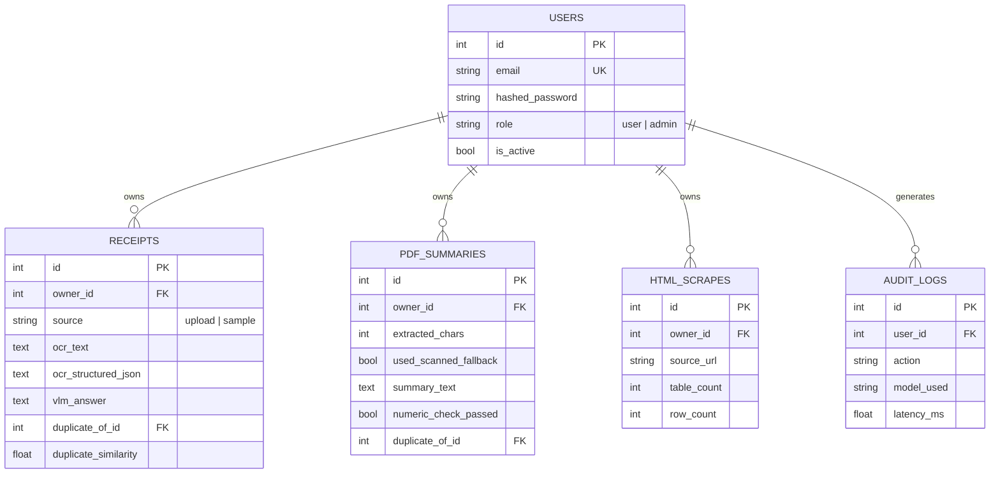

# Parchment — 아키텍처

> Week3 PoC · AI 문서 인텔리전스 워크스페이스
> 이 문서는 (동일한 다이어그램과 함께) [`docs/guide.html`](docs/guide.html) 안에도 그대로 임베드되어 있습니다.

## 1. 시스템 개요

Parchment는 단일 컨테이너 풀스택 애플리케이션입니다: React(TypeScript) SPA가 FastAPI 백엔드에서 정적 파일로 서빙되고, 이 백엔드는 REST API 뒤에서 6개의 AI 모델(로컬 5개, 옵션 클라우드 1개)을 호스팅하며, SQLite(정형 데이터)와 Chroma(벡터 데이터, 중복 탐지 용도)가 이를 뒷받침합니다 — Week1/11 PoC와 동일하게 검증된 형태를, 세 가지 기술 축(컴퓨터 비전/멀티모달 문서 읽기, PDF 파싱 + 요약, HTML 표 스크래핑)에 적용했습니다.

## 2. 왜 이 스택인가

| 선택 | 이유 |
|---|---|
| **Week1/11 PoC와 동일한 FastAPI + React 템플릿** | 검증되고 이미 견고화된 아키텍처(인증, 관리자, Docker, 준비 상태 프로빙, 격리된 부트스트랩 단계)를 새로 만들지 않고 의도적으로 재사용했습니다 — 어떤 견고화 내용을 물려받았는지는 §5 참고. |
| **서로 분리된 3개의 데모 탭이 아니라 "문서 인테이크 데스크"** | 이미지/멀티모달 추출, PDF 파싱/요약, HTML 표 스크래핑은 각각 그 자체로도 흥미로운 주제지만, Parchment는 이들을 백오피스/재무 팀이 실제로 쓸 법한 하나의 일관된 워크플로로 엮었습니다: 영수증, 보고서, 웹 표가 모두 깔끔하고 중복이 제거된 레코드가 됩니다. |
| **이번 라운드의 확실히 다른 비주얼 아이덴티티** | Week1/11 PoC(`CommerceIQ`, `VoxIQ`)는 `tailwind.config.js`/`index.css`를 diff해 보면 100% 동일한 Tailwind 설정, 색상 팔레트, 사이드바+카드 레이아웃을 공유합니다. 이번 라운드의 명시적 요청에 따라 Parchment는 따뜻한 파치먼트/테라코타 팔레트, 제목용 세리프 디스플레이 폰트(Newsreader), 사이드바 대신 상단 탭 레이아웃, 딱딱한 카드 대신 부드러운 "종이 스택" 그림자를 사용합니다 — 구체적으로 적용한 패턴은 `reference_skills/interface-craft`의 타이포그래피/레이아웃 가이드 참고. |
| **OCR(Tesseract)*와* 로컬 VLM을 나란히 보여줌** | 여기서 보여줄 만한 핵심은 "직접 CNN을 학습시키는 대신 사전학습된 멀티모달 모델을 쓴다"는 점입니다. 이를 말로만 설명하는 대신, Receipts 탭은 같은 이미지에 대해 실제 고전 OCR 파이프라인과 실제 로컬 비전-언어 모델(SmolVLM-256M)을 함께 실행해 둘 다 보여줍니다 — Week2 PoC가 bi-/cross-encoder 검색에 썼던 것과 같은 "개념만 설명하지 말고 비교를 직접 보여준다"는 패턴입니다. |
| **벡터-DB 기능으로 RAG 대신 중복 탐지** | 이 프로젝트의 브리프는 벡터 데이터베이스를 요구합니다. 완전한 embeddings + ChromaDB + retrieve-then-answer(RAG) 검색 기능은 그 자체로 상당한 규모의 프로젝트입니다 — 여기서 그것까지 만들면 완성된 제품 하나 대신 절반만 완성된 제품 두 개를 만드는 셈이 됩니다. 그래서 Parchment는 동일한 embedding + Chroma 스택을 더 좁고 뚜렷이 다른 목적 — 재제출/근접 중복 문서 플래깅(실제 백오피스 관심사) — 에만 사용합니다. §4 참고. |
| **AI 모델 6개, 로컬 5개 + 옵션 클라우드 1개** | Tesseract(LSTM OCR 엔진), SmolVLM-256M-Instruct, Qwen2.5-0.5B-Instruct(Week1/11에서 재사용), distilbart-cnn-12-6, all-MiniLM-L6-v2(Week2에서 재사용) 모두 로컬이며, 선택되기 전에 존재/실행 여부를 확인했습니다. OpenRouter의 `qwen/qwen3-8b`가 유일한 클라우드 경로로, 옵트인이며 이번 라운드에서 실제 키로 검증했습니다. |

## 3. 데이터 흐름 — 대표 요청 하나 (영수증 추출)

## 4. 저장소 모델

모든 영수증의 OCR 텍스트와 모든 PDF의 추출 텍스트는 추가로 임베딩되어(`all-MiniLM-L6-v2`) 문서 유형별로 구분된 **Chroma** 컬렉션(`documents`)에 upsert됩니다 — SQL 행이 시스템의 기준 데이터(system of record)이고, 벡터 스토어는 오직 "이런 걸 전에 본 적 있나?"(`ml/dedupe.py`)라는 질문에 답하기 위해서만 존재하며, 검색 UI를 구동하거나 LLM의 컨텍스트 창에 텍스트를 넣는 데는 절대 쓰이지 않습니다. 이는 의도적인 범위 경계입니다: 완전한 retrieve-then-answer 방식의 시맨틱 검색은 그 자체로 상당한 규모의 기능이며, 이 PoC는 절반만 완성된 두 번째 제품이 되지 않도록 의도적으로 그 범위를 피했습니다(문서 라이브러리에 대한 `README.md`의 설명 참고).

## 5. Week1/11 PoC에서 물려받은 견고화 (처음부터 적용됨)

같은 종류의 버그를 다시 발견하는 대신, Parchment의 초기 빌드에는 이전 PoC들이 후속 패스(또는 첫 패스)를 통해서야 확립했던 모든 패턴이 처음부터 반영되어 있습니다:

| 이전에 발견된 문제 | 여기서는 처음부터 적용됨 |
|---|---|
| 배송 가능성까지 검사하는 `EmailStr`가 `.local` 관리자 로그인을 깨뜨림 (Week1) | 인증에는 `EmailStr`이 아니라 동일한 형태 검사 전용 이메일 정규식 검증기를 사용 |
| 콜드스타트로 인한 기능 타임아웃이 버그처럼 보임 (Week1) | `GET /api/health/ready`와 `verify_e2e.py`의 워밍업 대기 단계가 첫 빌드부터 존재 |
| 부트스트랩 단계 하나가 실패하면 나머지도 조용히 건너뛰어짐 (Week1) | `_warm_step()`이 7개 시작 단계(샘플 데이터 2단계 + 모델 5개) 각각을 처음부터 격리 |
| `run.sh`가 이미 실행 중인 컨테이너를 불필요하게 재생성함 (Week1) | "이미 실행 중이면 URL만 알려준다"는 검사가 `run.sh`에 처음부터 포함 |
| 저장소 루트에 `api_keys/`를 보호하는 `.gitignore`가 없었음 (Week1) | 저장소 루트에 이미 존재 — 여기서 새로 할 일 없음 |
| 프롬프트에 명시적 예시가 없으면 작은 로컬 LLM이 데이터 형태를 잘못 읽을 수 있음 (Week2) | `routers/receipts.py`의 구조화 프롬프트가 필드 형태를 명시적으로 서술하고, LLM의 JSON 출력이 파싱에 실패하면 폴백(정규식) 경로를 제공 |

이 빌드의 실제 `verify_e2e.sh` 통과/실패 결과는 `history/v1.0.0.md`, 이번 라운드에서 발견된 실제 버그는 `debug/`를 참고하세요.

## 6. 상용 / 클라우드 확장 — 무엇이 달라지는가

Week1/11 PoC와 동일한 형태입니다(전체 표와 다이어그램은 해당 프로젝트들의 `architecture.md` §5/§6 참고) — 앱 계층 복제, 관리형 Postgres, 관리형/확장된 벡터 DB, 업로드 문서를 위한 오브젝트 스토리지 + CDN, 대량 트래픽 시 VLM/요약 모델용 GPU 노드 풀, 그리고 — Parchment 고유 항목으로 — Tesseract/pdf2image 페이지 렌더링을 별도의 워커 풀로 분리하는 것입니다. OCR과 페이지 래스터화는 CPU 바운드 작업이라, 분리하지 않으면 API 프로세스와 자원을 두고 경쟁하게 되기 때문입니다.

### 소규모 상용 스케일에서의 월 예상 비용
(일일 활성 사용자 약 500명, 전체 기능에 걸쳐 하루 약 2천 건의 AI 호출 기준; 아래 수치는 2026년 8월 기준 공개 정가를 참고한 지표일 뿐입니다 — 실제 예산을 세우기 전에는 항상 최신 공급자 가격을 다시 확인하세요)

| 항목 | 가정 | 월 예상 비용 |
|---|---|---|
| 앱 호스팅 (Cloud Run / Fargate, 2 vCPU / 4GB) | 웜 모델 유지를 위해 상시 가동 1–2 인스턴스 | $70–140 |
| 관리형 Postgres | 인스턴스 1개 + 일일 백업 | $60–90 |
| 관리형 벡터 DB (동일 Postgres 위의 pgvector, 또는 관리형 서비스) | pgvector: 추가 비용 없음 / 관리형: 사용량 기반 | $0–50 |
| 오브젝트 스토리지 + CDN (업로드된 영수증/PDF) | 약 20GB, 중간 수준의 이그레스 | $6–15 |
| OpenRouter (`qwen/qwen3-8b`, 옵트인 요약 전용) | 하루 약 8만 토큰, 백만 토큰당 $0.117/$0.455 | $6–18 |
| 모니터링/로깅 | 기본 관리형 티어 | $0–20 |
| **합계 (참고치)** | | **≈ 월 $140 – 335** |

## 7. 배포 시 고려사항

Week1/11 PoC와 동일한 핵심 목록입니다(동일한 Dockerfile을 통한 환경 일치, 파일 마운트 대신 실제 시크릿 매니저를 통한 시크릿 관리, Postgres + alembic 마이그레이션, 실제 프런트엔드 오리진으로 제한된 CORS) — 여기에 Parchment 고유의 항목 하나가 추가됩니다: **업로드된 영수증과 PDF에는 실제 PII가 포함될 수 있습니다**(이름, 금액, 계좌와 연관된 숫자 등). 이 빌드에 번들된 샘플은 설계상 합성/공개 도메인 데이터지만, 실제 사용자가 자신의 문서를 업로드하기 시작하면 실제 PII가 담길 수 있습니다 — 실제 배포에서는 실제 사용자 문서를 받기 전에 업로드 볼륨에 대한 데이터 보존 정책과 저장 시 암호화가 필요합니다.
