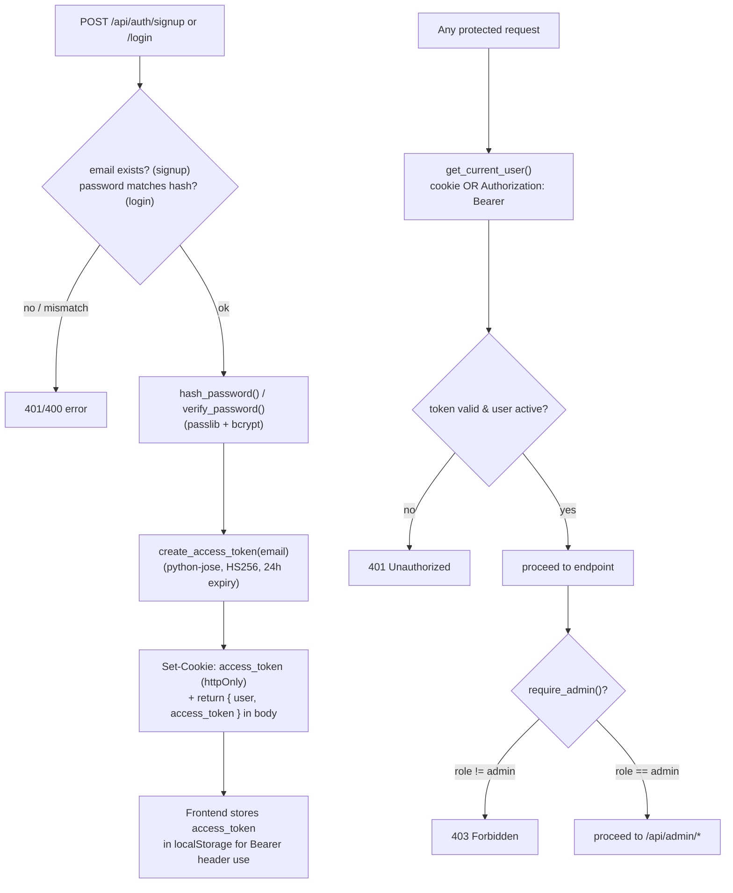
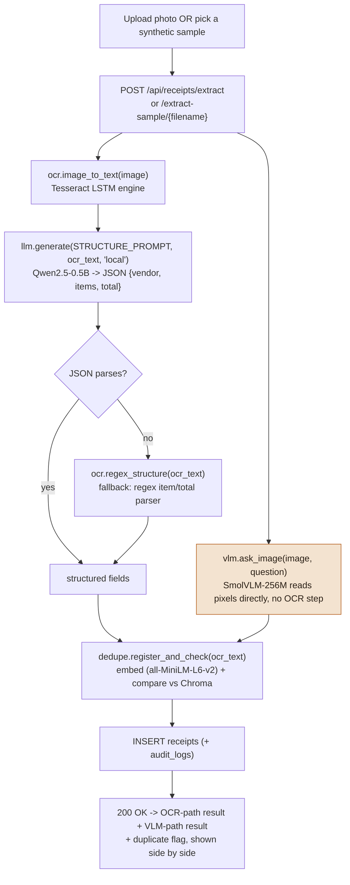
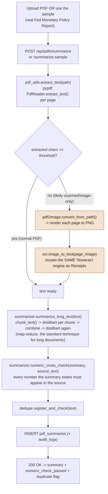
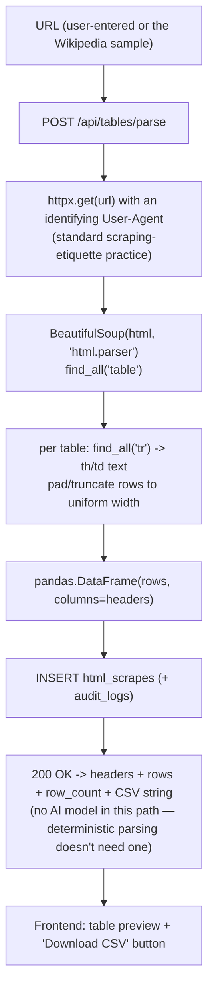
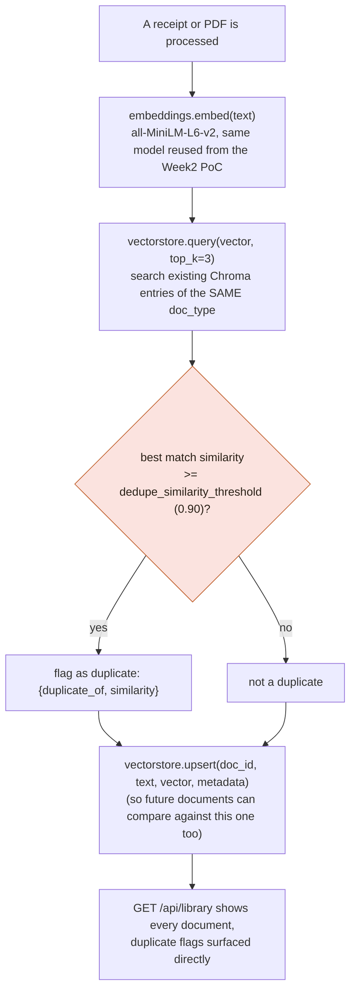
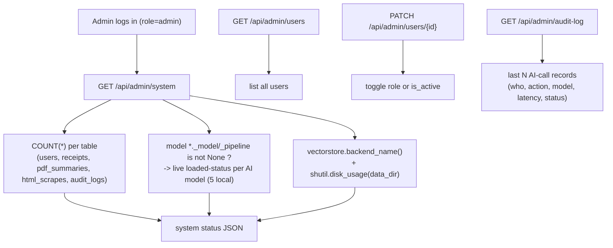

# Parchment — Function & Model Flowcharts

> Companion to [`architecture.md`](architecture.md). Also embedded in [`docs/guide.html`](docs/guide.html).
> Each diagram traces one feature end-to-end through the actual function names in `backend/app/`.

## 1. Authentication (`routers/auth.py`, `security.py`)

Identical to the Week1/11 PoCs — same JWT + bcrypt design, same shape-only email validator (not `EmailStr`, which broke `.local` admin logins in the Week1 PoC — see that project's `debug/issue-02`), reused here from the start rather than rediscovered.



## 2. Receipt Extraction — OCR vs. VLM side by side (`ml/ocr.py`, `ml/vlm.py`, `ml/llm.py`, `routers/receipts.py`)



> The highlighted box makes a common lesson literal: SmolVLM never runs OCR at all — it reads the image's pixels and answers directly, which is exactly the "pretrained multimodal AI" alternative to training a custom CNN.

## 3. PDF Summarization — with scanned-PDF OCR fallback (`etl/pdf_utils.py`, `ml/summarizer.py`, `routers/pdfs.py`)



## 4. HTML Table Parsing (`etl/html_utils.py`, `routers/tables.py`)



## 5. Document Library — near-duplicate detection, not RAG (`ml/dedupe.py`, `routers/library.py`)



> This is the entire vector-DB feature's scope: one similarity check per new document, never a "search my documents" UI and never text fed back into an LLM's context. Full retrieve-then-answer search over this same corpus is deliberately left out of scope as a separate, future feature — see `architecture.md` §4.

## 6. Admin Console (`routers/admin.py`)



## 7. Container bootstrap sequence (`main.py`)

```mermaid
sequenceDiagram
    autonumber
    participant D as Docker (docker compose up)
    participant U as Uvicorn / FastAPI
    participant BG as background thread
    participant FED as federalreserve.gov (sample PDF)
    participant HF as HuggingFace Hub

    D->>U: start container, run CMD
    U->>U: Base.metadata.create_all() (SQLite tables)
    U->>U: _seed_admin() (idempotent)
    U->>BG: spawn _warm_cache() thread
    U-->>D: /api/health responds 200 immediately

    Note over BG: each step below runs in its own\ntry/except (_warm_step) — an unrelated\nstep's failure never blocks the others.
    BG->>BG: ensure_sample_receipts() [isolated step, no network]
    BG->>FED: ensure_sample_pdf() [isolated step]
    FED-->>BG: Fed Monetary Policy Report PDF
    BG->>BG: check tesseract binary [isolated step, no network]
    BG->>HF: load SmolVLM, Qwen2.5-0.5B, distilbart,\nall-MiniLM-L6-v2 (4 independently-isolated steps)
    HF-->>BG: model weights (cached to named volume)
    BG->>U: log per-step result; "all warm" only if every step succeeded

    Note over D,U: GET /api/health/ready reports real per-model +\nper-step status; a failed sample-data step self-heals\nthe next time a real request needs it.
```
