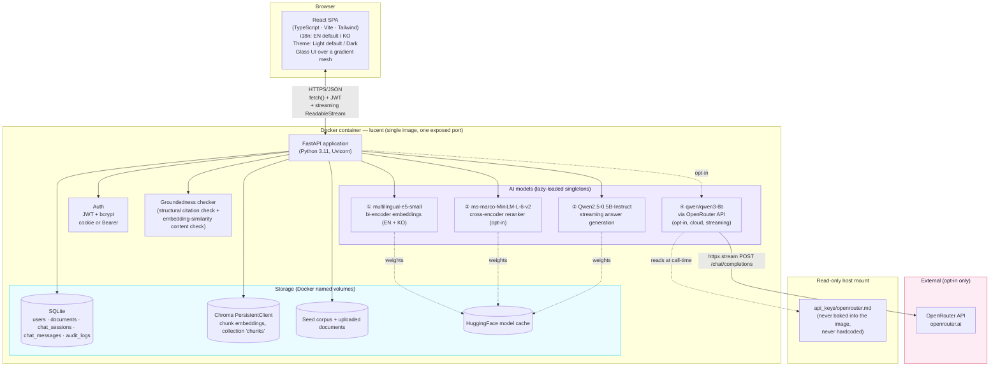
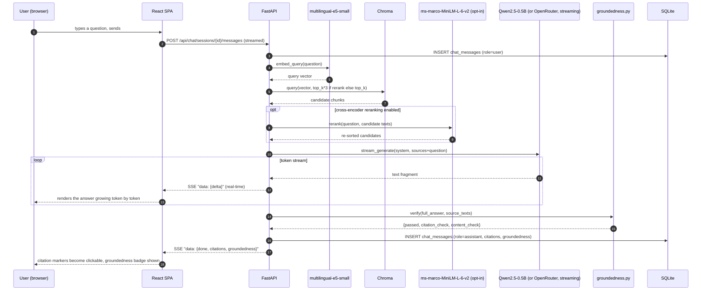
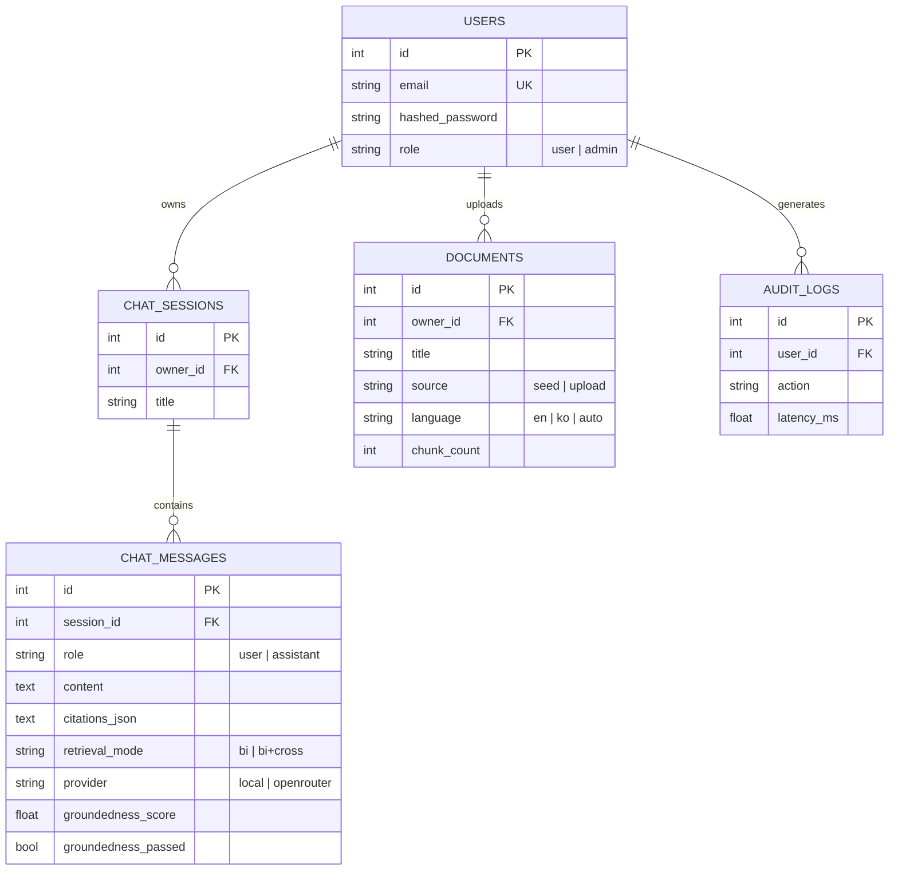

# Lucent — 아키텍처

> Week4 PoC · AI 지식 어시스턴트
> 이 문서는 (동일한 다이어그램과 함께) [`docs/guide.html`](docs/guide.html)에도 그대로 내장되어 있습니다.

## 1. 시스템 개요

Lucent는 단일 컨테이너 풀스택 애플리케이션입니다: FastAPI 백엔드가 정적 파일로 서빙하는 React(TypeScript) SPA가 있고, 이 백엔드는 4개의 AI 모델(로컬 3개, 선택적 클라우드 1개)을 REST + 스트리밍 API 뒤에 두며, SQLite(정형 데이터)와 Chroma(벡터 데이터)를 저장소로 사용합니다 — Week1-12 PoC들과 동일하게 검증된 형태를, 이번 주의 핵심 주제(임베딩, VectorDB 검색, 근거 기반 답변 생성)에 적용해 여러 기능 중 하나가 아니라 진짜 플래그십 제품으로 완성했습니다.

## 2. 일반적인 초기 구현을 뛰어넘는 엔지니어링 완성도

이 RAG 패턴의 일반적인 초기 구현 — 빠르게 만든 단일 세션용 프로토타입 형태 — 은 실제로 동작하는 Streamlit 앱인 경우가 많습니다. 아래 비교표는 "더 고급화되었다"는 말이 구체적이고 검증 가능한 의미를 가지도록 정확하게 정리한 것입니다.

| 비교 항목 | 일반적인 베이스라인 구현 | Lucent |
|---|---|---|
| 답변 생성 | 기본 경로에서 **LLM 호출이 전혀 없음** — 검색된 최상위 1개 청크를 그대로 반환하는 규칙 기반 템플릿. LLM을 통한 다듬기는 로컬 커맨드라인 AI 코딩 어시스턴트를 셸에서 호출하는 옵트인 기능일 뿐. | 실제 LLM(로컬 Qwen2.5-0.5B 또는 OpenRouter qwen3-8b)이 매번 여러 출처를 종합해 인용이 포함된 답변을 생성하며, **토큰 단위로 스트리밍**됨. |
| 벡터 저장소 | `chromadb.Client()` — **인메모리**, 재시작마다 초기화됨. | `chromadb.PersistentClient()` — 재시작 후에도 유지됨. |
| 청킹 | 문자 수 기준 슬라이싱, **overlap 없음**(overlap은 입문 자료에서 개념적으로만 다뤄지는 경우가 많고, 실제 구현에는 반영되지 않는 경우가 흔함). | 단어 수 기준 청킹, **실제 overlap 적용**(500단어/50단어 overlap), Week2/12 PoC에서 검증된 패턴. |
| 대화 | 단발성 질의응답 — 이력 없음. | 이력이 저장되는 다중턴 채팅 세션. |
| 근거 검증 | 없음 — 답변이 검색된 원문 그대로(그런 의미에서 자명하게 "근거 있음")이거나, 검증되지 않은 CLI 다듬기 결과일 뿐. | 모든 LLM 생성 답변에 대해 명시적으로 계산된 근거검증 결과(인용 유효성 + 문장 단위 임베딩 유사도). |
| 검색 투명성 | 단일 순위 리스트, 비교 없음. | bi-encoder와 cross-encoder 순위를 나란히 보여주는 전용 검색 실험실 페이지, 채팅 내 토글 포함. |
| 코퍼스 | 한국어 이커머스 FAQ 8건(단일 언어). | 실제 역사 에세이 85편(영어) + 동일 주제의 실제 한국어 위키백과 문서 — 임베딩 모델의 다국어 지원 주장을 실제로 검증. |
| UI | Streamlit, 단일 언어/테마. | 커스텀 글래스모피즘 React UI, 이중언어, 라이트/다크, 실시간 스트리밍 렌더링. |

이는 그 베이스라인 접근 방식에 대한 비판이 아닙니다 — 이런 초기 구현은 대개 하루짜리 실습이나 빠른 프로토타입을 목적으로 범위가 정해지며, 기본 경로를 100% 키 불필요·의존성 최소화 상태로 유지한 것은 오히려 올바른 설계입니다. Lucent는 동일한 아이디어를 실제로 끝까지 구현했을 때 어떤 *상용* 버전이 나오는지를 보여주기 위한 PoC로 범위를 잡았습니다.

## 3. 이 스택을 선택한 이유

| 선택 | 근거 |
|---|---|
| **Week1-12 PoC들과 동일한 FastAPI + React 템플릿** | 이미 검증되고 단단해진 아키텍처(인증, 관리자, Docker, readiness probing, 격리된 부트스트랩 단계)를 의도적으로 재사용 — 구체적으로 무엇이 이어졌는지는 §6 참고. |
| **진짜 토큰 단위 스트리밍** | 이번 브리프가 요구하는 채팅 경험에 필수적 — 로컬 모델은 백그라운드 스레드에서 `transformers.TextIteratorStreamer`로, OpenRouter는 OpenAI 호환 SSE 파싱(`stream: true`)으로 구현했으며, 두 경로 모두 프론트엔드가 `fetch()` + `ReadableStream`으로 소비하는 하나의 통일된 `StreamingResponse`로 노출됨(단순 `EventSource`는 채팅 메시지에 필요한 POST 바디를 실어 보낼 수 없음). |
| **세 번째로 완전히 다른 시각 정체성** | Week1/11 PoC(`CommerceIQ`, `VoxIQ`)는 동일한 쿨블루·고정 사이드바 스타일을 공유하고, Week3 PoC(`Parchment`)는 따뜻한 세리프/테라코타·상단 탭 스타일을 사용했습니다. 더 투명하고 고급스럽고 세련된 UI를 명시적으로 요구한 이번 라운드의 요청에 따라, Lucent는 그라데이션 메시 위의 반투명 유리 패널, 굵기 기반 위계를 갖는 단일 산세리프 계열(Manrope), 떠 있는 둥근 사이드바를 사용합니다 — 세 번째 내비게이션 패턴이자 세 번째 색상/타이포그래피 언어입니다. 구체적으로 적용된 패턴은 `reference_skills/interface-craft`의 타이포그래피·레이아웃 가이드 참고. |
| **Week3의 수치 교차검증에서 일반화된 근거검증** | Week3의 PDF 요약기는 요약문이 언급한 모든 숫자가 원문에 실제로 존재하는지 검증했습니다. Lucent는 이 "검증 없이 믿지 않는다"는 원칙을 전체 RAG 답변으로 일반화했습니다: 인용 인덱스 유효성 + 문장 단위 임베딩 유사도 기반 근거검증. |
| **4개 AI 모델, 로컬 3개 + 선택적 클라우드 1개** | `intfloat/multilingual-e5-small`(교차언어 데모에서 핵심 근거가 되는 다국어 지원 성능 때문에 특별히 선택), `cross-encoder/ms-marco-MiniLM-L-6-v2`(Week2 PoC에서 재사용), `Qwen2.5-0.5B-Instruct`(Week1-12 PoC들에서 재사용) 모두 로컬에서 동작하며 이미 검증됨. OpenRouter의 `qwen/qwen3-8b`가 유일한 클라우드 경로이며, 옵트인이고 이번 라운드에서 실제 키로 검증됨. |

## 4. 데이터 흐름 — 대표 요청 하나 (스트리밍 채팅 메시지)

## 5. 저장소 모델

문서의 모든 청크는 (`multilingual-e5-small`로) 추가로 임베딩되어 **Chroma** `PersistentClient` 컬렉션(`chunks`)에 upsert됩니다 — SQL 행이 문서와 대화의 시스템 오브 레코드(system of record)이고, 벡터 저장소는 재시작에도 살아남는 파생 검색 인덱스입니다. 이 "레코드 + 인덱스" 분리 구조는 이 프로젝트 시리즈 전반에서 사용된 패턴입니다.

## 6. Week1-12 PoC들에서 이어받은 하드닝(처음부터 적용됨)

| 이전에 발견된 문제 | 여기서 처음부터 적용된 대응 |
|---|---|
| 배달 가능성까지 검사하는 `EmailStr`가 `.local` 관리자 로그인을 깨뜨림(Week1) | 인증은 `EmailStr`가 아니라 형태만 검사하는 동일한 정규식 검증기 사용 |
| 콜드스타트 상태의 기능이 버그처럼 보임(Week1) | `GET /api/health/ready`와 `verify_e2e.py`의 워밍업 대기 단계를 최초 빌드부터 포함 |
| 부트스트랩 단계 하나가 실패하면 나머지도 조용히 건너뛰어짐(Week1) | `_warm_step()`이 처음부터 4개 시작 단계를 서로 격리 |
| `run.sh`가 이미 실행 중인 컨테이너를 불필요하게 재생성함(Week1) | "이미 실행 중이면 URL만 알려준다"는 검사를 `run.sh`에 처음부터 포함 |
| 진짜로 긴 문서에서 느린 map-reduce 루프가 HTTP 타임아웃을 넘길 수 있음(Week3) | 채팅 생성은 첫 토큰부터 스트리밍되며 하나의 블로킹 응답으로 반환되지 않음 — 느린 비스트리밍 생성이 재현했을 문제 자체가 여기서는 발생하지 않음 |
| 검증 로직 자체가 틀릴 수 있음(Week3의 퍼센트 표기 오탐 사례) | `groundedness.py`의 콘텐츠 검사는 정확 일치가 아니라 유사도 *임계값*을 사용해 동일한 유형의 오탐 거부를 방지 |

이 빌드의 실제 `verify_e2e.sh` 통과/실패 결과는 `history/v1.0.0.md`, 이번 라운드에서 발견된 실제 버그는 `debug/` 참고.

## 7. 상용/클라우드 확장 — 무엇이 달라질까

Week1-12 PoC들과 동일한 형태입니다(전체 표/다이어그램은 해당 프로젝트들의 `architecture.md` 참고) — 앱 티어 복제, 관리형 Postgres, 관리형/확장형 벡터 DB, 대규모 트래픽에서의 로컬 LLM/reranker용 GPU 노드 풀 — 여기에 Lucent 고유의 항목 하나가 추가됩니다: 트래픽이 여러 앱 레플리카에 로드밸런싱되면 **스트리밍 응답에는 세션 어피니티 또는 메시지 큐 기반 스트리밍 레이어**(예: Redis pub/sub 또는 WebSocket 게이트웨이)가 필요합니다. 일반 HTTP 스트리밍 응답은 시작한 레플리카에 고정되기 때문입니다.

### 소규모 상용 스케일에서의 월간 비용 추정
(일간 활성 사용자 ~500명, 일 채팅 메시지 ~3천 건 기준. 아래 수치는 2026년 8월 기준 공개된 표준 가격을 참고한 지표성 추정치이며, 실제 예산 산정 전에는 반드시 현재 공급사 가격을 다시 확인해야 합니다)

| 항목 | 가정 | 월간 예상 비용 |
|---|---|---|
| 앱 호스팅(Cloud Run / Fargate, 2 vCPU / 4GB) | 모델을 warm 상태로 유지하기 위한 상시 가동 인스턴스 1~2개 | $70–140 |
| 관리형 Postgres | 인스턴스 1개 + 일 단위 백업 | $60–90 |
| 관리형 벡터 DB(동일 Postgres 위의 pgvector, 또는 관리형 서비스) | pgvector: 추가 비용 없음 / 관리형: 사용량 기반 | $0–50 |
| GPU 버스트(대규모 트래픽에서의 로컬 LLM) | 월 ~20 GPU시간 | $15–30 |
| OpenRouter(`qwen/qwen3-8b`, 옵트인 전용) | 일 ~15만 토큰, $0.117/$0.455 per M | $10–25 |
| 모니터링/로깅 | 기본 관리형 티어 | $0–20 |
| **총계(지표성)** | | **≈ 월 $155 – 355** |

## 8. 배포 시 고려사항

Week1-12 PoC들과 동일한 핵심 목록입니다(환경 동등성, 실제 시크릿 매니저를 통한 비밀값 관리, Postgres + alembic 마이그레이션, 실제 프론트엔드 오리진으로 제한된 CORS) — 여기에 Lucent 고유의 항목 하나가 추가됩니다: **스트리밍 엔드포인트는 리버스 프록시/로드밸런서가 응답을 버퍼링하지 않도록 설정해야 합니다**(예: nginx에서 `proxy_buffering` 비활성화, 또는 관리형 로드밸런서의 동등 설정) — 전체 응답을 버퍼링한 뒤 전달하는 프록시는 스트리밍 답변을 조용히 블로킹 응답으로 되돌려 버립니다.
