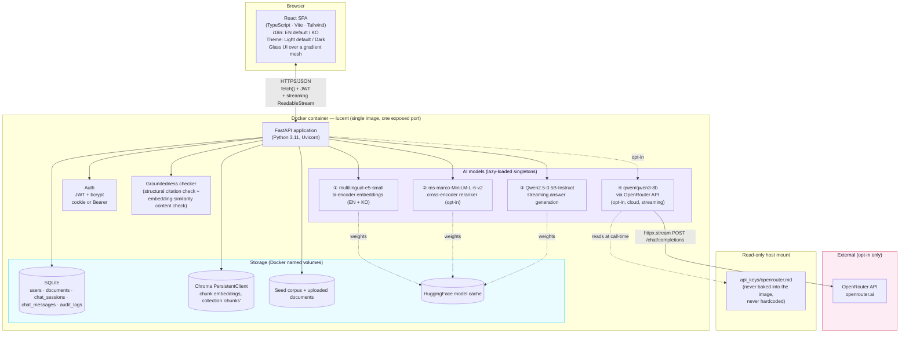
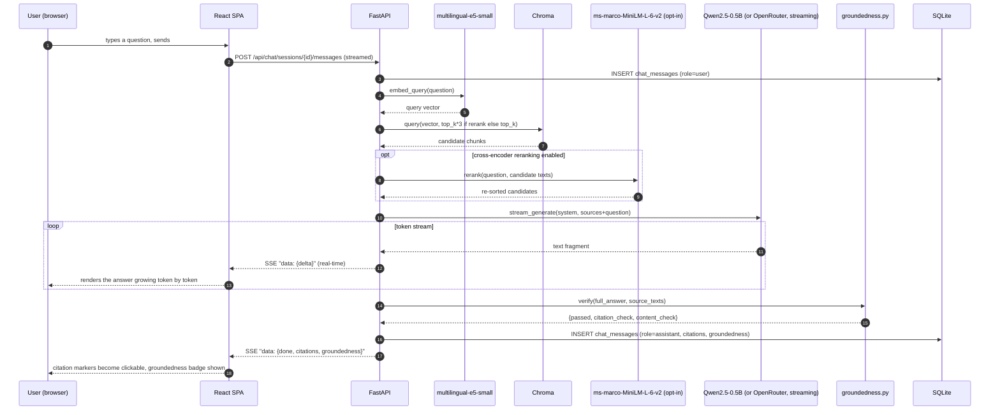
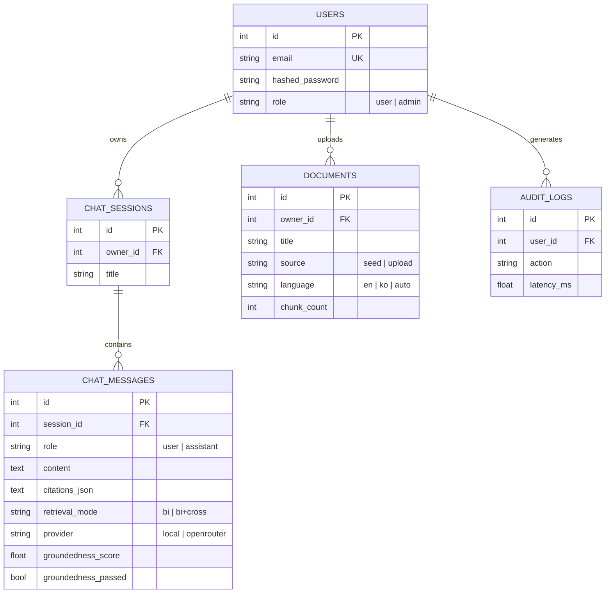

# Lucent — Architecture

> Week4 PoC · AI Knowledge Assistant
> This document is also embedded (with the same diagrams) inside [`docs/guide.html`](docs/guide.html).

## 1. System overview

Lucent is a single-container full-stack application: a React (TypeScript) single-page app served as static files by a FastAPI backend, which hosts four AI models (three local, one optional cloud) behind a REST + streaming API, backed by SQLite (structured data) and Chroma (vector data) — the same proven shape as the Week1-12 PoCs, applied to Week4's central topic (embeddings, VectorDB retrieval, citation-grounded generation) as a genuine flagship product rather than one feature among several.

## 2. Engineering depth beyond a typical first-pass implementation

A typical first-pass implementation of this RAG pattern — the kind built as a quick single-session prototype — is a real, working Streamlit app, and the comparison table below is worth being exact about, since "more advanced" should mean something specific and checkable:

| Dimension | Typical baseline implementation | Lucent |
|---|---|---|
| Answer generation | **No LLM call in the default path at all** — a rule-based template that returns the top-1 retrieved chunk verbatim. LLM polish is opt-in via shelling out to a local command-line AI coding assistant. | A real LLM (local Qwen2.5-0.5B or OpenRouter qwen3-8b) generates a synthesized, cited answer from multiple sources every time, **streamed token by token**. |
| Vector store | `chromadb.Client()` — **in-memory**, resets on every restart. | `chromadb.PersistentClient()` — survives restarts. |
| Chunking | Character-count slicing, **no overlap** implemented (overlap is often discussed only conceptually in introductory material, never actually wired into the shipped chunker). | Word-count chunking **with real overlap** (500 words / 50-word overlap), the pattern validated in the Week2/12 PoCs. |
| Conversation | Single question in, single answer out — no history. | Multi-turn chat sessions with persisted history. |
| Grounding check | None — the answer is either the verbatim top chunk (trivially "grounded") or an unchecked CLI-polished rewrite. | An explicit, computed groundedness verdict (citation validity + per-sentence embedding-similarity) on every LLM-generated answer. |
| Retrieval transparency | Single ranked list, no comparison. | A dedicated Retrieval Lab page showing bi- vs. cross-encoder rankings side by side, plus an in-chat toggle. |
| Corpus | 8 short Korean e-commerce FAQ entries (single language). | 85 real historical essays (English) + a topically-matching real Korean Wikipedia article — genuinely exercises the embedding model's multilingual claim. |
| UI | Streamlit, single language/theme. | Custom glass-morphism React UI, bilingual, light/dark, real-time streaming rendering. |

This isn't a criticism of that baseline approach — a first-pass implementation like this is often scoped for a one-day classroom exercise or quick prototype, and correctly keeps its default path 100% key-free and dependency-light. Lucent is scoped as a PoC meant to show what a *commercial* version of the same idea looks like once actually built out.

## 3. Why this stack

| Choice | Reasoning |
|---|---|
| **Same FastAPI + React template as the Week1-12 PoCs** | A proven, already-hardened architecture (auth, admin, Docker, readiness probing, isolated bootstrap steps) is reused deliberately — see §6 for the specific hardening carried over. |
| **Real token-by-token streaming** | The chat experience this brief calls for needs it — implemented with `transformers.TextIteratorStreamer` on a background thread for the local model, and OpenAI-compatible SSE parsing (`stream: true`) for OpenRouter, both exposed to the browser as one unified `StreamingResponse` the frontend consumes via `fetch()` + `ReadableStream` (a plain `EventSource` can't carry the POST body a chat message needs). |
| **A third, distinct visual identity** | The Week1/11 PoCs (`CommerceIQ`, `VoxIQ`) share an identical cool-blue, flush-sidebar look; the Week3 PoC (`Parchment`) used a warm serif/terracotta, top-tab look. Per this round's explicit request for a more transparent, advanced, polished UI, Lucent uses translucent glass panels over a gradient mesh, one weight-driven sans family (Manrope), and a floating rounded sidebar — a third navigation pattern and a third color/typography language. See `reference_skills/interface-craft`'s typography and layout guides for the specific patterns applied. |
| **Groundedness checking generalized from Week3's numeric cross-check** | Week3's PDF Summarizer verified that every number a summary stated appeared in its source text. Lucent generalizes the same "verify, don't just trust" discipline to a full RAG answer: citation-index validity plus per-sentence embedding-similarity grounding. |
| **4 AI models, 3 local + 1 optional cloud** | `intfloat/multilingual-e5-small` (chosen specifically because its multilingual coverage is load-bearing for the cross-lingual demo), `cross-encoder/ms-marco-MiniLM-L-6-v2` (reused from the Week2 PoC), and `Qwen2.5-0.5B-Instruct` (reused from the Week1-12 PoCs) are all local and already-validated. OpenRouter's `qwen/qwen3-8b` is the one cloud path, opt-in and validated with a real key this round. |

## 4. Data flow — one representative request (streamed chat message)

## 5. Storage model

Every document's chunks are additionally embedded (`multilingual-e5-small`) and upserted into a **Chroma** `PersistentClient` collection (`chunks`) — the SQL rows are the system of record for documents and conversations, the vector store is the derived, restart-surviving search index, the same "record + index" split used throughout this project series.

## 6. Hardening carried over from the Week1-12 PoCs (applied from day one here)

| Prior finding | Applied here from the start |
|---|---|
| Deliverability-checking `EmailStr` broke `.local` admin logins (Week1) | Auth uses the same shape-only email regex validator, not `EmailStr` |
| Cold-start feature timeouts looked like bugs (Week1) | `GET /api/health/ready` + a `verify_e2e.py` wait-for-warm step exist from the first build |
| One failed bootstrap step silently skipped the others (Week1) | `_warm_step()` isolates each of the 4 startup steps from the start |
| `run.sh` needlessly recreated an already-running container (Week1) | The "already running? just report the URL" check is in `run.sh` from the start |
| A slow map-reduce loop can blow past an HTTP timeout on a genuinely long real document (Week3) | Chat generation is streamed from the first token, not returned as one blocking response — the exact class of problem a slow non-streaming generation would have reintroduced here doesn't arise |
| A verification check can itself be wrong (Week3's percent-notation false-positive) | `groundedness.py`'s content check uses a similarity *threshold*, not exact matching, specifically to avoid the same class of false-positive rejection |

See `history/v1.0.0.md` for this build's actual `verify_e2e.sh` pass/fail results, and `debug/` for any real bugs found this round.

## 7. Production / cloud scaling — what would change

Same shape as the Week1-12 PoCs (see those projects' `architecture.md` for the full table/diagram) — app-tier replication, managed Postgres, a managed/scaled vector DB, a GPU node pool for the local LLM/reranker at volume — plus one Lucent-specific item: **streaming responses need session affinity or a message-queue-backed streaming layer** (e.g. Redis pub/sub or a WebSocket gateway) once traffic is load-balanced across multiple app replicas, since a plain HTTP streaming response is pinned to the replica that started it.

### Estimated monthly cost at small commercial scale
(~500 daily active users, ~3k chat messages/day; figures below are indicative public list prices as of Aug 2026 — always re-check current provider pricing before budgeting for real)

| Item | Assumption | Est. monthly cost |
|---|---|---|
| App hosting (Cloud Run / Fargate, 2 vCPU / 4GB) | 1–2 instances, always-on for warm models | $70–140 |
| Managed Postgres | 1 instance + daily backup | $60–90 |
| Managed vector DB (pgvector on the same Postgres, or a managed service) | pgvector: $0 extra / managed: usage-based | $0–50 |
| GPU burst (local LLM at volume) | ~20 GPU-hours/mo | $15–30 |
| OpenRouter (`qwen/qwen3-8b`, opt-in only) | ~150k tokens/day @ $0.117/$0.455 per M | $10–25 |
| Monitoring/logging | Basic managed tier | $0–20 |
| **Total (indicative)** | | **≈ $155 – 355 / month** |

## 8. Deployment considerations

Same core list as the Week1-12 PoCs (environment parity, secrets via a real secret manager, Postgres + alembic migrations, CORS restricted to the real frontend origin) — with one Lucent-specific addition: **streaming endpoints need their reverse proxy/load balancer configured to not buffer the response** (e.g. disable `proxy_buffering` on nginx, or the equivalent on a managed load balancer) — a proxy that buffers the whole response before forwarding it would silently turn a streaming answer back into a blocking one.
