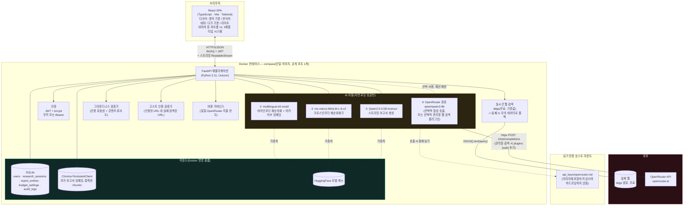
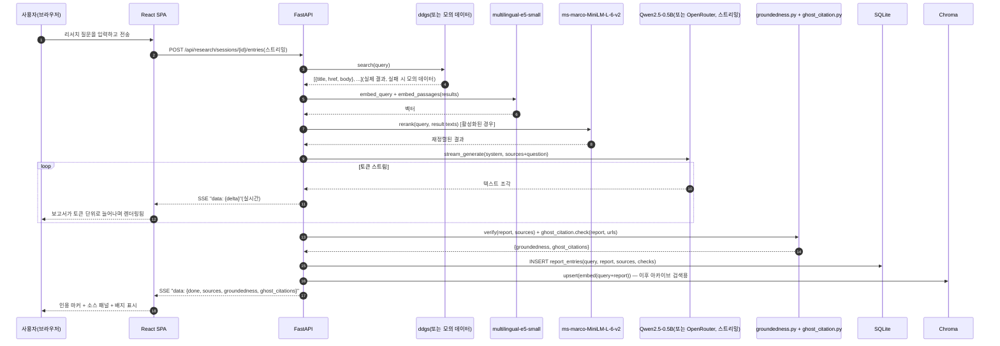
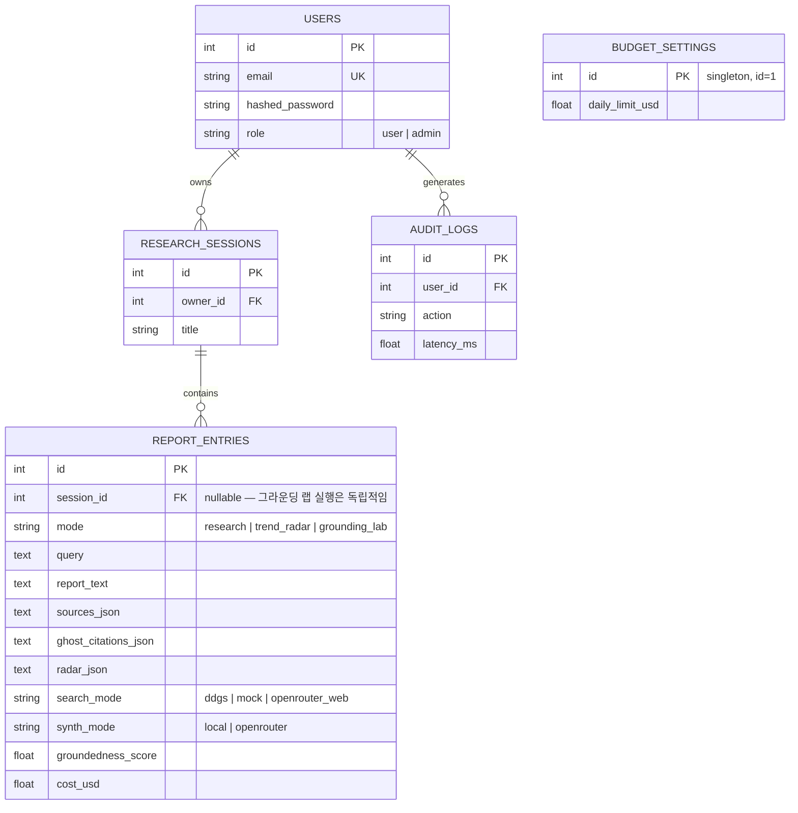

# Compass — 아키텍처

[English](architecture.md) | **한국어**

> Week5_1 PoC · 웹 검색 기반 리서치 어시스턴트
> 이 문서는 동일한 다이어그램과 함께 [`docs/guide.html`](docs/guide.html)에도 포함되어 있습니다.

## 1. 시스템 개요

Compass는 단일 컨테이너로 실행되는 풀스택 애플리케이션입니다. React(TypeScript) 단일 페이지 앱을 FastAPI 백엔드가 정적 파일로 제공하고, 백엔드는 REST + 스트리밍 API 뒤에서 4개의 AI 모델(로컬 3개, 선택적 클라우드 1개)을 호스팅하며, SQLite(구조화 데이터)와 Chroma(벡터 데이터)를 저장소로 사용합니다 — Week1-4 PoC들에서 검증된 것과 동일한 구조를, Week5_1의 핵심 주제(검색 API, 임베딩 기반 재순위화, 검색+LLM 그라운딩)에 진정한 플래그십 제품으로 적용한 형태입니다.

Week4의 Lucent와의 핵심 구조적 차이점은 **색인화할 고정된 로컬 코퍼스가 없다는 점**입니다. 검색은 쿼리마다 실제 웹을 대상으로 실시간으로 이루어지며, 따라서 벡터 저장소의 역할은 "지식 베이스 자체"에서 "Compass 자신의 과거 출력물에 대한 아카이브 색인"으로 바뀝니다. 그리고 지난주의 `etl/` 시드 코퍼스 파이프라인은 새로운 `search/` 계층으로 대체됩니다.

## 2. 엔지니어링 깊이: 일반적인 초기 구현보다 실제로 더 발전된 부분

이 "검색 + LLM 그라운딩" 패턴의 일반적인 초기 구현은 실제로 동작하는 Streamlit 앱이며, 아래 비교표는 정확하게 짚어볼 가치가 있습니다.

| 차원 | 일반적인 초기 구현 | Compass |
|---|---|---|
| 답변 생성 | 기본 경로에는 **LLM 호출이 전혀 없습니다** — `_rule_based_report()`는 재순위화된 스니펫을 나열하는 단순한 Python 템플릿입니다. Gemini/CLI 다듬기는 선택 사항이며 이 빌드에는 없는 환경 변수와 키/CLI 로그인이 필요합니다. | 실제 LLM(로컬 Qwen2.5-0.5B 또는 OpenRouter qwen3-8b)이 매번 실시간 검색 결과로부터 인용이 달린 보고서를 합성하며, **토큰 단위로 스트리밍**됩니다. |
| 지속성 | **없음** — DB도 벡터 저장소도 없으며, 모든 실행은 상태를 갖지 않는 단발성 인메모리 처리입니다. | SQLite(세션/보고서/감사/예산) + Chroma `PersistentClient`(아카이브 색인) — 둘 다 재시작 후에도 유지됩니다. |
| 대화 | 단일 검색 → 단일 보고서, 단일 Streamlit 페이지, 이력 없음. | 이력이 저장되는 다중 턴 리서치 세션과 턴마다 `[n]` 인용이 달린 보고서. |
| 검증 | 없음 — 규칙 기반 경로는 구조적으로 "환각 위험이 0"이므로 실제로 검증할 것이 없습니다. | LLM이 생성한 모든 보고서에 대해 독립적으로 계산되는 두 가지 검증: 인용 색인 유효성 + 콘텐츠 유사도 기반 그라운드니스(Week4에서 재사용), **그리고** URL 수준의 고스트 인용 검증(새로 추가 — 흔히 입문 수준에서 다루는 URL 검증 기법을 일반화한 것으로, 초기 구현에서는 실제 기능으로 구현된 적이 없음). |
| 비용 관리 | "예산 한도"는 LLM 기반 앱에서 잘 알려진 비용 거버넌스 원칙입니다. **하지만 일반적인 초기 구현에는 비용 통제가 전혀 없습니다.** | 관리자가 설정 가능한 실제 일일 OpenRouter 지출 한도가 있으며, 한도에 도달하면 유료 경로를 자동으로 차단합니다 — 유료 호출을 시도하기 *전에* 강제되며, 사후 기록에 그치지 않습니다. |
| 검색 투명성 | 재순위화된 단일 목록뿐, 비교 없음. | Compass 자체 파이프라인과 OpenRouter의 완전 관리형 웹 검색 플러그인을 나란히 비교하는 전용 그라운딩 랩 — 지연 시간, 비용, 양쪽의 인용 정보를 모두 제공. |
| 트렌드/도구 평가 | 3관점(비용/보안/승인) 평가 프레임워크가 문서 안에 글로만 존재. | 프레임워크를 실제 구조화된 추출로 실행하는, 실제 검색 결과에 기반한 작동하는 트렌드 레이더 페이지 — "증거 불충분" 폴백도 정직하게 제공. |
| UI | Streamlit, 단일 언어/테마. | 네이비 톤의 커스텀 "차트룸" React UI, 이중 언어, 다크/라이트, 실제 스트리밍 렌더링, 실제 모션(레이더 스윕 로딩, 스켈레톤 시머). |

이는 그 초기 구현 방식을 비판하려는 것이 아닙니다 — 보통 짧은 실습형 과제에 맞춰 범위가 정해지고, 기본 경로를 의존성 없이 가볍게 유지하는 것이 올바른 선택이며, "구조적으로 환각이 0"인 기본값은 교육용 산출물로서 정당하고 방어 가능한 설계 선택입니다. Compass는 같은 아이디어를 실제로 구현했을 때 *상용* 버전이 어떤 모습이 되는지 보여주기 위한 PoC로 범위를 잡았습니다.

## 3. 이 기술 스택을 선택한 이유

| 선택 | 근거 |
|---|---|
| **Week1-4 PoC들과 동일한 FastAPI + React 템플릿** | 이미 검증되고 강화된 아키텍처(인증, 관리자, Docker, 준비 상태 프로빙, 독립된 부트스트랩 단계, 스트리밍 SSE 인프라)를 의도적으로 재사용했습니다 — 구체적으로 어떤 강화 사항이 이어졌는지는 §6을 참고하세요. |
| **기본 검색 백엔드로 `ddgs` 사용, 실패 시 모의 데이터 우선** | 무료이고 API 키가 필요 없으며, 표준적인 "모의 데이터 우선" 복원력 패턴과 일치합니다 — 다만 DuckDuckGo 자체 검색 결과를 스크래핑하는 비공식 클라이언트이므로, 런타임 실패는 장애가 아니라 예상되고 처리 가능한 케이스로 취급합니다. |
| **OpenRouter를 두 가지 방식으로, 키 하나로 사용** | 일반적인 채팅 완성 호출은 Compass 자체가 검색한 소스를 합성하는 데 사용되고(Week4에서 검증한 동일한 메커니즘), OpenRouter 자체의 `plugins:[{"id":"web"}]` 웹 검색 기능(기획 단계에서 공식 문서로 실제 동작을 확인함)은 추가로 Compass가 완전 관리형 대안과 비교할 수 있게 해줍니다 — 두 번째 클라우드 공급자/키를 도입하지 않고도 가능하며, 이 패턴의 일반적인 참고 스택이 서로 다른 검색/LLM 공급자 조합을 사용하는 경우에도 이 프로젝트 시리즈의 "OpenRouter만이 검증된 유일한 클라우드 API"라는 원칙을 그대로 유지합니다. |
| **네 번째로 구별되는 비주얼 아이덴티티이자, 이 시리즈 최초의 다크 기본 앱** | Week1/2(`CommerceIQ`, `VoxIQ`)은 시원한 블루 톤에 고정 사이드바를 사용하는 룩을 공유하고, Week3(`Parchment`)는 따뜻한 세리프체/테라코타 톤에 상단 탭 방식을 사용했으며, Week4(`Lucent`)은 반투명 인디고/시안 글래스 룩에 라이트 기본이었습니다. Compass는 네이비/브라스/틸 색상의 "차트룸" 팔레트, 고정된 커맨드 콘솔 + 아이콘 레일 내비게이션, 3계열 타입 시스템(세리프/산세리프/모노스페이스)을 사용하며 기본값이 다크입니다 — 매주 UI/UX 기준을 계속 끌어올리라는 이번 라운드의 명시적 요구에 따른 것입니다. 적용된 구체적인 패턴(이징 곡선, 지속 시간 단계, 스켈레톤 대 스피너 선택 기준)은 `reference_skills/interface-craft`의 모션 및 마이크로인터랙션·타이포그래피 가이드를 참고하세요. |
| **흔한 입문 기법을 일반화한 고스트 인용 검증** | 인용 검증에 대한 흔한 입문 수준 접근 방식은 정규식으로 인용된 URL을 추출해 실제 검색 결과 URL과 비교하는 것을 가르칩니다 — Compass는 이를 강의용 개념으로 남겨두지 않고 실제로 항상 동작하는 검증 단계로 구현했습니다. |
| **AI 모델 4개, 로컬 3개 + 선택적 클라우드 1개** | `intfloat/multilingual-e5-small`과 `cross-encoder/ms-marco-MiniLM-L-6-v2`는 Week2/4 PoC에서 그대로 재사용했습니다(후자는 별개로, 이 패턴의 일반적인 초기 구현에서도 사용하는 동일한 재순위화 모델이기도 합니다 — 입문용으로는 해시 기반의 장난감 임베딩을 자리표시자로 가르치는 경우도 있지만, 이것이 실제 모델로 출시된 적은 없습니다). `Qwen2.5-0.5B-Instruct`는 Week1-4 PoC에서 재사용했습니다. OpenRouter의 `qwen/qwen3-8b`는 유일한 클라우드 경로로, 선택 사용이며 이번 라운드에 실제 키로 검증했습니다(두 호출 형태 모두). |

## 4. 데이터 흐름 — 대표 요청 1개(스트리밍 리서치 쿼리)

## 5. 저장소 모델

성공적으로 생성된 모든 보고서는 추가로 임베딩되어(`multilingual-e5-small`) **Chroma** `PersistentClient` 컬렉션에 upsert됩니다 — SQL 행이 원본 데이터(system of record)이고, 벡터 저장소는 재시작 후에도 유지되는 파생 시맨틱 색인으로서 아카이브 검색을 지원합니다. Week4과 달리 이 색인은 고정된 외부 코퍼스가 아니라 Compass *자신이 생성한 출력물*을 담고 있습니다.

## 6. Week1-4 PoC에서 이어받아 강화한 사항(이번 프로젝트에서는 처음부터 적용)

| 이전에 발견된 문제 | 이번에 처음부터 적용한 조치 |
|---|---|
| 배송 가능 여부까지 검사하는 `EmailStr`가 `.local` 관리자 로그인을 깨뜨림(Week1) | 인증은 `EmailStr`가 아니라 형식만 검사하는 동일한 이메일 정규식 검증기를 사용 |
| 콜드 스타트 시 기능 타임아웃이 버그처럼 보였음(Week1) | `GET /api/health/ready`와 준비 상태를 기다리는 `verify_e2e.py` 단계가 최초 빌드부터 존재 |
| 부트스트랩 단계 하나가 실패하면 나머지도 조용히 건너뛰어짐(Week1; Week4의 debug/issue-01로 재발) | `_warm_step()`이 시작 단계 4개 각각을 격리하며, **또한** `search/web_search.py`의 두 독립 페치 경로 각각도 격리(여기서는 실시간 소스가 하나뿐이라 해당 사항은 없지만, 격리 원칙 자체는 모든 부트스트랩 단계에 동일하게 적용) |
| 느린 맵-리듀스 루프가 실제 긴 문서에서 HTTP 타임아웃을 초과할 수 있었음(Week3) | 보고서 생성은 첫 토큰부터 스트리밍되며, 하나의 블로킹 응답으로 반환되지 않음 |
| 검증 로직 자체가 틀릴 수 있음(Week3의 퍼센트 표기 오탐 사례) | `groundedness.py`의 콘텐츠 검사는 정확 일치가 아니라 유사도 *임계값*을 사용 |
| 실시간 SSE 이벤트와 이를 다시 불러오는 REST 엔드포인트가 서로 다른 형태의 JSON을 반환해, 새로고침 시 UI 배지가 조용히 사라짐(Week4의 debug/issue-02) | `routers/research.py`의 `_entry_dict()`는 처음부터 스트리밍 이벤트의 중첩된 `groundedness` 구조와 일치하도록 작성했으며, 전용 E2E 회귀 검사도 함께 마련 |
| 탐욕적(greedy) 정규식이 실제 소형 모델 출력에 섞인 여분의 문자 하나를 잘못 매칭함(이번 주 자체 debug/issue-01) | `pipeline.py`의 `_extract_first_json_object()`는 탐욕적 `.*` 정규식 대신 중괄호 깊이 세기 방식을 사용 |

이번 빌드의 실제 `verify_e2e.sh` 성공/실패 결과는 `history/v1.0.0.md`를, 이번 라운드에서 발견된 실제 버그 하나는 `debug/`를 참고하세요.

## 7. 프로덕션/클라우드 확장 시 변경 사항

Week1-4 PoC들과 동일한 구조입니다(전체 표/다이어그램은 각 프로젝트의 `architecture.md`를 참고하세요) — 앱 계층 복제, 관리형 Postgres, 관리형/확장된 벡터 DB, 대량 트래픽 시 로컬 LLM/재순위화 모델용 GPU 노드 풀, 스트리밍 응답을 위한 세션 어피니티까지 동일합니다 — 여기에 Compass만의 항목이 하나 추가됩니다. **SLA가 있는 실제 웹 검색 API**(현재의 `ddgs`처럼 최선형·비공식 방식이 아닌)가 데모 수준을 넘어서는 순간 가장 먼저 교체해야 할 항목입니다. `ddgs` 자체 문서에서도 교육용 소프트웨어임을 명시하고 있기 때문입니다.

### 소규모 상용 환경의 월간 예상 비용
(일일 활성 사용자 약 500명, 하루 약 1,500건의 리서치 쿼리. 아래 수치는 2026년 8월 기준 공개 정가를 바탕으로 한 참고치이므로 실제 예산을 편성하기 전에 공급자의 최신 가격을 반드시 다시 확인하세요)

| 항목 | 가정 | 월간 예상 비용 |
|---|---|---|
| 앱 호스팅(Cloud Run / Fargate, 2 vCPU / 4GB) | 인스턴스 1~2개, 모델 워밍 유지를 위해 상시 실행 | $70–140 |
| 관리형 Postgres | 인스턴스 1개 + 일일 백업 | $60–90 |
| 관리형 벡터 DB(동일 Postgres의 pgvector 또는 관리형 서비스) | pgvector: 추가 $0 / 관리형: 사용량 기반 | $0–50 |
| GPU 버스트(대량 트래픽 시 로컬 LLM) | 월 약 20 GPU 시간 | $15–30 |
| 실제 라이선스 웹 검색 API(`ddgs`의 프로덕션 대체) | 사용량 구간별 과금, 예: Bing/Brave/Serper급 가격 정책 | $50–300 |
| OpenRouter(`qwen/qwen3-8b` 합성, 선택 사용) | 일 약 8만 토큰, 100만 토큰당 $0.117/$0.455 | $6–15 |
| OpenRouter 관리형 웹 검색(그라운딩 랩 / 선택적 "스마트 검색") | 일 약 200건, 건당 약 $0.007–0.012 | $40–75 |
| 모니터링/로깅 | 기본 관리형 요금제 | $0–20 |
| **합계(참고치)** | | **월 약 $240–720** |

Week4의 Lucent보다 눈에 띄게 높은 수준입니다 — 실제 라이선스 검색 API와 종량제 웹 검색 호출은 고정된 로컬 문서 코퍼스에는 없던 새로운 지속 비용이기 때문입니다.

## 8. 배포 고려 사항

Week1-4 PoC들과 핵심 항목은 동일합니다(환경 일치성, 실제 비밀 관리자를 통한 비밀값 관리, Postgres + alembic 마이그레이션, 실제 프런트엔드 오리진으로 제한한 CORS, 스트리밍 엔드포인트에는 프록시 버퍼링 비활성화) — 여기에 Compass만의 항목이 하나 추가됩니다. **프로덕션 배포에서는 동시 요청에도 견고하게 동작하는 별도의 예산 한도 강제 로직이 필요합니다**(이 PoC의 단일 프로세스·단일 DB 트랜잭션 기반 "확인 후 지출" 방식은 데모에는 충분하지만, 실제 동시 부하 상황에서는 진짜 TOCTOU 경쟁 조건이 발생합니다 — 프로덕션 버전에서는 애플리케이션 코드에서 조회 후 비교하는 방식이 아니라, 예를 들어 DB 수준의 `UPDATE ... WHERE spent + cost <= limit` 같은 원자적 예약이나 분산 속도 제한기가 필요합니다).
