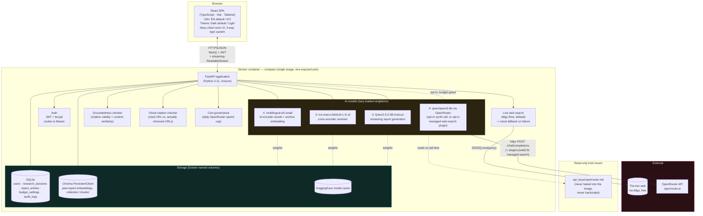
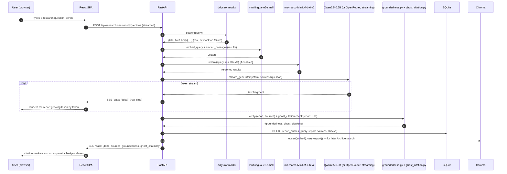
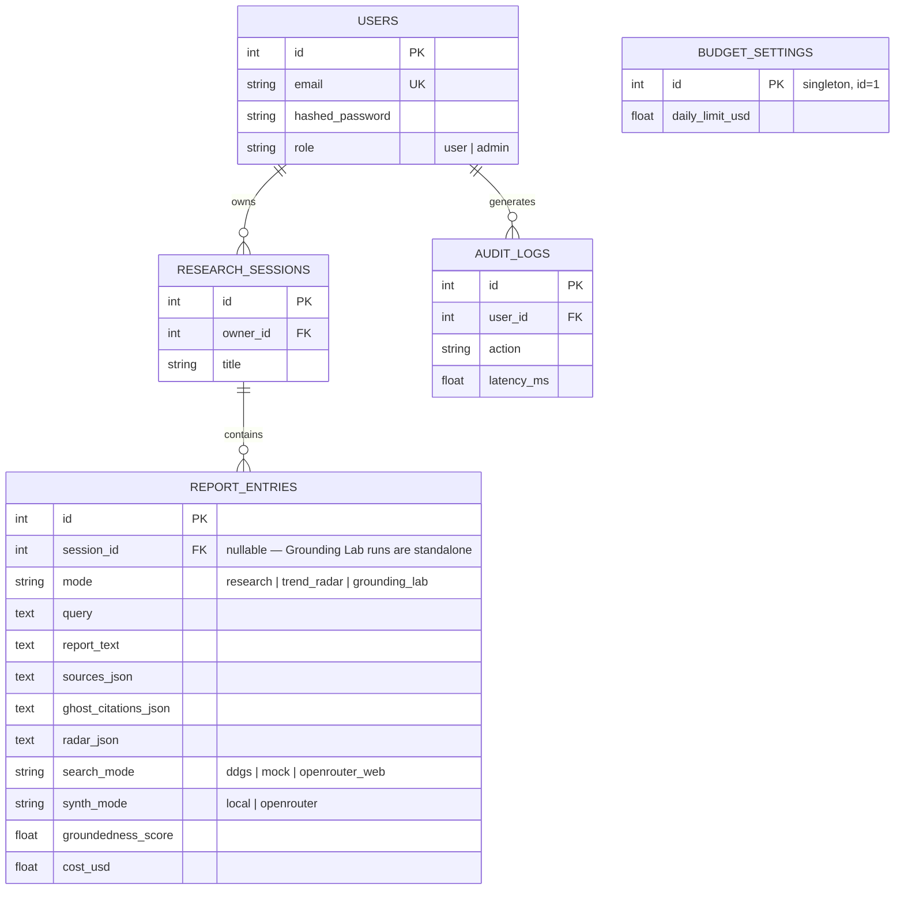

# Compass — Architecture

> Week5_1 PoC · Web-Search-Grounded Research Assistant
> This document is also embedded (with the same diagrams) inside [`docs/guide.html`](docs/guide.html).

## 1. System overview

Compass is a single-container full-stack application: a React (TypeScript) single-page app served as static files by a FastAPI backend, which hosts four AI models (three local, one optional cloud) behind a REST + streaming API, backed by SQLite (structured data) and Chroma (vector data) — the same proven shape as the Week1-4 PoCs, applied to Week5_1's central topic (search APIs, embedding-based reranking, search+LLM grounding) as a genuine flagship product.

The key structural difference from Week4's Lucent: **there is no fixed local corpus to index.** Retrieval happens live, per query, against the actual web — so the vector store's role shifts from "the knowledge base itself" to "an archive index over Compass's own past output," and a new `search/` layer replaces last week's `etl/` seed-corpus pipeline.

## 2. Engineering depth: what's genuinely more advanced than a typical baseline implementation

A typical baseline implementation of this "search + LLM grounding" pattern is a real, working Streamlit app — and this comparison table is worth being exact about:

| Dimension | Typical baseline implementation | Compass |
|---|---|---|
| Answer generation | **No LLM call in the default path at all** — `_rule_based_report()` is a plain Python template listing reranked snippets. Gemini/CLI polish is opt-in and requires an env var + a key/CLI login this build doesn't have. | A real LLM (local Qwen2.5-0.5B or OpenRouter qwen3-8b) synthesizes a cited report from live search results every time, **streamed token by token**. |
| Persistence | **None** — no DB, no vector store; every run is stateless, in-memory, single-shot. | SQLite (sessions/reports/audit/budget) + Chroma `PersistentClient` (archive index) — both survive restarts. |
| Conversation | Single search → single report, one Streamlit page, no history. | Multi-turn research sessions with persisted history and a `[n]`-cited report per turn. |
| Verification | None — the rule-based path is "structurally zero hallucination risk" by construction, so nothing is actually checked. | Two independent, computed checks on every LLM-generated report: citation-index validity + content-similarity groundedness (reused from Week4), **and** a URL-level ghost-citation check (new — generalizing a common introductory URL-verification technique, never implemented as a feature in the baseline). |
| Cost discipline | "Budget cap" is a well-known cost-governance principle for LLM-backed apps; **a typical baseline implementation has no cost control at all.** | A real, admin-configurable daily OpenRouter spend cap that auto-blocks the paid path once reached — enforced before any paid call is attempted, not just logged after the fact. |
| Retrieval transparency | Single reranked list, no comparison. | A dedicated Grounding Lab comparing Compass's own pipeline against OpenRouter's fully-managed web-search plugin side by side — latency, cost, and citations for both. |
| Trend/tool evaluation | A 3-lens (cost/security/approval) evaluation framework exists only as prose in a doc. | A working Trend Radar page that runs the framework as real structured extraction, grounded in real search results, with an honest "insufficient evidence" fallback. |
| UI | Streamlit, single language/theme. | Custom navy "chart room" React UI, bilingual, dark/light, real streaming rendering, real motion (radar-sweep loading, skeleton shimmer). |

This isn't a criticism of that baseline approach — it's typically scoped for a short classroom-style exercise, correctly keeps its default path dependency-light, and its "structurally zero hallucination" default is a legitimate, defensible design choice for a teaching artifact. Compass is scoped as a PoC meant to show what a *commercial* version of the same idea looks like once actually built out.

## 3. Why this stack

| Choice | Reasoning |
|---|---|
| **Same FastAPI + React template as the Week1-4 PoCs** | A proven, already-hardened architecture (auth, admin, Docker, readiness probing, isolated bootstrap steps, streaming SSE infrastructure) is reused deliberately — see §6 for the specific hardening carried over. |
| **`ddgs` as the default search backend, mock-first on failure** | Free, no API key, matches a standard mock-first resilience pattern — but it's an unofficial client scraping DuckDuckGo's own results, so runtime failures are treated as an expected, handled case, not an outage. |
| **OpenRouter used two distinct ways, one key** | An ordinary chat-completion call synthesizes Compass's own retrieved sources (same mechanism Week4 validated); OpenRouter's own `plugins:[{"id":"web"}]` web-search feature (confirmed live via its own docs during planning) additionally lets Compass compare against a fully-managed alternative — without introducing a second cloud vendor/key, keeping this project's "OpenRouter is the only validated cloud API" rule intact even though a common reference stack for this pattern pairs a different search/LLM vendor combination. |
| **A fourth, distinct visual identity, and the first dark-default app in this series** | Week1/2 (`CommerceIQ`, `VoxIQ`) share a cool-blue, flush-sidebar look; Week3 (`Parchment`) used a warm serif/terracotta, top-tab look; Week4 (`Lucent`) used translucent indigo/cyan glass, light-default. Compass uses a navy/brass/teal "chart room" palette, a fixed command-console + icon-rail navigation, a 3-way type system (serif/sans/mono), and defaults to dark — per this round's explicit request to keep raising the UI/UX bar each week. See `reference_skills/interface-craft`'s motion-and-microinteractions and typography guides for the specific patterns applied (easing curves, duration tiers, skeleton-vs-spinner tradeoffs). |
| **Ghost-citation checking, generalizing a common introductory technique** | A common introductory approach to citation verification teaches regex-extracting cited URLs and diffing against real search-result URLs — Compass implements this as a real, always-on verification pass rather than leaving it as a lecture concept. |
| **4 AI models, 3 local + 1 optional cloud** | `intfloat/multilingual-e5-small` and `cross-encoder/ms-marco-MiniLM-L-6-v2` are reused verbatim from the Week2/4 PoCs (the latter is also, independently, the same reranker a typical baseline implementation of this pattern uses — an introductory hash-based toy embedding is sometimes taught as a placeholder but was never actually shipped as the real model). `Qwen2.5-0.5B-Instruct` is reused from the Week1-4 PoCs. OpenRouter's `qwen/qwen3-8b` is the one cloud path, opt-in and validated with real keys this round (both call shapes). |

## 4. Data flow — one representative request (streamed research query)

## 5. Storage model

Every successful report is additionally embedded (`multilingual-e5-small`) and upserted into a **Chroma** `PersistentClient` collection — the SQL rows are the system of record, the vector store is the derived, restart-surviving semantic index that powers Archive search. Unlike Week4, this index holds Compass's *own generated output*, not a fixed external corpus.

## 6. Hardening carried over from the Week1-4 PoCs (applied from day one here)

| Prior finding | Applied here from the start |
|---|---|
| Deliverability-checking `EmailStr` broke `.local` admin logins (Week1) | Auth uses the same shape-only email regex validator, not `EmailStr` |
| Cold-start feature timeouts looked like bugs (Week1) | `GET /api/health/ready` + a `verify_e2e.py` wait-for-warm step exist from the first build |
| One failed bootstrap step silently skipped the others (Week1; recurred as Week4's debug/issue-01) | `_warm_step()` isolates each of the 4 startup steps, **and** each of `search/web_search.py`'s two independent fetch paths (not applicable here — there's only one live source — but the isolation principle is applied to every bootstrap step regardless) |
| A slow map-reduce loop can blow past an HTTP timeout on a real long document (Week3) | Report generation is streamed from the first token, never returned as one blocking response |
| A verification check can itself be wrong (Week3's percent-notation false positive) | `groundedness.py`'s content check uses a similarity *threshold*, not exact matching |
| A live SSE event and its REST-reload endpoint returned differently-shaped JSON, silently dropping a UI badge on reload (Week4's debug/issue-02) | `routers/research.py`'s `_entry_dict()` was written to match the streaming event's nested `groundedness` shape from the start, with a dedicated E2E regression check |
| A greedy regex over-matched a real small-model output containing a stray extra character (this week's own debug/issue-01) | `pipeline.py`'s `_extract_first_json_object()` uses brace-depth counting instead of a greedy `.*` regex |

See `history/v1.0.0.md` for this build's actual `verify_e2e.sh` pass/fail results, and `debug/` for the one real bug found this round.

## 7. Production / cloud scaling — what would change

Same shape as the Week1-4 PoCs (see those projects' `architecture.md` for the full table/diagram) — app-tier replication, managed Postgres, a managed/scaled vector DB, a GPU node pool for the local LLM/reranker at volume, session affinity for streaming responses — plus one Compass-specific item: **a real web-search API with an SLA** (rather than `ddgs`'s best-effort, unofficial access) would be the first thing to swap in for anything beyond a demo, since `ddgs`'s own documentation explicitly frames it as educational-use software.

### Estimated monthly cost at small commercial scale
(~500 daily active users, ~1.5k research queries/day; figures below are indicative public list prices as of Aug 2026 — always re-check current provider pricing before budgeting for real)

| Item | Assumption | Est. monthly cost |
|---|---|---|
| App hosting (Cloud Run / Fargate, 2 vCPU / 4GB) | 1–2 instances, always-on for warm models | $70–140 |
| Managed Postgres | 1 instance + daily backup | $60–90 |
| Managed vector DB (pgvector on the same Postgres, or a managed service) | pgvector: $0 extra / managed: usage-based | $0–50 |
| GPU burst (local LLM at volume) | ~20 GPU-hours/mo | $15–30 |
| A real, licensed web-search API (production replacement for `ddgs`) | Volume-tiered; e.g. Bing/Brave/Serper-class pricing | $50–300 |
| OpenRouter (`qwen/qwen3-8b` synth, opt-in) | ~80k tokens/day @ $0.117/$0.455 per M | $6–15 |
| OpenRouter managed web search (Grounding Lab / opt-in "smart search") | ~200 requests/day @ ~$0.007-0.012/req | $40–75 |
| Monitoring/logging | Basic managed tier | $0–20 |
| **Total (indicative)** | | **≈ $240 – 720 / month** |

Notably higher than Week4's Lucent — a real licensed search API and metered web-search calls are both new, ongoing costs a fixed local document corpus never has.

## 8. Deployment considerations

Same core list as the Week1-4 PoCs (environment parity, secrets via a real secret manager, Postgres + alembic migrations, CORS restricted to the real frontend origin, no proxy buffering on streaming endpoints) — with one Compass-specific addition: **a production deployment needs its own budget-cap enforcement to be robust against concurrent requests** (this PoC's single-process, single-DB-transaction check-then-spend is adequate for a demo but is a real TOCTOU race under real concurrent load — a production version would need an atomic reservation, e.g. a DB-level `UPDATE ... WHERE spent + cost <= limit` or a distributed rate limiter, not a fetch-then-compare in application code).
