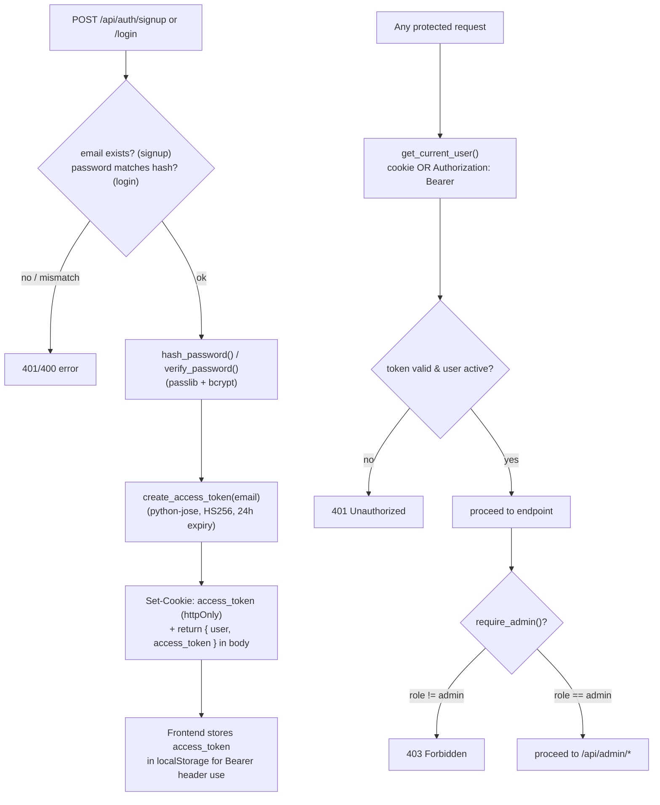
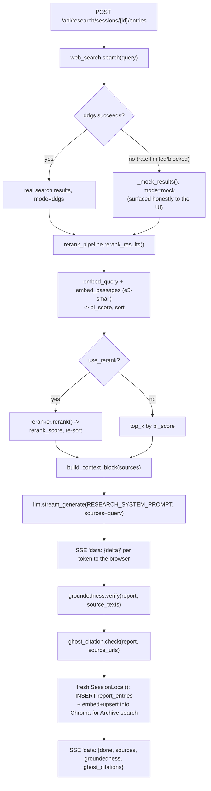
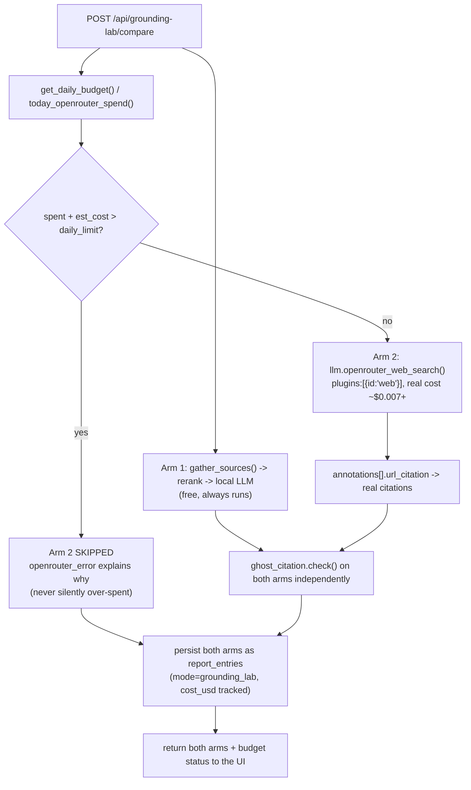
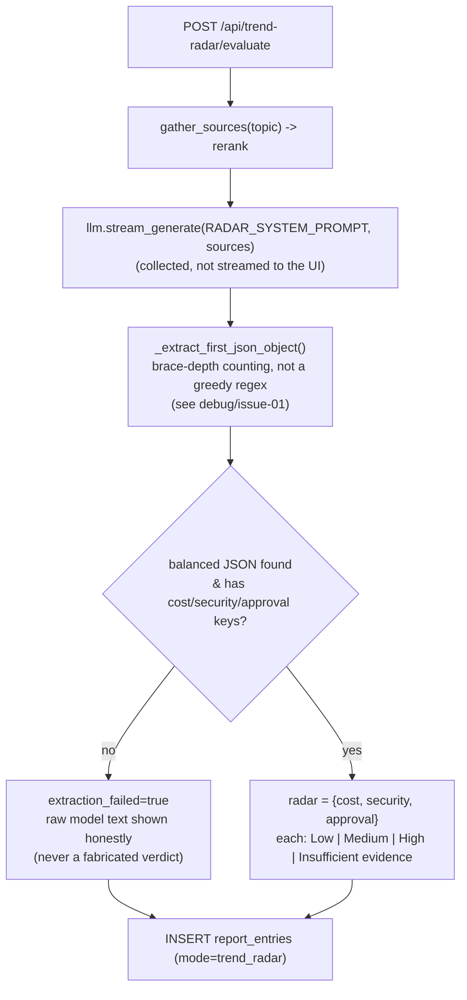
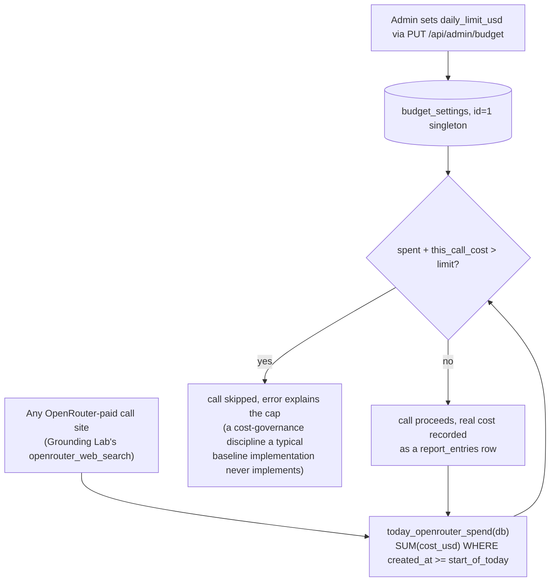
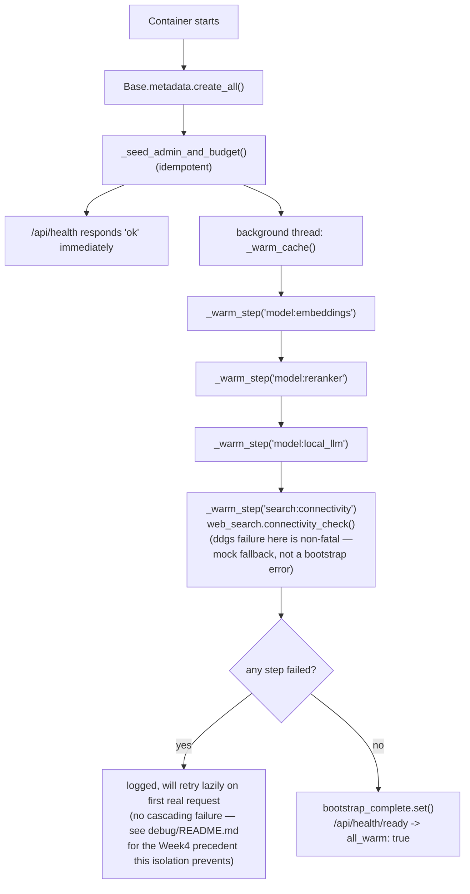

# Compass — Function & Model Flowcharts

> Companion to [`architecture.md`](architecture.md). Also embedded in [`docs/guide.html`](docs/guide.html).
> Each diagram traces one feature end-to-end through the actual function names in `backend/app/`.

## 1. Authentication (`routers/auth.py`, `security.py`)

Identical to the Week1-13 PoCs — same JWT + bcrypt design, same shape-only email validator (not `EmailStr`, which broke `.local` admin logins in the Week1 PoC — see that project's `debug/issue-02`), reused here from the start rather than rediscovered.

## 2. Streaming Research (`pipeline.py`, `search/`, `ml/llm.py`, `ml/groundedness.py`, `ml/ghost_citation.py`, `routers/research.py`)

## 3. Grounding Lab — self-hosted pipeline vs. OpenRouter managed search (`routers/grounding_lab.py`)

## 4. Trend Radar — structured 3-lens extraction (`pipeline.py`, `routers/trend_radar.py`)

## 5. Cost Governance (`models.BudgetSetting`, `routers/admin.py`, `routers/research.py`)

## 6. Container bootstrap sequence (`main.py`)

