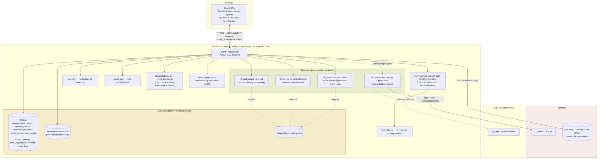
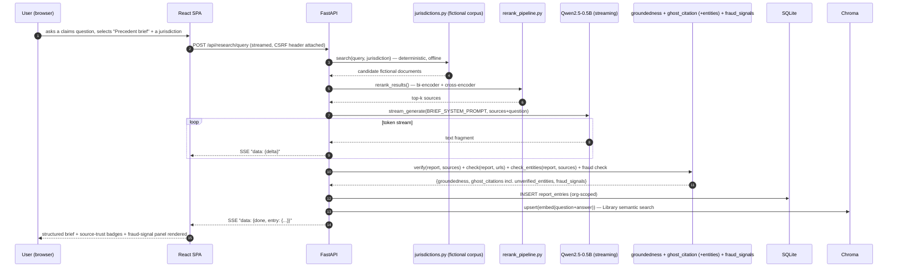
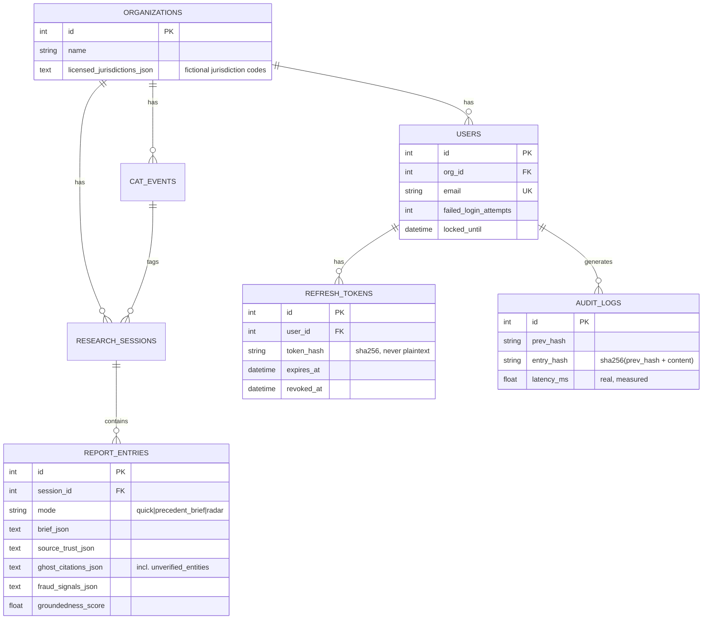

# Verity — 아키텍처

> Week5_1 PoC_v2 · Fenwick Mutual을 위한 근거 기반 클레임 리서치 어시스턴트
> 이 문서는 (동일한 다이어그램과 함께) [`docs/guide.html`](docs/guide.html) 안에도 임베드되어 있습니다.

## 1. 시스템 개요

Verity는 단일 컨테이너 풀스택 애플리케이션입니다: FastAPI 백엔드가 정적 파일로 서빙하는
React(TypeScript) SPA가, REST + 스트리밍 API 뒤에서 로컬 AI 모델 3개와 옵트인 클라우드
에스컬레이션 모델 1개를 호스팅하며, SQLite(구조화 데이터)와 Chroma(벡터 데이터)로
뒷받침됩니다. 구조적 형태는 이 시리즈의 이전 모든 제품과 동일한 검증된 패턴이며 — 이번
라운드에서 다른 점은 여기에 적용된 상용화급 하드닝의 깊이(§4)와 실시간 웹을 전혀 사용하지
않는 완전히 가상의 클레임 리서치 코퍼스(README §2, `search/jurisdictions.py`)입니다.

## 2. 엔지니어링 완성도 — 일반적인 초기 구현 대비 실질적으로 더 발전된 부분

이 패턴(검색 API + 재순위화 + 검색 근거 생성)의 전형적인 초기 단순 구현은 종종 기본
합성 경로에서 **LLM을 전혀 호출하지 않는** Streamlit 앱입니다(재순위화된 스니펫을 그대로
나열하는 규칙 기반 템플릿으로, 새 텍스트를 생성하지 않으므로 "구조적으로 환각 위험 0"이라고
정당화되곤 합니다). 아래 비교는 이런 종류의 베이스라인을 기준으로 합니다:

| 차원 | 일반적인 베이스라인 구현 | Verity |
|---|---|---|
| 답변 생성 | 기본적으로 LLM 호출 없음 — 규칙 기반 템플릿이 재순위화된 스니펫을 나열 | 실제 LLM(로컬 또는 OpenRouter)이 매번 토큰 단위로 스트리밍되는, 인용이 달린 Quick Answer 또는 구조화된 Precedent Brief를 생성 |
| 영속성 | 없음 — 상태 없는 단발성 | SQLite + Chroma, 둘 다 `org_id` 범위로 스코핑되며 재시작 후에도 유지 |
| 검증 | 없음(규칙 기반 경로는 검증할 대상 자체가 없음) | 인용 마커 유효성 + 콘텐츠 유사도 기반 근거충실도 + URL 고스트 인용 검사 + **개체명 환각 교차검증**(이 빌드가 발견하고 완화한 실제 결함, `debug/issue-03` 참고) |
| 타겟/포지셔닝 | 일반적인 베이스라인의 프레이밍에는 명시된 타겟 오디언스가 없음 | 명명된 페르소나(Dana Whitfield), 명명된 가상 회사, 그리고 둘 다 명시적으로 밝히는 랜딩 페이지 |
| 인증/보안 | 없음 | 액세스+리프레시 JWT 회전, CSRF, 계정 잠금, 속도 제한, 변조 감지 감사로그 — 이 시리즈의 이전 어떤 제품(이 프로젝트 자체의 전신인 Compass 포함)도 구현하지 않았던 것 |
| 관측성 | 없음 | 실측 p50/p95/p99 지연, 구조화된 에러 로그, 공개 상태 페이지 |

이는 그런 베이스라인에 대한 비판이 아닙니다 — 그런 첫 단계 구현은 원래 짧고 시간 제한이
있는 연습 과제에 맞게 자연스럽게 스코핑된 것입니다. Verity는 동일한 근본 아이디어(검색
API + 재순위화 + 검색 근거 생성)가 실제 타겟 고객과 실제 보안/관측성 기준을 염두에 두고
제대로 만들어졌을 때 어떤 모습이 될 수 있는지를 보여주는 상용화 수준의 데모로 스코핑되어
있습니다.

## 3. 디자인 — 공유 스위트 아이덴티티 "Fenwick Ledger"

이번 라운드의 요청은 Weeks 1-4 및 이 프로젝트 자체의 이전 Compass 빌드와는 완전히 다른
접근을, 그것도 훨씬 높은 품질 기준으로, 명시적으로 이름 붙인 타겟과 함께 요청했습니다 —
그리고 Week5_1과 Week5_2가 독립된 두 개의 주간 아이덴티티가 아니라 하나로 연결된 회사의
제품 스위트로 읽히도록 요청했습니다. 이 프로젝트 시리즈에는 이미 5개의 서로 다른 시각
아이덴티티가 존재하며(쿨그레이/블루 사이드바; 웜 파치먼트/테라코타 상단 탭; 글래스/그라디언트
메시 플로팅 사이드바; 네이비/브래스/틸 커맨드 콘솔; 파스텔 라일락/세이지 클레이모피즘) —
"Fenwick Ledger"는 여섯 번째로, Verity와 Threshold(그 Week5_2 짝 프로젝트) 사이에서
공유되며 기존의 어떤 축도 반복하지 않습니다:

- **색상**: 딥 보틀그린(`#1f4d3d` 라이트 / `#4f9c7f` 다크)을 Verity의 프라이머리 액센트로,
  카퍼(`#a85d2e` 라이트 / `#d18a53` 다크)를 스위트 공용 인터랙션 색상(이자 Threshold 자체의
  프라이머리)으로 사용하며, 따뜻한 아이보리/본 배경(라이트) 또는 에스프레소-차콜 배경
  (다크, 네이비나 퍼플이 아님) — "차트룸"이나 파스텔풍보다는 인수심사 원장의 정밀함과
  영속성을 환기시킵니다.
- **타이포그래피**: 잉크트랩 디테일이 있는 따뜻하고 대비가 강한 디스플레이 세리프인
  **Fraunces**를 헤딩에, **IBM Plex Sans**를 UI 본문에, 청구번호·보험증권 ID·금액에는
  테이블러 숫자를 지원하는 **IBM Plex Mono**를 사용 — 세 가지 모두 이전 어느 주에도
  사용된 적 없음.
- **내비게이션**: **도시에 탭 바인더** — 왼쪽에 고정된 세로 스택 형태로, 오버랩된 마닐라지
  스타일 탭 디바이더가 선택 시 "앞으로 당겨지고"(이동 + 그림자 강조) 나머지는 뒤로
  물러납니다 — 이 프로젝트 시리즈의 이전 어떤 내비게이션 패턴과도 다른 메타포이며, 바인더에서
  사건 파일을 꺼내는 주제 자체에 직접 근거를 둔 디자인입니다.

**측정된, 가정하지 않은 접근성**: 본문 텍스트는 `--text-primary`/`--text-secondary`를
사용하며(각 표면 대비 라이트 16.09:1 / 7.87:1, 다크 13.66:1 / 9.07:1 — 이전 매주 사용한
동일한 Python WCAG 대비율 스크립트로 계산), `--text-muted`(캡션/타임스탬프 전용, 본문에는
사용하지 않음)는 3.75:1/4.62:1; 액센트 색상은 디자인 관례상 아이콘/보더/헤딩으로 제한되어
있음에도 두 테마 모두에서 4.5:1 이상을 확보합니다.

## 4. 상용화급 엔지니어링 — 실제로 추가된 것과 그 범위의 경계

| 영역 | 구현된 것 | 명시적 범위 경계 |
|---|---|---|
| **테넌시** | `Organization` 테이블, 하드코딩된 `id=1` 싱글턴 대신 다른 모든 테이블이 `org_id`로 FK 연결 | 테넌트 스위처 UI 없음; 정확히 하나의 조직만 시드됨 |
| **세션 보안** | 단기 액세스 JWT(20분) + 회전형 리프레시 토큰(7일, 1회용, 저장 시 SHA-256 해시), httpOnly/SameSite=Strict 쿠키, 모든 변경 요청에 CSRF 이중 제출, 5회 로그인 실패 시 잠금(15분) | `COOKIE_SECURE`/`ENFORCE_SECURE_DEFAULTS`는 기본 꺼짐 — 이전 모든 PoC와 마찬가지로 데모가 평문 HTTP에서도 문서화된 자체 자격증명으로 부팅되도록 함; 실제 배포는 TLS 뒤에서 둘 다 켬 |
| **감사 무결성** | 해시체인 `AuditLog`(`entry_hash = sha256(prev_hash‖content)`); 관리자의 "무결성 검증"이 체인을 순회하여 정확한 파손 지점을 보고 | 단일 라이터 체인 — 실제 다중 인스턴스 배포는 하나의 선형 체인을 유지하기 위해 조정된 append(예: 단일 감사-라이터 서비스)가 필요 |
| **속도 제한** | 인증 + AI 엔드포인트에 직접 구현한 인메모리 슬라이딩 윈도우 | 명시적으로 단일 프로세스; 실제 다중 인스턴스 배포는 공유 상태(Redis 등)가 필요 |
| **관측성** | 실측 라우트별 p50/p95/p99(롤링 윈도우), 요청 상관관계 ID가 포함된 구조화된 `ErrorLog`, 공개 `/api/status` | 인메모리 지표는 재시작 시 리셋 — 숨기지 않고 문서화됨 |
| **UX** | 공개 마케팅 랜딩 페이지, 빈 상태, 스켈레톤 없는 직접 로딩 상태, 키보드 포커스 링, 태블릿 대응 최소 기준 | 온보딩 투어/마법사 없음 — 우선순위가 낮은 폴리시 항목으로 명시적으로 미룸 |

## 5. 데이터 흐름 — Precedent Brief 요청

## 6. 저장 모델

## 7. 프로덕션/클라우드 확장 — 무엇이 달라질까

이전 모든 PoC 자체의 확장 계획표와 동일한 형태입니다(앱 계층 복제, 매니지드 Postgres,
매니지드 벡터 DB, 로컬 LLM용 GPU 버스트 용량) — 여기에 이번 라운드의 새 서브시스템에 특화된
항목이 추가됩니다: 다중 인스턴스 배포를 위한 공유 상태 속도 제한기(Redis), 인메모리 롤링
윈도우 대신 실제 지표 백엔드(Prometheus/Grafana), API 계층이 수평 확장될 경우 감사로그
해시체인을 위한 조정된 단일 라이터 경로.

### 소규모 상용 스케일에서의 예상 월 비용
(~500 DAU, 일일 ~1.5천 건 리서치 쿼리; 2026년 8월 기준 참고 가격)

| 항목 | 가정 | 예상 월 비용 |
|---|---|---|
| 앱 호스팅 (2 vCPU/4GB) | 1-2 인스턴스 | $70–140 |
| 매니지드 Postgres | 1 인스턴스 + 백업 | $60–90 |
| 매니지드 벡터 DB / pgvector | 사용량 기반 | $0–50 |
| GPU 버스트 (로컬 LLM) | 월 ~15 GPU시간 | $10–25 |
| OpenRouter (옵트인 에스컬레이션) | 쿼리의 ~10% | $2–8 |
| Redis (속도 제한, 다중 인스턴스) | 소형 매니지드 인스턴스 | $10–20 |
| 지표/로깅 | 기본 매니지드 티어 | $10–30 |
| **합계(참고용)** | | **≈ 월 $162 – 363** |

## 8. 배포 고려사항

이전 모든 PoC와 동일한 핵심 목록입니다(환경 동일성, 실제 시크릿 매니저를 통한 시크릿 관리,
Postgres + 마이그레이션, 실제 오리진으로 제한된 CORS, 스트리밍 엔드포인트에 프록시 버퍼링
없음) — 여기에 추가로: 실제 TLS 뒤에서 **`ENFORCE_SECURE_DEFAULTS`와 `COOKIE_SECURE`를
`true`로 전환**(데모는 문서화된 자체 자격증명으로 평문 HTTP에서 부팅되도록 둘 다 꺼둔 채
배포됨); 둘 다 현재 설계상 단일 프로세스 인메모리 상태이므로 인스턴스를 하나 이상 운영하기
전에 **속도 제한과 지표를 공유 백엔드로 이전**.
