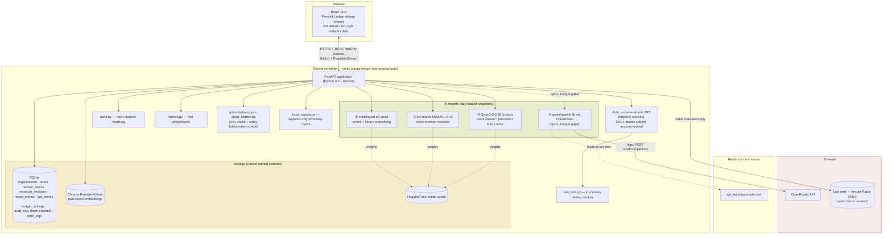
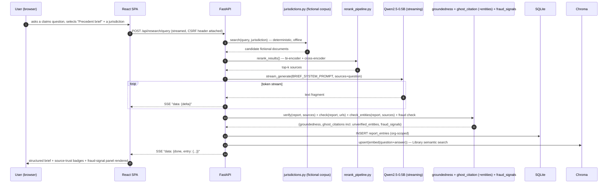
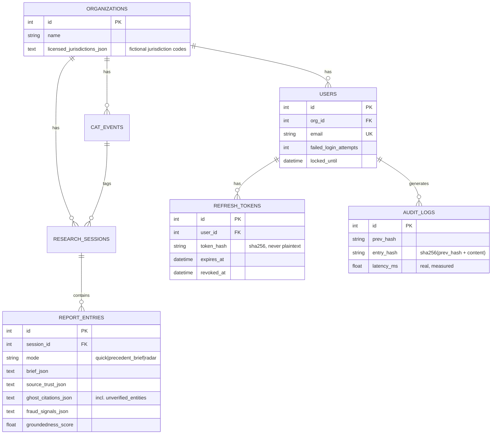

# Verity — Architecture

> Week5_1 PoC_v2 · Grounded Claims-Research Assistant for Fenwick Mutual
> This document is also embedded (with the same diagrams) inside [`docs/guide.html`](docs/guide.html).

## 1. System overview

Verity is a single-container full-stack application: a React (TypeScript) SPA served as static
files by a FastAPI backend, hosting three local AI models plus one optional cloud escalation model
behind a REST + streaming API, backed by SQLite (structured data) and Chroma (vector data). The
structural shape is the same proven pattern as every earlier product in this series — what's different
this round is the depth of commercial-grade hardening applied to it (§4) and a fully fictional,
never-live-web claims research corpus (§2 in the README, `search/jurisdictions.py`).

## 2. Engineering depth — genuinely more advanced than a typical first-pass implementation

A typical first-pass, naive implementation of this pattern (search-API + reranking +
search-grounded generation) is often a simple Streamlit app whose default synthesis path calls
**no LLM at all** (a rule-based template that just lists reranked snippets, sometimes justified as
"structurally zero hallucination risk" since it never generates new text). The comparison below is
against that kind of baseline:

| Dimension | Typical baseline implementation | Verity |
|---|---|---|
| Answer generation | No LLM call by default — a rule-based template lists reranked snippets | A real LLM (local or OpenRouter) synthesizes a cited Quick Answer or structured Precedent Brief every time, streamed token by token |
| Persistence | None — stateless, single-shot | SQLite + Chroma, both `org_id`-scoped, both survive restarts |
| Verification | None (the rule-based path has nothing to verify) | Citation-marker validity + content-similarity groundedness + URL ghost-citation check + **entity-hallucination cross-check** (a real gap this build found and mitigated, see `debug/issue-03`) |
| Target/positioning | No stated target audience in a typical baseline's framing | A named persona (Dana Whitfield), a named fictional company, and a landing page that states both explicitly |
| Auth/security | None | Access+refresh JWT rotation, CSRF, account lockout, rate limiting, tamper-evident audit log — none of which any earlier product in this series (including this project's own predecessor, Compass) implemented |
| Observability | None | Real p50/p95/p99 latency, structured error log, public status page |

This isn't a criticism of that kind of baseline — a first-pass build like that is naturally scoped
for a quick, time-boxed exercise. Verity is scoped as a demonstration of what a genuinely commercial
version of the same underlying idea (search-API + reranking + search-grounded generation) looks like
once built out with a real target customer and a real security/observability bar in mind.

## 3. Design — "Fenwick Ledger," a shared suite identity

This round's request asked for a completely different approach from Weeks 10-13 and this project's
own prior Compass build, at a materially higher quality bar, with an explicitly named target — and
for Week5_1 and Week5_2 to read as one connected company's product suite rather than two
independent weekly identities. Five prior distinct visual identities already exist in this
project series (cool-gray/blue sidebar; warm parchment/terracotta top-tabs; glass/gradient-mesh floating
sidebar; navy/brass/teal command-console; pastel lilac/sage claymorphism) — "Fenwick Ledger" is a
sixth, sharing across Verity and Threshold (its Week5_2 companion) rather than repeating any
existing axis:

- **Color**: deep bottle-green (`#1f4d3d` light / `#4f9c7f` dark) as Verity's primary accent, copper
  (`#a85d2e` light / `#d18a53` dark) as the suite's shared interaction color (and Threshold's own
  primary), on a warm ivory/bone ground (light) or espresso-charcoal (dark, not navy or purple) —
  evoking an underwriting ledger's precision and permanence rather than a "chart room" or pastel-soft
  register.
- **Type**: **Fraunces** (a warm, high-contrast display serif with ink-trap detailing) for headings,
  **IBM Plex Sans** for UI body, **IBM Plex Mono** with tabular figures for claim numbers, policy
  IDs, and monetary amounts — none of the three used in any prior week.
- **Navigation**: a **dossier tab-binder** — a left-anchored vertical stack of overlapping,
  manila-style tab dividers that "pull forward" (translate + shadow lift) on selection while the
  others recede — a distinct metaphor from every prior nav pattern in this project series, and one
  grounded directly in the subject matter: pulling a case file from a binder.

**Accessibility, measured not assumed**: running text uses `--text-primary`/`--text-secondary`
(16.09:1 / 7.87:1 light, 13.66:1 / 9.07:1 dark against their surfaces — computed via the same Python
WCAG contrast-ratio script used every prior week); `--text-muted` (used only for captions/timestamps,
never body copy) sits at 3.75:1/4.62:1; accent colors clear 4.5:1+ in both themes despite being
restricted to icons/borders/headings by design convention.

## 4. Commercial-grade engineering — what was actually added, and its real scope boundary

| Area | What's implemented | Explicit scope boundary |
|---|---|---|
| **Tenancy** | `Organization` table, every other table FK'd to `org_id` instead of a hardcoded `id=1` singleton | No tenant-switcher UI; exactly one org is seeded |
| **Session security** | Short-lived access JWT (20 min) + rotating refresh token (7 day, single-use, SHA-256-hashed at rest), httpOnly/SameSite=Strict cookies, CSRF double-submit on every mutating request, lockout after 5 failed logins (15 min) | `COOKIE_SECURE`/`ENFORCE_SECURE_DEFAULTS` default off so the demo boots with its own documented credentials over plain HTTP, exactly like every prior PoC — a real deployment behind TLS flips both |
| **Audit integrity** | Hash-chained `AuditLog` (`entry_hash = sha256(prev_hash‖content)`); admin "Verify integrity" walks the chain and reports the exact break point | Single-writer chain — a real multi-instance deployment would need a coordinated append (e.g. a single audit-writer service) to keep one linear chain |
| **Rate limiting** | Hand-rolled in-memory sliding window on auth + AI endpoints | Explicitly single-process; a real multi-instance deployment needs shared state (Redis or similar) |
| **Observability** | Real per-route p50/p95/p99 (rolling window), structured `ErrorLog` with request-correlation IDs, public `/api/status` | In-memory metrics reset on restart — documented, not hidden |
| **UX** | Public marketing landing page, empty states, skeleton-free direct loading states, keyboard focus rings, tablet-responsive minimum | No onboarding tour/wizard — deferred as a lower-priority polish item |

## 5. Data flow — a Precedent Brief request

## 6. Storage model

## 7. Production / cloud scaling — what would change

Same shape as every prior PoC's own scaling table (app-tier replication, managed Postgres, a
managed vector DB, GPU burst capacity for the local LLM) — plus items specific to this round's new
subsystems: a shared-state rate limiter (Redis) for multi-instance deployment, a real metrics
backend (Prometheus/Grafana) rather than the in-memory rolling window, and a coordinated
single-writer path for the audit-log hash chain if the API tier is ever horizontally scaled.

### Estimated monthly cost at small commercial scale
(~500 DAU, ~1.5k research queries/day; indicative Aug 2026 list prices)

| Item | Assumption | Est. monthly cost |
|---|---|---|
| App hosting (2 vCPU/4GB) | 1-2 instances | $70–140 |
| Managed Postgres | 1 instance + backup | $60–90 |
| Managed vector DB / pgvector | usage-based | $0–50 |
| GPU burst (local LLM) | ~15 GPU-hours/mo | $10–25 |
| OpenRouter (opt-in escalation) | ~10% of queries | $2–8 |
| Redis (rate limiting, multi-instance) | small managed instance | $10–20 |
| Metrics/logging | basic managed tier | $10–30 |
| **Total (indicative)** | | **≈ $162 – 363/month** |

## 8. Deployment considerations

Same core list as every prior PoC (environment parity, secrets via a real secret manager, Postgres +
migrations, CORS restricted to the real origin, no proxy buffering on streaming endpoints) — plus:
**flip `ENFORCE_SECURE_DEFAULTS` and `COOKIE_SECURE` to `true`** behind real TLS (the demo ships both
off so it boots with its own documented credentials over plain HTTP); **move rate limiting and
metrics to shared backends** before running more than one instance, since both are currently
single-process, in-memory state by design.
