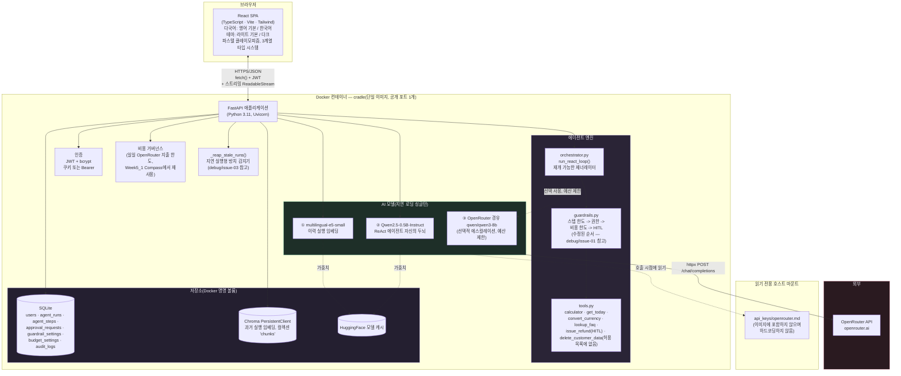
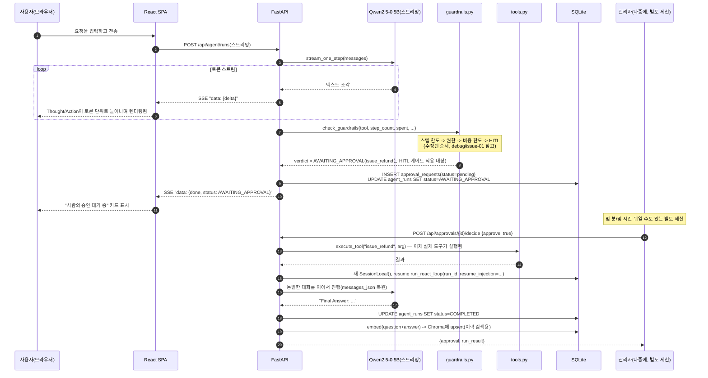
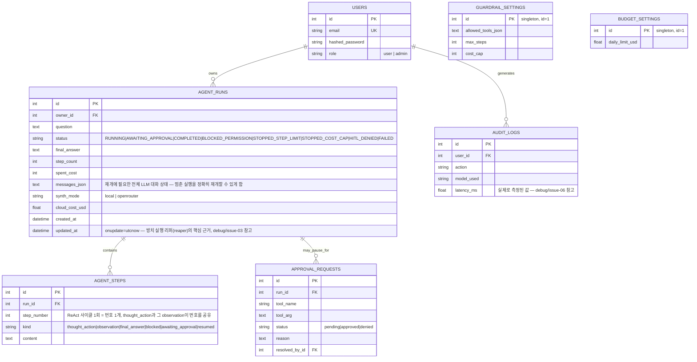

# Cradle — 아키텍처

[English](architecture.md) | **한국어**

> Week5_2 PoC · 실제 안전장치를 갖춘 로컬 ReAct 에이전트 콘솔
> 이 문서는 동일한 다이어그램과 함께 [`docs/guide.html`](docs/guide.html)에도 포함되어 있습니다.

## 1. 시스템 개요

Cradle은 단일 컨테이너로 실행되는 풀스택 애플리케이션입니다. React(TypeScript) 단일 페이지 앱을 FastAPI 백엔드가 정적 파일로 제공하고, 백엔드는 REST + 스트리밍 API 뒤에서 로컬 AI 모델 2개(임베딩 + 로컬 ReAct 에이전트 LLM)와 선택적 클라우드 에스컬레이션 모델 1개를 호스팅하며, SQLite(구조화 데이터)와 Chroma(벡터 데이터)를 저장소로 사용합니다 — Week1-5_1 PoC들에서 검증된 것과 동일한 구조입니다.

이전 모든 주차와의 핵심 구조적 차이점은 다음과 같습니다. **에이전트 실행이 반드시 하나의 요청/응답 사이클로 끝나지 않는다는 점**입니다. 실행은 실제 사람의 승인/거부 결정을 기다리며 중간에 멈출 수 있고, 이를 시작한 원래의 HTTP 연결이 이미 끊긴 뒤에도 한참 지나서 재개될 수 있습니다. `agent/orchestrator.py::run_react_loop()`는 두 가지 방식(새 실행에는 실시간 스트리밍으로, 멈춘 실행 재개에는 동기적으로 끝까지 소비하는 방식)으로 소비되는 하나의 공유 제너레이터로 작성되어, 두 경로가 서로 어긋나지 않도록 합니다.

## 2. 일반적인 초기 구현을 넘어서는 엔지니어링 깊이

이 패턴을 최소한으로 보여주는 첫 시도를 넘어, "실제 사용을 위해 안전장치를 진짜로 배선한다"는 것이 정확히 무엇을 요구하는지 짚어볼 가치가 있습니다.

| 차원 | 일반적인 초기 구현 | Cradle |
|---|---|---|
| 통합 | **서로 소통하지 않는 두 개의 별도 데모 조각** — 예시용 ReAct 에이전트와 별도의 안전장치 클래스가 나란히 제시되지만, 실제로 대화하는 에이전트는 시연되는 안전장치로 감싸진 그 에이전트가 아닙니다. | 하나의 에이전트, 하나의 루프, 항상 경로 위에 있는 안전장치 — 모든 실제 도구 호출은 별도의 예시가 아니라 실행 전에 반드시 `guardrails.py`를 거칩니다. |
| 안전장치 검사 순서 | **저지르기 쉬운 실수**: 단순한 구현은 도구 권한을 확인하기 *전에* 비용 한도를 확인할 수 있습니다. 그러면 비용 한도도 초과하는 허가되지 않은 도구 호출이 `BLOCKED_PERMISSION` 대신 `STOPPED_COST_CAP`으로 잘못 기록됩니다 — 보안 이벤트가 일상적인 예산 이벤트로 잘못 분류되는 셈입니다. | 처음부터 올바른 순서(스텝 한도 → 권한 → 비용 한도 → HITL)로 구현했고, 정확히 이 시나리오에서 `BLOCKED_PERMISSION`이라는 올바른 결과가 나오는지 증명하는 전용 회귀 테스트(`step_guardrail_order_regression`)를 갖췄습니다. `debug/issue-01` 참고. |
| Human-in-the-Loop | `approval_required_tools` 같은 개념이 데모에서 실제로는 채워지지 않는 독립된 클래스 기능으로만 존재할 수 있습니다 — 빈 집합인 채로 남아 HITL이 실제로 트리거되지 않습니다. | 실제로 저장되는 `ApprovalRequest` 큐: 승인이 필요한 도구 호출은 실행을 진짜로 멈추고, 관리자의 승인/거부 결정이 실행을 진짜로 재개시킵니다(승인 시 실제 도구를 실행하고, 거부 시 거부 관찰 내용을 주입해 에이전트가 이에 반응하게 함) — 원래 요청이 끝난 뒤 한참 지나서일 수도 있습니다. |
| 지속성 | **없음** — DB가 없어서 인메모리 전용 세션은 새로고침하면 사라집니다. | SQLite(실행/스텝/승인/안전장치/예산/감사) + Chroma `PersistentClient`(이력 색인) — 둘 다 재시작 후에도 유지됩니다. |
| 재개 가능성 | 해당 없음 — 재개할 것이 없으며, 상태 없는 스크립트에서는 "멈춘 실행"이라는 개념 자체가 의미가 없습니다. | `AgentRun.messages_json`이 멈춘 실행을 완전한 충실도로 재개하는 데 필요한 정확한 LLM 대화 상태를 스냅샷으로 저장하며, 실행이 진행 중이든 재개 중이든 동일한 `run_react_loop()` 제너레이터가 구동합니다. |
| 모델 라우팅 | 구현되지 않음 — 모델 하나, 경로 하나, 항상 동일. | 로컬 에이전트가 막히거나(`STOPPED_STEP_LIMIT`) 실행이 끝났을 때, 최선을 다한 최종 답변 합성을 위해 OpenRouter의 `qwen/qwen3-8b`로 선택적·예산 제한 방식으로 에스컬레이션 — "기본은 소형 모델, 필요할 때만 에스컬레이션"이라는 라우팅 패턴을 실제로 구현했으며, Week5_1 Compass의 일일 예산 한도 거버넌스 패턴을 그대로 재사용합니다. |
| 감사 추적 | 없음. | 모든 AI 호출과 도구 실행 결정을 기록하는 실제 `audit_logs` 테이블 — 누가, 무엇을, 얼마나 걸렸는지(이 부분의 실제 결함을 이번 라운드에서 발견하고 수정했습니다 — `debug/issue-06` 참고), 성공/실패 여부까지 포함합니다. |
| UI | 최소한의 단일 언어/테마, 평면적인 위젯. | 커스텀 파스텔 클레이모피즘 React UI, 이중 언어, 라이트/다크(둘 다 파스텔 톤), 진짜 마우스 반응형 3D 틸트 컴포넌트, 추론 트레이스를 시각화하는 층층이 쌓인 3D 카드 스택. |

이는 이 패턴의 어떤 최소 참고 구현도 비판하려는 것이 아닙니다 — 안전장치 클래스를(실행 중인 에이전트 루프 안에 파묻어두지 않고) 독립적으로 살펴볼 수 있는 데모로 범위를 잡는 것은 짧은 실습 과제에서는 정당하고 방어 가능한 교육적 선택입니다. Cradle은 안전장치를 실제 사용을 위해 진짜로 *배선했을 때* 어떤 모습이 되는지 보여주기 위한 PoC로 범위를 잡았습니다.

## 3. UI 디자인 — 진짜 공간감을 갖춘 파스텔 클레이모피즘

이번 라운드의 구체적인 요구 사항은 일반적인 비주얼 리프레시를 넘어 세 가지를 명시했습니다. (a) 단순한 장식이 아닌 진짜 3D와 공간감, (b) 명도는 높고 채도는 낮은 라이트 파스텔 색감, (c) 그냥 만든 것이 아니라 의도적으로 디자인되었다고 느껴지는 UI.

| 요소 | Week5_1 "Compass" | Week5_2 "Cradle" |
|---|---|---|
| 팔레트 | 네이비 + 브라스 + 틸(다크 기본, 채도 높음) | **명도는 높고 채도는 낮은 파스텔**: 부드러운 오프화이트 바탕에 더스티 라일락 `#8b7cc7` / 세이지 그린 `#2f7a5c`(라이트); 다크 모드에서는 색조를 반전하지 않고 밝게 끌어올린 동일 색상(`#b6a8e8` / `#7fc9a8`) |
| 깊이감 표현 | 평면 카드, 단일 드롭섀도 레이어 | **클레이모피즘**: 양방향 그림자 레시피 — 밝은 쪽 하이라이트(`-10px -10px 22px rgba(255,255,255,0.9)`)와 색조가 섞인 부드러운 그림자(`12px 14px 28px rgba(139,124,199,0.18)`)를 결합해, 표면이 그림자 딸린 평면이 아니라 볼록하게 튀어나온 듯 보이게 함 |
| 진짜 3D 인터랙션 | 없음 | `TiltCard.tsx`가 포인터를 추적해 CSS 커스텀 속성(`--rx`/`--ry`)을 설정하고, `pointermove`에서 `perspective` + `rotateX`/`rotateY` 트랜스폼이 이를 반영합니다 — 정적인 착시가 아니라 사용자의 커서에 실제로 반응하는 공간적 움직임입니다. 모든 요소가 아니라 몇몇 핵심 화면(로그인 카드, 통계 하이라이트)에만 의도적으로 적용했습니다 — "과감함은 한 곳에만 쓰고 그 주변은 차분하게 유지한다"는 원칙입니다. |
| 추론 트레이스 | (해당 기능 없음) | "카드 스택" 시각화(`.step-card`): Thought/Action/Observation 카드마다 인덱스에 따라 작게 번갈아 `rotate()`가 적용되고, 호버 시 들어올려지며 반듯해집니다 — ReAct 루프 고유의 "단계가 쌓인다"는 구조를 공간적으로 그대로 표현한 것입니다. |
| 타이포그래피 | 세리프 + 기하학적 산세리프 + 모노(3계열) | **Quicksand**(둥글고 부드러운 디스플레이 헤드라인) + **Plus Jakarta Sans**(UI 본문/크롬) + **Space Mono**(감사/데이터) — 클레이모피즘의 부드러운 표면 언어에 맞춰 둥근 형태를 골라 만든 세 번째 독자적인 3계열 조합. |
| 내비게이션 | 고정 커맨드 콘솔 + 아이콘 레일 | 떠 있는, 가운데 정렬된, 필(pill) 형태의 상단 내비게이션 바 — 완전히 둥근 형태로, 이전 모든 주차의 패턴(Week1/2의 고정 사이드바, Week3의 상단 탭, Week4의 떠 있는 글래스 사이드바, Week5_1의 콘솔+레일)과 구별됩니다. |
| 기본 테마 | 다크(이 시리즈 최초) | **라이트**로 의도적으로 되돌림 — 파스텔 클레이모피즘 특유의 부드러운 하이라이트/그림자 조합은 "볼록해 보이려면" 밝은 핵심 표면이 필요합니다. 다크 모드는 색을 반전시키는 대신 같은 색조를 밝게 끌어올려서, 포토네거티브가 아니라 눈에 띄게 같은 디자인 언어로 유지됩니다. |

**측정된 접근성, 가정이 아닌 검증**: 이전 모든 주차와 마찬가지로, 본문 텍스트는 항상 별도로 검증된 4.5:1 이상의 `--text-*` 토큰을 사용합니다. 강조 색상(`--accent`/`--accent-2`)은 배경과의 대비가 의도적으로 약 3:1 정도에 그치므로, 아이콘·테두리·큰 제목에만 사용하고 작은 본문 텍스트에는 절대 사용하지 않습니다. 이전 모든 주차와 동일한 Python WCAG 대비율 스크립트로 검증했습니다.

## 4. 데이터 흐름 — 대표 요청 1개(실시간 에이전트 실행, HITL 게이트가 걸린 도구)

## 5. 저장소 모델

완료된 모든 실행은 추가로 임베딩되어(`multilingual-e5-small`) **Chroma** `PersistentClient` 컬렉션에 upsert됩니다 — SQL 행이 원본 데이터(system of record)이고, 벡터 저장소는 재시작 후에도 유지되는 파생 시맨틱 색인으로서 이력 검색을 지원합니다.

## 6. Week1-5_1 PoC에서 이어받아 강화한 사항(이번 프로젝트에서는 처음부터 적용)

| 이전에 발견된 문제 | 이번에 처음부터 적용한 조치 |
|---|---|
| 의존성 주입된 DB 세션이 라우트 핸들러가 *반환*되는 시점에 닫혀, `StreamingResponse` 본문이 끝나기도 전에 종료됨(Week4) | `orchestrator.py::run_react_loop()`는 `Depends(get_db)` 세션이 아니라 자체적인 새 `SessionLocal()`을 엽니다 |
| 부트스트랩 단계 하나가 실패하면 나머지도 조용히 건너뛰어짐(Week1; Week4에서 재발) | `_warm_step()`이 시작 시 모델 로딩 단계 2개를 각각 격리합니다 |
| 실시간 SSE 이벤트와 이를 다시 불러오는 REST 엔드포인트가 서로 다른 형태의 JSON을 반환함(Week4) | `AgentStep` 행은 실시간 스트리밍이든 다시 불러오든 동일한 `kind`/`content` 구조를 사용합니다 — 여전히 수정이 필요했던 유일한 부분(형태 불일치가 아니라 클라이언트 측 스텝 번호 불일치)은 `debug/issue-04`이며, 이번 라운드에 발견하고 수정했습니다 |
| 탐욕적 정규식이 실제 소형 모델 출력을 잘못 매칭함(Week5_1) | 이번 주에는 직접 해당하지 않음(JSON 추출 단계가 없음) — 같은 이유로 `react_loop.py`의 `truncate_generation()`은 탐욕적 정규식 대신 명시적인 정지 시퀀스 스캔을 사용합니다 |

## 7. 이번 주 새로 발견하고 강화한 사항(이번 빌드에서 발견해 수정, 이전 주차에서 물려받은 것이 아님)

| # | 발견한 문제 | 수정 내용 |
|---|---|---|
| 1 | 단순한 안전장치 검사 순서는 실수하기 쉬움(비용 한도를 권한보다 먼저 확인) | 처음부터 수정된 순서로 구현했고, 잘못된 레이블링을 유발할 정확한 시나리오에 대해 회귀 테스트를 추가 |
| 2 | 마지막 Final Answer 단계가 `step_complete` 이벤트를 전혀 내보내지 않아, 실시간 완료 시에는 스트리밍 박스가 멈춘 채로 남고 새로고침 시에는 답변이 중복 표시됨 | 두 증상 모두 하나의 공통 근본 원인으로 추적해 함께 수정 |
| 3 | 스트리밍 도중 클라이언트 연결이 끊기면 실행이 영원히 `RUNNING` 상태로 멈춰 완료할 수도, 에스컬레이션할 수도, 이력에서 볼 수도 없게 됨 | 모든 runs-list/runs-detail 요청마다 "방치된 실행 정리"를 지연 실행형으로 확인(180초 임계값) — 이를 위해 생성 시 한 번만 찍히던 `AgentRun.updated_at`에 `onupdate=utcnow`를 추가해야 했음 |
| 4 | 동일하게 완료된 실행이 실시간으로 볼 때와 다시 열었을 때 서로 다른 스텝 번호를 보여줌 — 실시간 화면이 백엔드의 실제 사이클별 번호 대신 카드별로 자체 카운터를 만들어냄 | 이제 백엔드가 모든 `step_complete` 이벤트에 실제 `step_count`를 전송하며, 프런트엔드는 `prev.length + 1` 대신 이 값을 사용 |
| 5 | E2E 스위트 자체의 방치 실행 회귀 테스트가 자신의 합성 데이터를 실제 관리자 계정("id가 가장 낮은 사용자")에 연결해버림 | 대신 스위트 자체의 일회용 `e2e-*` 테스트 사용자에게 귀속되도록 수정 |
| 6 | 감사 추적의 `latency_ms` 컬럼이 모든 호출 지점에서 `0.0`으로 하드코딩되어 있었음 — "얼마나 걸렸는가"라는 필드가 존재 이유와 달리 아무 값도 갖지 못함 | OpenRouter 에스컬레이션 호출의 실제 경과 시간을 측정하고, 실행별 감사 항목에는 실행의 실제 총 소요 시간(`updated_at - created_at`)을 사용 |

여섯 가지 모두에 대한 전체 설명과 제품 결함과는 별도로 다룬 세 가지 스크린샷 도구 관련(비버그) 발견 사항은 `debug/README.md`를 참고하세요.

## 8. 이 기술 스택을 선택한 이유

| 선택 | 근거 |
|---|---|
| **Week1-5_1 PoC들과 동일한 FastAPI + React 템플릿** | 이미 검증되고 강화된 아키텍처(인증, 관리자, Docker, 준비 상태 프로빙, 독립된 부트스트랩 단계, 스트리밍 SSE 인프라)를 의도적으로 재사용했습니다. |
| **프레임워크가 아니라 직접 작성한 ReAct 파서** | ReAct 패턴 자체(프롬프트 구조와 문자열 파싱을 통한 Thought→Action→Observation)가 이번 빌드의 핵심입니다 — 여기서 LangChain을 쓰면 직접 구현할 가치가 있는 부분을 건너뛰게 될 뿐 아니라, **Week6_1 자체의 명시된 범위**(같은 에이전트를 LangChain으로 프레임워크화하고 대화 메모리를 추가한 버전)와도 겹치게 됩니다. Cradle은 의도적으로 순수하고 프레임워크 없는 ReAct 구현으로 남겨두어, 다음 주의 LangChain 업그레이드가 실질적이고 의미 있는 대조 대상을 가질 수 있게 했습니다. |
| **작업 큐 대신 직접 작성한, DB에 저장되는 재개 가능 제너레이터** | 완전한 작업 큐 시스템(Celery/RQ)은 단일 컨테이너 PoC에는 실제로 과도한 인프라입니다. 두 가지 방식(실시간 SSE, 재개 시 동기적으로 끝까지 소비)으로 소비되는 공유 제너레이터 함수를 사용하면 새로운 이동 부품 없이 진짜 재개 가능성을 얻을 수 있습니다. 대신 오케스트레이터가 자신의 DB 세션 생명주기를 직접 관리해야 하는 비용이 따릅니다(§6 참고). |
| **로컬 모델 2개 + 선택적 클라우드 에스컬레이션 1개** | `Qwen2.5-0.5B-Instruct`는 로컬 ReAct 에이전트 자신의 추론 두뇌로 적합한 소형 지시-튜닝 모델이며, 그 적합성 때문에 의도적으로 선택했습니다. `multilingual-e5-small`은 Week2/4/14_1 PoC에서 그대로 재사용했습니다. OpenRouter의 `qwen/qwen3-8b`는 Week5_1 Compass가 검증한 "선택 사용, 예산 제한 클라우드 업그레이드" 역할을 그대로 채우되, 이번에는 검색 기능이 아니라 잘 알려진 모델 라우팅 패턴(필요할 때만 소형 로컬 모델에서 더 큰 유료 모델로 에스컬레이션)에 적용했습니다. |
| **다섯 번째로 구별되는 비주얼 아이덴티티 — 그리고 진짜 공간감 인터랙션을 처음 도입** | 이번 라운드의 명시적 요구에 따라: 명도는 높고 채도는 낮은 파스텔 클레이모피즘, 진짜 포인터 반응형 3D 틸트 컴포넌트, 층층이 쌓인 카드 스택 트레이스 시각화 — §3 참고. |

## 9. 프로덕션/클라우드 확장 시 변경 사항

Week1-5_1 PoC들과 동일한 구조입니다(전체 표/다이어그램은 각 프로젝트의 `architecture.md`를 참고하세요) — 앱 계층 복제, 관리형 Postgres, 관리형/확장된 벡터 DB, 대량 트래픽 시 로컬 LLM용 GPU 노드 풀, 스트리밍 응답을 위한 세션 어피니티까지 동일합니다 — 여기에 Cradle만의 항목 두 가지가 추가됩니다. 승인 지연이 데모의 초/분 단위가 아니라 실제 규모에서 시간/일 단위로 늘어날 수 있는 상황에 대비해 직접 작성한 재개 가능 제너레이터 패턴을 대체할 **실제 작업 큐**(Celery/RQ 또는 유사한 시스템), 그리고 **원자적 도구 실행 감사** — 이 PoC의 "안전장치 확인 후 실행" 순서는 단일 프로세스 데모에는 충분하지만, 실제 동시 부하 상황에서는 DB 수준의 원자적 예약이 필요합니다. 이는 Week5_1 Compass 자체의 architecture.md가 예산 한도에 대해 언급한 것과 동일한 주의 사항입니다.

### 소규모 상용 환경의 월간 예상 비용
(일일 활성 사용자 약 500명, 하루 약 2,000건의 에이전트 실행. 아래 수치는 2026년 8월 기준 공개 정가를 바탕으로 한 참고치이므로 실제 예산을 편성하기 전에 공급자의 최신 가격을 반드시 다시 확인하세요)

| 항목 | 가정 | 월간 예상 비용 |
|---|---|---|
| 앱 호스팅(Cloud Run / Fargate, 2 vCPU / 4GB) | 인스턴스 1~2개, 모델 워밍 유지를 위해 상시 실행 | $70–140 |
| 관리형 Postgres | 인스턴스 1개 + 일일 백업 | $60–90 |
| 관리형 벡터 DB(동일 Postgres의 pgvector 또는 관리형 서비스) | pgvector: 추가 $0 / 관리형: 사용량 기반 | $0–50 |
| GPU 버스트(대량 트래픽 시 로컬 LLM) | 월 약 15 GPU 시간(Compass의 검색 기반 생성보다 가벼움) | $10–25 |
| OpenRouter(`qwen/qwen3-8b` 에스컬레이션, 선택 사용, 막혔을 때/다른 의견이 필요할 때만) | 실행의 약 15%가 에스컬레이션, 건당 약 1,000토큰, 100만 토큰당 $0.117/$0.455 | $2–6 |
| 작업 큐(Redis + 워커, 실제 규모에서 긴 지연이 발생하는 HITL용) | 소형 관리형 Redis + 워커 인스턴스 1~2개 | $15–30 |
| 모니터링/로깅 | 기본 관리형 요금제 | $0–20 |
| **합계(참고치)** | | **월 약 $157–361** |

Week5_1 Compass보다 눈에 띄게 낮은 수준입니다 — 이번 주의 도구는 모두 무료이고 로컬에서 실행되는 Python 함수이므로 라이선스 검색 API도, 요청당 관리형 웹 검색 과금도 없기 때문입니다.

## 10. 배포 고려 사항

Week1-5_1 PoC들과 핵심 항목은 동일합니다(환경 일치성, 실제 비밀 관리자를 통한 비밀값 관리, Postgres + alembic 마이그레이션, 실제 프런트엔드 오리진으로 제한한 CORS, 스트리밍 엔드포인트에는 프록시 버퍼링 비활성화) — 여기에 Cradle만의 항목이 하나 추가됩니다. **프로덕션 HITL 큐에는 실제 알림 경로가 필요합니다**(대기 중인 검토자에게 보내는 이메일/Slack/웹훅) — 이 PoC의 큐는 풀(pull) 방식이라(관리자가 직접 승인 페이지를 방문해야 함) 데모에는 충분하지만, 실제 사용에서는 푸시 알림 없이 멈춘 실행이 무기한 대기하게 됩니다.
