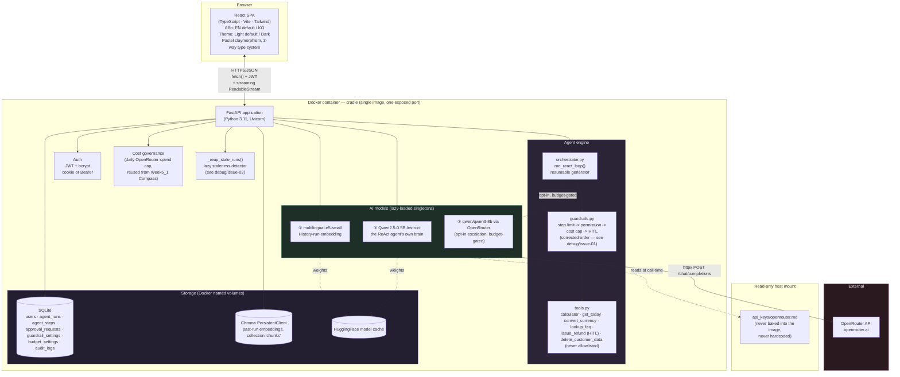
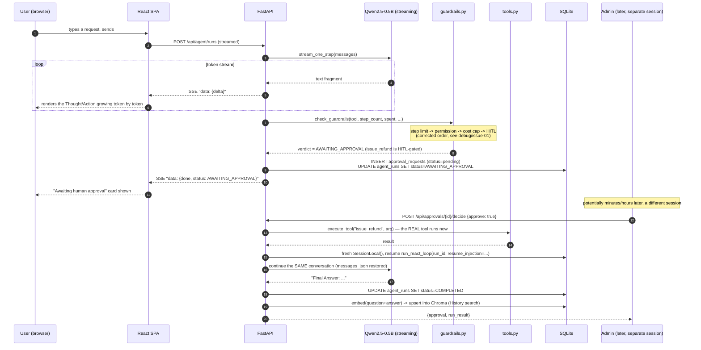
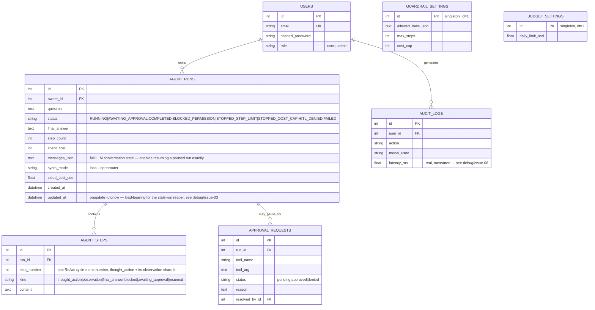

# Cradle — 아키텍처

> Week5_2 PoC · 실제로 작동하는 안전장치를 갖춘 로컬 ReAct 에이전트 콘솔
> 이 문서는 (같은 다이어그램과 함께) [`docs/guide.html`](docs/guide.html)에도 그대로 포함되어 있습니다.

## 1. 시스템 개요

Cradle은 단일 컨테이너로 동작하는 풀스택 애플리케이션입니다: React(TypeScript) 싱글 페이지 앱을 FastAPI
백엔드가 정적 파일로 서빙하며, 이 백엔드는 로컬 AI 모델 두 개(임베딩 + 로컬 ReAct 에이전트 LLM)와 선택적
클라우드 에스컬레이션 모델 하나를 REST + 스트리밍 API 뒤에 두고, SQLite(정형 데이터)와 Chroma(벡터 데이터)로
데이터를 저장합니다 — Week1-14_1 PoC들과 동일하게 검증된 구조입니다.

이전 주차들과의 핵심적인 구조적 차이: **에이전트 실행이 반드시 하나의 요청/응답 사이클로 끝나지 않는다는
점**입니다. 실행은 도중에 멈춰서 — 실제 사람의 승인/거부 결정을 기다리다가 — 원래 실행을 시작시킨 HTTP
연결이 이미 오래전에 끊긴 뒤에도 나중에 재개될 수 있습니다. `agent/orchestrator.py::run_react_loop()`는 두
가지 방식으로 소비되는 하나의 공유 제너레이터로 작성되어 있습니다(새 실행에는 실시간 스트리밍으로, 멈췄던
실행을 재개할 때는 동기적으로 끝까지 소진시켜서) — 두 경로가 서로 어긋나지 않도록 하기 위함입니다.

## 2. 일반적인 기본 구현을 넘어서는 엔지니어링 완성도

"가드레일을 실제 사용을 위해 진짜로 배선한다"는 것이 이 패턴을 최소한으로 예시만 구현한 첫 버전을 넘어
구체적으로 무엇을 요구하는지 정확히 짚어볼 가치가 있습니다:

| 구분 | 일반적인 기본 구현 | Cradle |
|---|---|---|
| 통합 | **서로 대화하지 않는 두 개의 별도 데모 조각** — 예시용 ReAct 에이전트와 별도의 가드레일 클래스가 나란히 제시되지만, 실제로 대화하는 에이전트는 시연되는 가드레일이 감싸고 있는 그 에이전트가 아닙니다. | 하나의 에이전트, 하나의 루프, 가드레일이 항상 경로 안에 있음 — 모든 실제 도구 호출은 실행되기 전에 반드시 `guardrails.py`를 거칩니다. 별도의 예시가 아닙니다. |
| 가드레일 체크 순서 | **저지르기 쉬운 실수**: 순진한 구현은 도구 권한을 체크하기 *전에* 비용 상한을 체크할 수 있습니다. 그러면 비용 상한도 초과한 미승인 도구 호출이 `BLOCKED_PERMISSION`이 아니라 `STOPPED_COST_CAP`으로 잘못 기록됩니다 — 보안 이벤트가 일상적인 예산 이벤트로 오분류되는 것입니다. | 올바른 순서(스텝 한도 → 권한 → 비용 상한 → HITL)를 처음부터 구현하고, 정확히 그 시나리오에서 `BLOCKED_PERMISSION`이 나오는지 증명하는 전용 회귀 테스트(`step_guardrail_order_regression`)를 붙였습니다. `debug/issue-01` 참고. |
| Human-in-the-Loop | `approval_required_tools` 같은 개념이 고립된 클래스 기능으로만 존재하고 데모에서는 한 번도 채워지지 않는 경우가 많습니다 — 빈 집합으로 남아 HITL이 실제로 트리거되지 않습니다. | 실제로 영속화되는 `ApprovalRequest` 큐: 게이트가 걸린 도구 호출이 진짜로 실행을 멈추고, 관리자의 승인/거부 결정이 진짜로 재개시킵니다(승인 시 실제 도구를 실행하고, 거부 시 거부 관찰 결과를 주입해 에이전트가 이를 반영하도록) — 원래 요청이 끝난 뒤 오랜 시간이 지나도 가능합니다. |
| 영속성 | **없음** — DB 없음, 메모리 상의 세션은 새로고침하면 사라짐. | SQLite(실행/스텝/승인/가드레일/예산/감사) + Chroma `PersistentClient`(히스토리 인덱스) — 둘 다 재시작에도 살아남습니다. |
| 재개 가능성 | 해당 없음 — 재개할 것이 없음; 멈춘 실행이라는 개념 자체가 상태 없는 스크립트에서는 의미가 없습니다. | `AgentRun.messages_json`이 멈춘 실행을 완전히 동일하게 재개하는 데 필요한 정확한 LLM 대화 상태를 스냅샷으로 저장하며, 실행이 실시간이든 재개 중이든 동일한 `run_react_loop()` 제너레이터가 구동합니다. |
| 모델 라우팅 | 구현되지 않음 — 항상 모델 하나, 경로 하나. | 로컬 에이전트가 막히거나(`STOPPED_STEP_LIMIT`) 완료될 때, OpenRouter의 `qwen/qwen3-8b`로 선택적·예산 제한적으로 에스컬레이션해 최선의 최종 답변 하나를 합성 — "기본은 소형 모델, 필요할 때만 에스컬레이션"이라는 라우팅 패턴을 실제로 구현했으며, Week5_1 Compass가 검증한 일일 예산 상한 거버넌스 패턴을 그대로 재사용합니다. |
| 감사 로그 | 없음. | 모든 AI 호출과 도구 실행 결정을 기록하는 실제 `audit_logs` 테이블 — 누가, 무엇을, 얼마나 걸렸는지(이 부분의 실제 결함을 이번 라운드에서 찾아 고쳤습니다 — `debug/issue-06` 참고), 성공/실패 여부까지. |
| UI | 최소한의 단일 언어/테마, 평면 위젯. | 커스텀 파스텔 클레이모피즘 React UI, 이중언어, 라이트/다크(둘 다 파스텔), 진짜 마우스 반응형 3D 틸트 컴포넌트, 추론 트레이스를 시각화하는 층층이 쌓인 3D 카드 스택. |

이는 이 패턴을 최소화해 구현한 어떤 참고 구현에 대한 비판이 아닙니다 — 가드레일 클래스를(살아있는 에이전트
루프 안에 파묻기보다는) 독립적으로 살펴볼 수 있는 데모로 두는 것은 짧은 연습 문제에서는 정당하고 방어 가능한
설계 선택입니다. Cradle은 "가드레일을 실제로 배선한다"는 것이 실전 용도로 제대로 구축했을 때 어떤 모습인지
보여주기 위해 범위를 잡은 PoC입니다.

## 3. UI 디자인 — 진짜 공간감을 가진 파스텔 클레이모피즘

이번 라운드의 명시적 요청은 일반적인 비주얼 리프레시를 넘어 세 가지를 요구했습니다: (a) 장식이 아니라 진짜
3D와 공간감, (b) 고명도·저채도의 라이트 파스텔 색감, (c) 단순히 만든 게 아니라 의도적으로 디자인된 것처럼
읽히는 UI.

| 요소 | Week5_1 "Compass" | Week5_2 "Cradle" |
|---|---|---|
| 팔레트 | 네이비 + 브라스 + 틸(다크 기본, 채도 높음) | **고명도·저채도 파스텔**: 은은한 오프화이트 배경 위의 더스티 라일락 `#8b7cc7` / 세이지 그린 `#2f7a5c`(라이트); 다크에서는 같은 색상을 반전시키지 않고 명도만 높여 사용(`#b6a8e8` / `#7fc9a8`) |
| 깊이감 모델 | 평평한 카드, 단일 드롭섀도 레이어 | **클레이모피즘**: 양방향 그림자 레시피 — 밝은 쪽 하이라이트(`-10px -10px 22px rgba(255,255,255,0.9)`)와 색조가 입혀진 부드러운 그림자(`12px 14px 28px rgba(139,124,199,0.18)`)를 함께 써서, 그림자가 얹힌 평면이 아니라 볼록하게 튀어나온 표면처럼 보이게 함 |
| 진짜 3D 상호작용 | 없음 | `TiltCard.tsx`가 포인터를 추적해 CSS 커스텀 프로퍼티(`--rx`/`--ry`)를 설정하고, `pointermove`마다 `perspective` + `rotateX`/`rotateY` 변환에 반영합니다 — 정적인 착시가 아니라 사용자 커서에 진짜로 반응하는 공간감입니다. 모든 요소가 아니라 핵심 표면 몇 곳(로그인 카드, 통계 하이라이트)에만 의도적으로 한정했습니다 — "과감함은 한 곳에만 쓰고 주변은 조용하게 유지" |
| 추론 트레이스 | (동등한 기능 없음) | "스택 카드" 시각화(`.step-card`): Thought/Action/Observation 카드마다 인덱스에 따라 조금씩 번갈아 `rotate()`가 걸리고 hover 시 들리며 펴집니다 — ReAct 루프 자체의 "단계가 쌓인다"는 구조를 공간적으로 그대로 표현했습니다 |
| 타이포그래피 | 세리프 + 기하학적 산세리프 + 모노(3단) | **Quicksand**(둥글고 부드러운 디스플레이 헤드라인) + **Plus Jakarta Sans**(UI 본문/크롬) + **Space Mono**(감사/데이터) — 클레이모피즘의 부드러운 표면 언어에 맞춰 둥근 느낌을 고른, 세 번째로 독자적인 3단 조합 |
| 내비게이션 | 고정된 커맨드 콘솔 + 아이콘 레일 | 떠 있는, 가운데 정렬된 필(pill) 형태의 상단 내비게이션 바 — 완전히 둥근 형태로, 이전 모든 주차의 패턴(Week1/11의 붙박이 사이드바, Week3의 상단 탭, Week4의 떠 있는 글래스 사이드바, Week5_1의 콘솔+레일)과 구별됩니다 |
| 기본 테마 | 다크(이 시리즈 최초) | **라이트**로 의도적으로 되돌림 — 파스텔 클레이모피즘의 부드러운 하이라이트/그림자 조합은 "볼록하게" 보이려면 밝은 핵심 표면이 필요합니다; 다크 변형은 같은 색상을 반전이 아니라 명도만 높여 적용해서, 포토네거티브가 아니라 눈에 보이게 같은 디자인 언어를 유지합니다 |

**추측이 아니라 측정된 접근성**: 이전 모든 주차와 마찬가지로, 본문 텍스트는 항상 별도로 검증된 4.5:1 이상의
`--text-*` 토큰을 사용합니다; 강조색(`--accent`/`--accent-2`)은 의도적으로 배경 대비 약 3:1의 대비만
가지도록 했는데, 이 때문에 아이콘·테두리·큰 헤딩에만 쓰고 작은 본문 텍스트에는 절대 쓰지 않습니다. 이전
모든 주차에서 사용한 것과 동일한 Python WCAG 대비율 스크립트로 검증했습니다.

## 4. 데이터 흐름 — 대표적인 요청 하나(HITL 게이트가 걸린 도구를 실시간으로 실행)

## 5. 저장 모델

완료된 실행은 모두 추가로 임베딩(`multilingual-e5-small`)되어 **Chroma** `PersistentClient` 컬렉션에
upsert됩니다 — SQL 행이 시스템의 기록 원본이고, 벡터 스토어는 그로부터 파생되어 재시작에도 살아남는, 히스토리
검색을 구동하는 시맨틱 인덱스입니다.

## 6. Week1-14_1 PoC들에서 이어받은 견고화(처음부터 이번에도 적용)

| 이전에 발견한 사항 | 이번에 처음부터 적용한 방식 |
|---|---|
| 의존성 주입된 DB 세션이 라우트 핸들러가 *return*하는 순간 닫혀버려, `StreamingResponse` 본문이 끝나기 전에 세션이 사라짐(Week4) | `orchestrator.py::run_react_loop()`는 `Depends(get_db)` 세션 대신 자체적으로 새 `SessionLocal()`을 엽니다 |
| 부트스트랩 단계 하나가 실패하면 나머지도 조용히 건너뜀(Week1; Week4에서 재발) | `_warm_step()`이 시작 시 모델 로드 2단계를 각각 격리합니다 |
| 실시간 SSE 이벤트와 그 REST 재조회 엔드포인트가 서로 다른 모양의 JSON을 반환함(Week4) | `AgentStep` 행은 실시간 스트리밍이든 재조회든 동일한 `kind`/`content` 모양을 사용합니다 — 여전히 손볼 곳이 남아 있던 유일한 지점(모양이 아니라 클라이언트 쪽 스텝 번호가 어긋나는 문제)이 `debug/issue-04`이며, 이번 라운드에서 발견하고 고쳤습니다 |
| 탐욕적(greedy) 정규식이 실제 소형 모델 출력을 과도하게 매칭함(Week5_1) | 이번 주에는 직접 해당하지 않음(JSON 추출 단계가 없음) — `react_loop.py`의 `truncate_generation()`은 같은 이유로 탐욕적 정규식이 아니라 명시적인 종료 시퀀스 스캔을 사용합니다 |

## 7. 이번 주 새로 발견한 견고화(이번 빌드에서 찾아 고친 것, 물려받은 것 아님)

| # | 발견 사항 | 수정 |
|---|---|---|
| 1 | 순진한 가드레일 체크 순서는 틀리기 쉽습니다(비용 상한이 권한보다 먼저) | 처음부터 올바른 순서로 구현; 그 오분류를 유발할 정확한 시나리오에 대해 회귀 테스트 수행 |
| 2 | 마지막 Final Answer 단계가 `step_complete` 이벤트를 전혀 보내지 않아, 실시간 완료 시 남는 스트리밍 박스와 재열람 시 중복된 답변이 생김 | 두 증상 모두 같은 하나의 근본 원인으로 추적해 함께 수정 |
| 3 | 스트림 도중 클라이언트 연결이 끊기면 실행이 영원히 `RUNNING`으로 멈춤 — 완료도, 에스컬레이션도 안 되고, 히스토리에도 보이지 않음 | 모든 실행 목록/상세 요청마다 지연 평가되는 "방치된 실행 회수" 체크(180초 임계값) 추가; 생성 시 한 번만 찍히던 `AgentRun.updated_at`에 `onupdate=utcnow`를 추가해야 했음 |
| 4 | 같은 완료된 실행이 실시간으로 볼 때와 재열람할 때 서로 다른 스텝 번호를 보여줌 — 실시간 뷰가 백엔드의 실제 사이클별 번호 대신 카드별로 자체 카운터를 만들어 씀 | 이제 백엔드가 모든 `step_complete` 이벤트에 실제 `step_count`를 실어 보내고, 프런트엔드는 `prev.length + 1` 대신 이 값을 사용합니다 |
| 5 | E2E 스위트 자체의 방치된 실행 회귀 테스트가 합성 데이터를 실제 관리자 계정에 붙였음("id가 가장 낮은 사용자"를 골랐기 때문) | 대신 스위트 전용의 폐기 가능한 `e2e-*` 테스트 사용자에 귀속시킴 |
| 6 | 감사 로그 자체의 `latency_ms` 컬럼이 모든 호출 지점에서 `0.0`으로 하드코딩되어 있었음 — "이게 얼마나 걸렸는지"를 위해 존재하는 필드가 죽은 값이었음 | OpenRouter 에스컬레이션 호출의 실제 경과 시간을 측정; 실행 단위 감사 항목에는 실행의 실제 총 소요 시간(`updated_at - created_at`)을 사용 |

여섯 건 모두의 전체 기록과, 제품 결함과는 별도로 분류한 스크린샷 도구 자체의 비-버그 발견 세 건은
`debug/README.md`에서 확인할 수 있습니다.

## 8. 이 스택을 선택한 이유

| 선택 | 이유 |
|---|---|
| **Week1-14_1 PoC들과 동일한 FastAPI + React 템플릿** | 이미 검증되고 견고화된 아키텍처(인증, 관리자, Docker, 준비상태 프로빙, 격리된 부트스트랩 단계, 스트리밍 SSE 인프라)를 의도적으로 재사용했습니다. |
| **프레임워크가 아닌 손으로 짠 ReAct 파서** | ReAct 패턴 자체(프롬프트 구조와 문자열 파싱을 통한 Thought→Action→Observation)를 직접 구현하는 것이 이 빌드의 핵심입니다 — 여기서 LangChain을 쓰면 손으로 구현할 가치가 있는 바로 그 부분을 건너뛰게 되고, **Week6_1의 명시된 범위**(같은 에이전트를 LangChain으로 프레임워크화하고 대화형 메모리를 추가한 버전)와도 겹치게 됩니다. Cradle은 의도적으로 순수하고 프레임워크 없는 ReAct 구현으로 남겨서, 다음 주의 LangChain 업그레이드가 견줄 수 있는 진짜 대조군을 남깁니다. |
| **태스크 큐 대신 손으로 짠, DB에 영속화되는 재개 가능한 제너레이터** | 단일 컨테이너 PoC에 Celery/RQ 같은 완전한 태스크 큐 시스템은 실질적으로 과한 인프라입니다; 두 가지 방식(실시간 SSE, 재개 시 동기적 소진)으로 소비되는 공유 제너레이터 함수는 새로운 이동 부품 없이 진짜 재개 가능성을 얻지만, 대신 오케스트레이터가 자신의 DB 세션 생명주기를 명시적으로 관리해야 하는 대가가 있습니다(§6 참고). |
| **로컬 모델 두 개 + 선택적 클라우드 에스컬레이션 하나** | `Qwen2.5-0.5B-Instruct`는 로컬 ReAct 에이전트 자신의 추론 두뇌로 쓰기에 잘 맞는 소형 인스트럭션 튜닝 모델입니다 — 이 적합성을 이유로 의도적으로 선택했습니다. `multilingual-e5-small`은 Week2/13/14_1 PoC들에서 그대로 재사용합니다. OpenRouter의 `qwen/qwen3-8b`는 Week5_1 Compass가 검증한 "선택적·예산 제한적 클라우드 업그레이드" 역할을 그대로 맡되, 이번에는 검색 기능이 아니라 널리 문서화된 모델 라우팅 패턴(필요할 때만 소형 로컬 모델에서 더 큰 유료 모델로 에스컬레이션)에 적용됩니다. |
| **다섯 번째 독자적 비주얼 아이덴티티 — 처음으로 진짜 공간감 있는 상호작용 도입** | 이번 라운드의 명시적 요청에 따라: 고명도·저채도 파스텔 클레이모피즘, 진짜 포인터 반응형 3D 틸트 컴포넌트, 층층이 쌓인 카드 스택 트레이스 시각화 — §3 참고. |

## 9. 프로덕션 / 클라우드 확장 — 무엇이 바뀔지

Week1-14_1 PoC들과 같은 구조입니다(전체 표/다이어그램은 해당 프로젝트들의 `architecture.md` 참고) —
앱 계층 복제, 매니지드 Postgres, 매니지드/확장된 벡터 DB, 대량 트래픽 시 로컬 LLM을 위한 GPU 노드 풀, 스트리밍
응답을 위한 세션 어피니티 — 여기에 Cradle 고유의 두 항목이 더해집니다: 승인 지연이 데모의 초/분 단위가 아니라
실제 스케일에서 몇 시간/며칠까지 늘어날 수 있게 되면 손으로 짠 재개 가능 제너레이터 패턴을 대체할 **진짜
태스크 큐**(Celery/RQ 등), 그리고 **원자적 도구 실행 감사** — 이 PoC의 가드레일 체크 후 실행 시퀀스는 단일
프로세스 데모에는 충분하지만 실제 동시 부하 아래에서는 DB 수준의 원자적 예약이 필요합니다. Week5_1
Compass의 architecture.md가 자신의 예산 상한에 대해 지적한 것과 같은 주의사항입니다.

### 소규모 상업 스케일에서의 예상 월간 비용
(일일 활성 사용자 약 500명, 하루 에이전트 실행 약 2천 건 기준; 아래 수치는 2026년 8월 기준 공개된 참고
가격이며 — 실제 예산을 세울 때는 항상 현재 제공사 가격을 다시 확인하세요)

| 항목 | 가정 | 예상 월 비용 |
|---|---|---|
| 앱 호스팅(Cloud Run / Fargate, 2 vCPU / 4GB) | 웜 모델 유지를 위해 상시 가동 인스턴스 1–2개 | $70–140 |
| 매니지드 Postgres | 인스턴스 1개 + 일일 백업 | $60–90 |
| 매니지드 벡터 DB(같은 Postgres 위의 pgvector, 또는 매니지드 서비스) | pgvector: 추가 비용 없음 / 매니지드: 사용량 기반 | $0–50 |
| GPU 버스트(대량 트래픽 시 로컬 LLM) | 월 약 15 GPU 시간(검색 기반 생성을 쓰는 Compass보다 가벼움) | $10–25 |
| OpenRouter(`qwen/qwen3-8b` 에스컬레이션, 선택적, 막혔을 때/재확인용으로만) | 실행의 약 15%가 에스컬레이션, 에스컬레이션당 약 1천 토큰, $0.117/$0.455 per M | $2–6 |
| 태스크 큐(Redis + 워커, 실제 스케일에서 긴 지연의 HITL을 위해) | 소규모 매니지드 Redis + 워커 인스턴스 1–2개 | $15–30 |
| 모니터링/로깅 | 기본 매니지드 티어 | $0–20 |
| **합계(참고용)** | | **약 $157 – 361 / 월** |

Week5_1 Compass보다 눈에 띄게 낮은데, 이번 주 도구들은 모두 무료·로컬 Python 함수이므로 라이선스 검색
API도, 요청당 매니지드 웹 검색 과금도 필요 없기 때문입니다.

## 10. 배포 시 고려사항

Week1-14_1 PoC들과 핵심 목록은 동일합니다(환경 동등성, 실제 시크릿 매니저를 통한 비밀 관리, Postgres +
alembic 마이그레이션, 실제 프런트엔드 오리진으로 제한된 CORS, 스트리밍 엔드포인트에 프록시 버퍼링 없음) —
여기에 Cradle 고유의 항목 하나가 추가됩니다: **프로덕션 HITL 큐에는 진짜 알림 경로가 필요합니다**(당직
검토자에게 이메일/Slack/웹훅) — 이 PoC의 큐는 풀(pull) 방식이라(관리자가 직접 승인 페이지를 방문해야 함)
데모로는 충분하지만, 실전에서는 푸시 알림 없이 멈춘 실행이 무기한 대기하게 될 수 있습니다.
