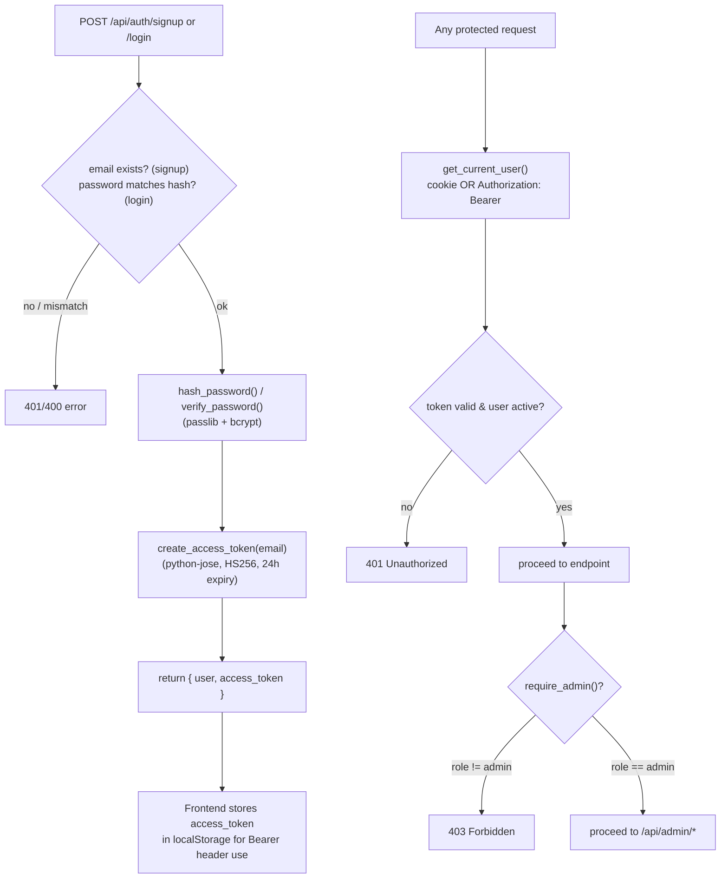
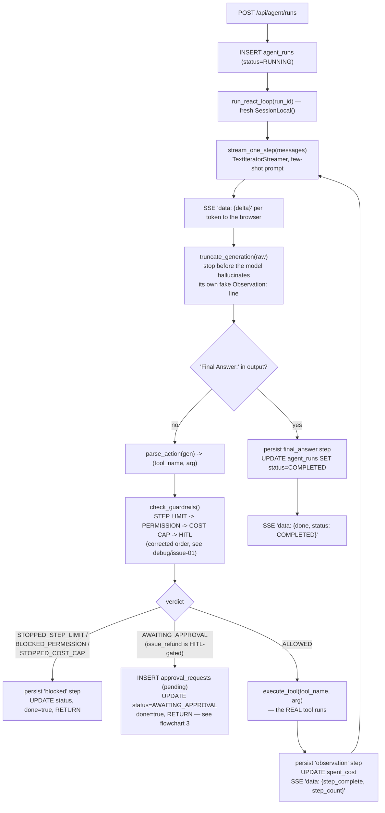
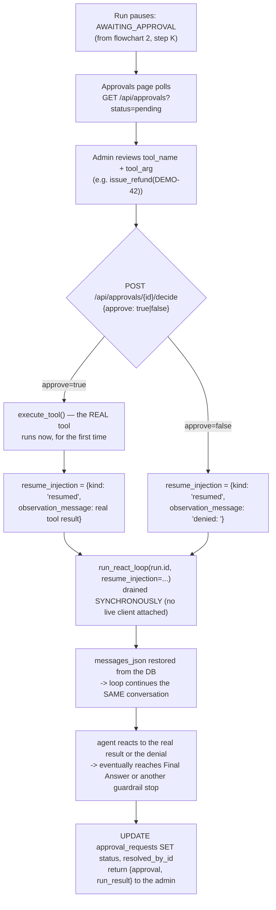
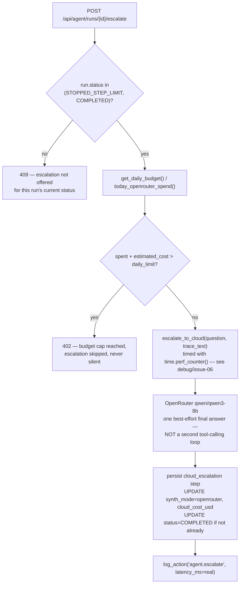
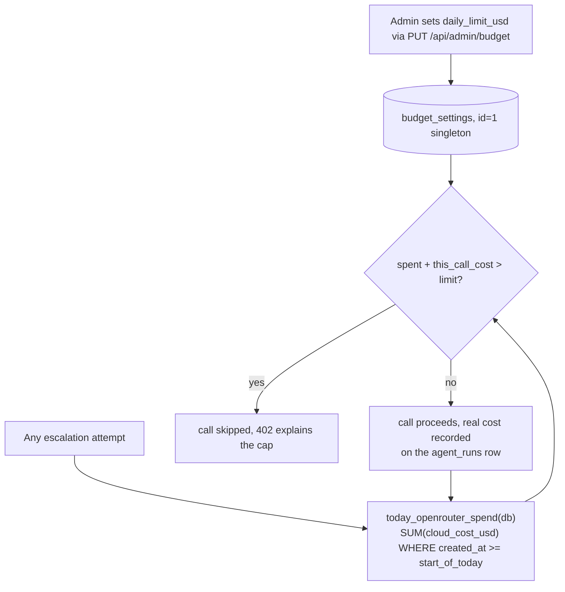
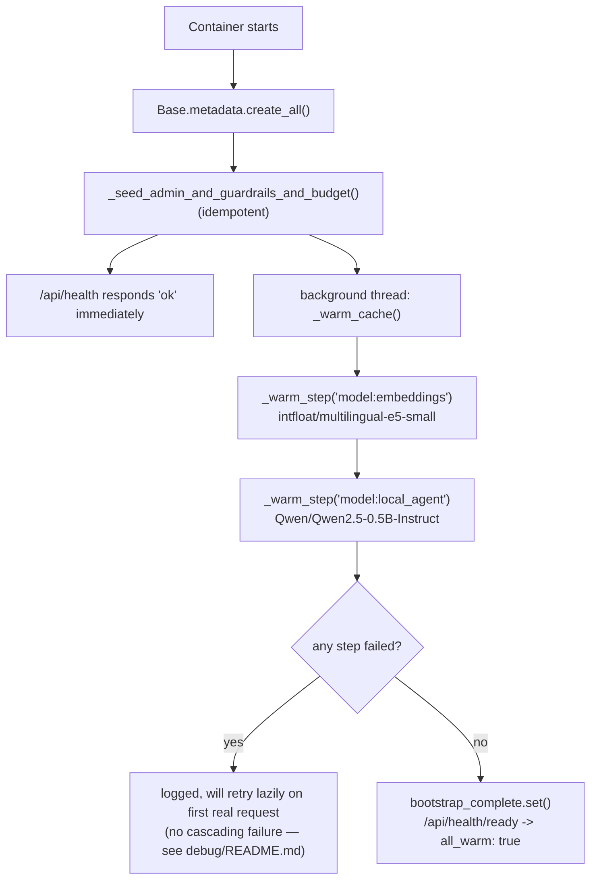
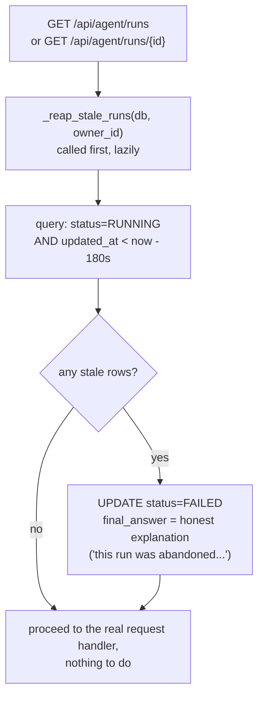

# Cradle — Function & Model Flowcharts

> Companion to [`architecture.md`](architecture.md). Also embedded in [`docs/guide.html`](docs/guide.html).
> Each diagram traces one feature end-to-end through the actual function names in `backend/app/`.

## 1. Authentication (`routers/auth.py`, `security.py`)

Identical to the Week1-5_1 PoCs — same JWT + bcrypt design, same shape-only email validator, reused
here from the start rather than rediscovered.

## 2. The ReAct + guardrail streaming loop (`agent/react_loop.py`, `agent/guardrails.py`, `agent/orchestrator.py`, `routers/agent.py`)

## 3. The approval-resume flow (`routers/approvals.py`, `agent/orchestrator.py`)

The one guardrail a typical baseline implementation builds as a class feature but never actually
wires into a shipped app — see `debug/issue-01`'s companion finding and `architecture.md` §2.

## 4. Model routing / cloud escalation (`ml/llm.py`, `routers/agent.py`)

## 5. Cost governance (`models.BudgetSetting`, `routers/admin.py`, `routers/agent.py`)

Reused verbatim from Week5_1 Compass's own daily-budget-cap pattern, applied here to the escalation
call instead of a paid search call.

## 6. Container bootstrap sequence (`main.py`)

One step shorter than Week5_1 Compass's — no web-search connectivity check this week, since
Cradle's tools are all local Python functions with no live external dependency.

## 7. The stale-run reaper (`routers/agent.py::_reap_stale_runs`)

New this week — see `debug/issue-03` for the full incident that motivated it.

