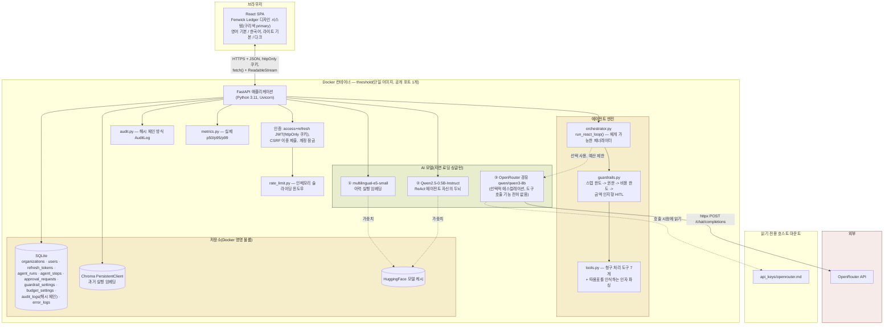
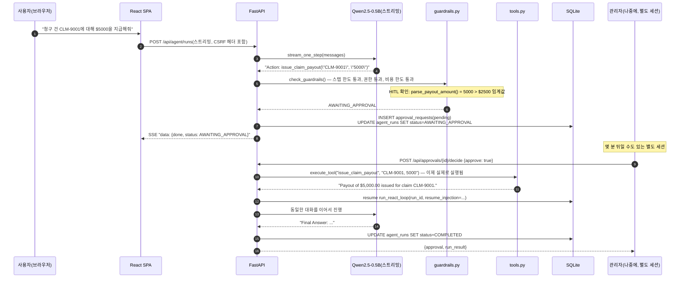
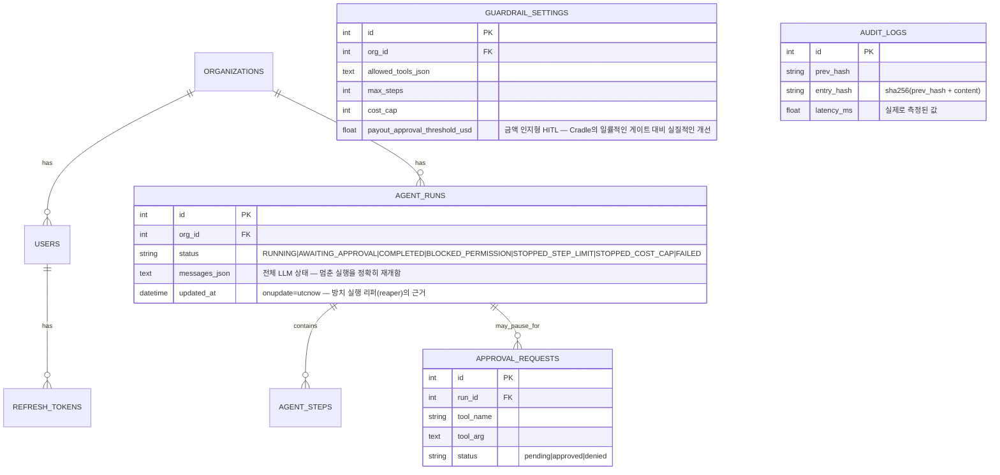

# Threshold — 아키텍처

[English](architecture.md) | **한국어**

> Week5_2 PoC_v2 · Fenwick Mutual를 위한 안전장치 기반 ReAct 에이전트 콘솔
> 이 문서는 동일한 다이어그램과 함께 [`docs/guide.html`](docs/guide.html)에도 포함되어 있습니다.

## 1. 시스템 개요

Threshold는 단일 컨테이너로 실행되는 풀스택 애플리케이션입니다. React(TypeScript) SPA를 FastAPI 백엔드가 정적 파일로 제공하고, 백엔드는 REST + 스트리밍 API 뒤에서 로컬 AI 모델 2개와 선택적 클라우드 에스컬레이션 모델 1개를 호스팅하며, SQLite와 Chroma를 저장소로 사용합니다. 구조적인 형태 — 재개 가능한 ReAct 루프, 수정된 안전장치 순서, 보안/관측성 아키텍처를 포함해 — 는 Verity(Week5_1의 자매 리빌드)와 그 이전의 Cradle PoC와 공유하며, 여기에 Threshold만의 비즈니스 로직(청구 처리 도구 세트와 금액 인지형 HITL)이 더해졌습니다.

## 2. 엔지니어링 깊이 — 일반적인 초기 구현을 넘어서

이 패턴의 전형적인 단순한 초기 구현은 동작하는 2탭짜리 Streamlit 앱처럼 보입니다 — 기능은 하지만 실제 사용에 필요한 수준에는 한참 못 미칩니다.

| 차원 | 일반적인 초기 구현 | Threshold |
|---|---|---|
| 통합 | 서로 소통하지 않는 두 개의 데모 탭 — ReAct 에이전트 탭과 안전장치 실행 탭이 별도의 데모로 존재 | 하나의 에이전트, 하나의 루프, 항상 경로 위에 있는 안전장치 |
| 안전장치 검사 순서 | **흔하고 재현하기 쉬운 버그**: 단순한 안전장치 실행기는 권한보다 비용 한도를 먼저 확인하므로, 마침 예산이 이미 소진된 상태에서 허가되지 않은 도구 호출 시도가 예산 이벤트로 잘못 표시됨 | 수정된 순서를 관리자 UI에서 확인할 수 있으며, 바로 그 시나리오를 재현하는 직접적인 회귀 테스트를 갖춤 |
| Human-in-the-Loop | 코드에는 골격이 있지만 실제 배포된 앱에는 연결되지 않은 기능 — 빈 집합인 채로 남음 | 실제로 저장되고 금액을 인지하는 큐: 한도를 초과하는 지급은 진짜로 멈추고, 관리자의 결정이 진짜로 재개시킴 |
| HITL 세분화 | 해당 없음 — 배포된 데모에서는 HITL이 아예 트리거되지 않음 | **금액 인지형**: $500 지급은 자동 승인되지만 $9,000 지급은 사람이 필요합니다 — 모든 지급을 무조건 막는 것이 아님 |
| 지속성 | 없음 — 모든 Streamlit 세션은 인메모리 | SQLite + Chroma, `org_id` 단위로 구분되며 둘 다 재시작 후에도 유지됨 |
| 보안 | 없음 | Access+refresh JWT 로테이션, CSRF, 계정 잠금, 요청 속도 제한, 위변조 감지가 가능한 감사 로그 |
| 관측성 | 없음 | 실제 p50/p95/p99 지연 시간, 구조화된 오류 로그, 공개 상태 페이지 |
| 타깃/포지셔닝 | 명시된 타깃 고객 없음 | 이름을 가진 페르소나(Priya Nakamura)와 회사, 공개 랜딩 페이지 |

## 3. 디자인 — Verity와 "Fenwick Ledger"를 공유

이번 라운드의 명시적 요구에 따라, Threshold와 Verity는 서로 무관한 두 개의 주차별 빌드가 아니라 하나로 연결된 회사의 제품 스위트입니다 — 각자 여섯 번째/일곱 번째로 별도의 아이덴티티를 새로 만드는 대신 하나의 디자인 시스템을 공유합니다. 전체 근거와 접근성 측정 결과는 Verity 자체의 `architecture.md` §3을 참고하세요(동일한 방법론이 여기에도 적용되며, 두 팔레트는 동일한 Python WCAG 대비율 스크립트로 함께 검증되었습니다).

| 요소 | Verity와 공유 | Threshold만의 차별점 |
|---|---|---|
| 색상 | 아이보리/본(라이트) / 에스프레소 차콜(다크) 바탕, 차단/위험 상태에는 브릭레드 | **구리색(`#a85d2e` 라이트 / `#d18a53` 다크)을 주 강조색으로 사용** — Verity의 보틀그린은 Threshold의 공유 보조색이 됨 |
| 타이포그래피 | Fraunces(디스플레이) + IBM Plex Sans(본문) + IBM Plex Mono(데이터) | — |
| 내비게이션 | "도시에(dossier) 탭 바인더" 패턴 | — |
| 트레이스 시각화 | — | **장부 항목(ledger-entry) 카드**: ReAct 스텝마다 종류별로 색상이 다른 왼쪽 세로선이 표시됩니다(구리=thought/action, 초록=observation, 호박=승인 대기, 빨강=차단) — 이전 Cradle PoC의 클레이모피즘 카드 스택과는 다른 시각 문법으로, 이전 주차의 표현을 그대로 재사용하지 않고 이 아이덴티티만의 "장부/사건 기록" 메타포에 맞춘 것입니다. |

## 4. Threshold의 도구 세트 — 위험 등급과 비용 근거

| 도구 | 대체하는 Cradle 도구 | 위험 등급 | 비용 |
|---|---|---|---|
| `check_filing_deadline(jurisdiction, loss_date)` | `get_today` | 안전 | 2 |
| `lookup_policy_coverage(policy_number)` | *(신규)* | 안전 | 5 |
| `estimate_claim_payout(expression)` | `calculator` | 안전 | 5 |
| `convert_reinsurance_currency(amount, currency)` | `convert_currency` | 안전 | 5 |
| `lookup_claims_procedure(keyword)` | `lookup_faq` | 안전 | 10 |
| `issue_claim_payout(claim_id, amount)` | `issue_refund` | **HITL — 금액 인지형** | 35 |
| `close_and_purge_claim_file(claim_id)` | `delete_customer_data` | **허용 목록에 절대 포함되지 않음(미끼용)** | 50 |

`lookup_policy_coverage`는 단순히 이름만 바꾼 도구가 아니라 진짜로 새로운 도구입니다 — 보험 증권의 보장 한도/공제액/상태를 확인하는 실제로 구별되는 업무를 반영하며, Cradle의 원래 도구 6개 중 어느 것도 이를 다루지 않았습니다.

**모델 라우팅 보안 불변 조건**: OpenRouter 에스컬레이션 경로에는 도구 호출 기능이 전혀 없습니다 — 기존 트레이스 텍스트로부터 최선을 다한 답변을 합성할 수만 있습니다. `issue_claim_payout`을 직접 호출할 수 없으며, 실제 지급은 반드시 로컬 ReAct 루프와 전체 안전장치 엔진을 거쳐야 합니다.

## 5. 이번 빌드에서 발견한 실제 버그와 도구 인자 처리의 견고함에 대한 시사점

전체 설명은 `debug/issue-01`을 참고하세요. 요약하면: 퓨샷 예시가 단순 숫자 인자만 보여주다 보니, 모델이 문자열/다중 부분 인자에 대해 나름대로 따옴표 규칙을 즉흥적으로 만들어냈습니다 — 인자 전체를 감싸는 따옴표(`lookup_claims_procedure("subrogation")`)와, 쉼표로 구분된 각 부분을 따로 따옴표로 감싸는 방식(`check_filing_deadline("Belmont Bay", "2025-01-01")`) 둘 다 나타났습니다. `tools.py`의 `clean_arg()`/`split_args()` 헬퍼는(쉼표 분리 이후) 각 *최종* 토큰에서 따옴표 문자를 개별적으로 정리하는데, 이것이 두 가지 실제 관례를 모두 올바르게 처리하는 유일한 방법입니다 — 분리 전에 전체 원시 문자열에서 따옴표를 벗겨내면 하나는 고쳐지지만 다른 하나는 깨집니다.

## 6. 데이터 흐름 — Human-in-the-Loop 지급 요청

## 7. 저장소 모델

## 8. 프로덕션/클라우드 확장

Verity 자체의 architecture.md §7과 동일한 구조와 주의 사항입니다(앱 계층 복제, 관리형 Postgres, 관리형 벡터 DB, GPU 버스트, 멀티 인스턴스 배포를 위한 공유 상태 요청 속도 제한기와 조율된 감사 로그 기록기) — 여기에 Threshold만의 항목이 하나 추가됩니다. **실제 HITL 알림 경로**(대기 중인 검토자에게 보내는 이메일/Slack/웹훅). 이 PoC의 큐는 풀(pull) 방식이라(관리자가 직접 승인 페이지를 방문해야 함) 데모에는 충분하지만, 실제 사용에서는 푸시 알림 없이 멈춘 지급 건이 무기한 대기하게 됩니다.

### 소규모 상용 환경의 월간 예상 비용
(일일 활성 사용자 약 500명, 하루 약 2,000건의 에이전트 실행. 2026년 8월 기준 공개 정가 참고치)

| 항목 | 가정 | 월간 예상 비용 |
|---|---|---|
| 앱 호스팅(2 vCPU/4GB) | 인스턴스 1~2개 | $70–140 |
| 관리형 Postgres | 인스턴스 1개 + 백업 | $60–90 |
| 관리형 벡터 DB / pgvector | 사용량 기반 | $0–50 |
| GPU 버스트(로컬 LLM) | 월 약 12 GPU 시간 | $8–20 |
| OpenRouter(선택적 에스컬레이션) | 실행의 약 10% | $2–6 |
| Redis(요청 속도 제한, 멀티 인스턴스) | 소형 관리형 인스턴스 | $10–20 |
| 메트릭/로깅 | 기본 관리형 요금제 | $10–30 |
| **합계(참고치)** | | **월 약 $160–356** |

## 9. 배포 고려 사항

Verity 자체의 architecture.md §8과 핵심 항목이 동일합니다(실제 TLS 뒤에서의 `ENFORCE_SECURE_DEFAULTS`/`COOKIE_SECURE`, 멀티 인스턴스 이전에 필요한 공유 상태 요청 속도 제한/메트릭) — 여기에 위에서 언급한 HITL 알림 경로 공백이 더해집니다.
