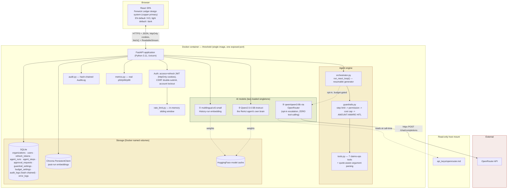
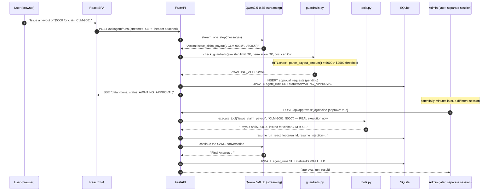
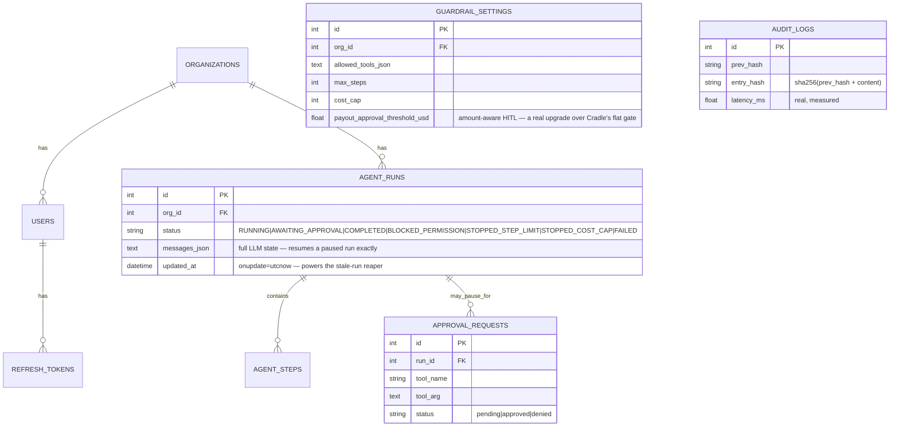

# Threshold — 아키텍처

> Week5_2 PoC_v2 · Fenwick Mutual을 위한 가드레일 기반 ReAct 에이전트 콘솔
> 이 문서는 동일한 다이어그램과 함께 [`docs/guide.html`](docs/guide.html)에도 임베드되어 있습니다.

## 1. 시스템 개요

Threshold는 단일 컨테이너 풀스택 애플리케이션입니다: FastAPI 백엔드가 정적 파일로 서빙하는 React
(TypeScript) SPA가, REST + 스트리밍 API 뒤에서 두 개의 로컬 AI 모델과 하나의 선택적 클라우드
에스컬레이션 모델을 호스팅하며, SQLite와 Chroma로 데이터를 저장합니다. 재개 가능한 ReAct 루프,
수정된 가드레일 순서, 보안/관측 가능성 아키텍처를 포함한 구조적 형태는 Verity(Week5_1의 짝
프로젝트)와 이전 Cradle PoC와 공유하며, Threshold만의 비즈니스 로직(클레임 처리 도구 세트와 금액
인식 HITL)으로 확장했습니다.

## 2. 엔지니어링 완성도 — 일반적인 초기 구현을 넘어서

이 패턴을 일반적으로 처음 구현하면 작동하는 2탭 Streamlit 앱처럼 보입니다 — 동작은 하지만 실제
운영에 필요한 수준에는 한참 못 미칩니다:

| 항목 | 일반적인 초기 구현 | Threshold |
|---|---|---|
| 통합 | 서로 대화하지 않는 두 개의 데모 탭 — ReAct 에이전트 탭과 가드레일 실행 탭이 별도 데모로 존재 | 하나의 에이전트, 하나의 루프, 항상 경로에 있는 가드레일 |
| 가드레일 검사 순서 | **흔하고 재현 가능한 버그**: 단순한 가드레일 구현은 권한보다 비용 상한을 먼저 검사하여, 예산이 이미 소진된 시점에 발생한 미승인 도구 호출이 예산 이벤트로 잘못 기록됨 | 수정된 순서, 관리자 UI에서 눈에 보이도록 표시, 정확히 같은 시나리오를 재현하는 직접 회귀 테스트 |
| Human-in-the-Loop | 코드에 만들어 놓았지만 배포된 앱에는 연결하지 않은 기능 — 빈 집합으로 남음 | 실제로 영속화된, 금액을 인식하는 큐: 상한선을 초과하는 지급은 진짜로 멈추고, 관리자의 결정이 진짜로 재개함 |
| HITL 세분화 | 해당 없음 — 배포된 데모에서는 HITL이 아예 트리거되지 않음 | **금액 인식**: $500 지급은 자동 승인, $9,000 지급은 사람이 필요 — 모든 지급이 무조건 그런 것이 아님 |
| 영속성 | 없음 — 모든 Streamlit 세션은 인메모리 | SQLite + Chroma, `org_id` 범위, 재시작에도 유지 |
| 보안 | 없음 | 액세스+리프레시 JWT 회전, CSRF, 계정 잠금, 속도 제한, 변조 감지 감사 로그 |
| 관측 가능성 | 없음 | 실제 p50/p95/p99 지연시간, 구조화된 오류 로그, 공개 상태 페이지 |
| 타겟/포지셔닝 | 명시된 타겟 오디언스 없음 | 명시된 페르소나(Priya Nakamura)와 회사, 공개 랜딩 페이지에 |

## 3. 디자인 — Verity와 "Fenwick Ledger" 공유

이번 라운드의 명시적 요청에 따라, Threshold와 Verity는 서로 무관한 두 개의 주간 빌드가 아닌 하나의
연결된 회사 제품 스위트입니다 — 각자 여섯 번째/일곱 번째 별도의 정체성을 새로 만드는 대신 하나의
디자인 시스템을 공유합니다. 전체 근거와 접근성 측정치는 Verity 자체의 `architecture.md` §3을
참고하세요(동일한 방법론이 여기에도 적용됩니다; 두 팔레트는 동일한 Python WCAG 명암비 스크립트로
함께 검증되었습니다).

| 요소 | Verity와 공유 | Threshold만의 차별점 |
|---|---|---|
| 색상 | 아이보리/본(라이트) / 에스프레소-차콜(다크) 배경, 차단/위험 상태에 벽돌색 | **카퍼(`#a85d2e` 라이트 / `#d18a53` 다크)를 주 액센트로** — Verity의 보틀그린이 Threshold의 공유 보조색이 됨 |
| 타입 | Fraunces(디스플레이) + IBM Plex Sans(본문) + IBM Plex Mono(데이터) | — |
| 내비게이션 | "도시에 탭 바인더" 패턴 | — |
| 트레이스 시각화 | — | **원장 항목(ledger-entry) 카드**: 각 ReAct 스텝은 종류별로 색이 다른 좌측 선을 가짐(카퍼=생각/행동, 초록=관찰, 호박=승인 대기, 빨강=차단) — 이전 Cradle PoC의 클레이모피즘 카드 스택과는 구별되는 시각적 문법으로, 이전 라운드의 처리 방식을 그대로 재사용하는 대신 이 정체성만의 "원장/사건 기록" 메타포에 맞춤 |

## 4. Threshold의 도구 세트 — 위험 등급과 비용 산정 근거

| 도구 | 대체 대상(Cradle) | 위험 등급 | 비용 |
|---|---|---|---|
| `check_filing_deadline(jurisdiction, loss_date)` | `get_today` | 안전 | 2 |
| `lookup_policy_coverage(policy_number)` | *(신규)* | 안전 | 5 |
| `estimate_claim_payout(expression)` | `calculator` | 안전 | 5 |
| `convert_reinsurance_currency(amount, currency)` | `convert_currency` | 안전 | 5 |
| `lookup_claims_procedure(keyword)` | `lookup_faq` | 안전 | 10 |
| `issue_claim_payout(claim_id, amount)` | `issue_refund` | **HITL — 금액 인식** | 35 |
| `close_and_purge_claim_file(claim_id)` | `delete_customer_data` | **절대 허용 목록에 오르지 않음(미끼)** | 50 |

`lookup_policy_coverage`는 단순 리스킨이 아닌 진짜 새로운 도구입니다 — Cradle의 원래 여섯 도구
어디에도 없던, 실제로 구별되는 업무(보험증권의 보장 한도/공제액/상태 확인)를 반영합니다.

**모델 라우팅 보안 불변식**: OpenRouter 에스컬레이션 경로는 도구 호출 능력이 전혀 없습니다 —
기존 트레이스 텍스트로부터 최선의 답변을 합성할 수만 있습니다. 스스로 `issue_claim_payout`을 호출할
수 없으며, 실제 지급은 반드시 로컬 ReAct 루프와 전체 가드레일 엔진을 거쳐야 합니다.

## 5. 이번 빌드에서 발견한 실제 버그, 그리고 도구 인자 견고성에 대해 알려주는 것

전체 내용은 `debug/issue-01`을 참고하세요. 요약하면: few-shot 예시가 단순 숫자 인자만 보여주기
때문에, 모델은 문자열/다중 부분 인자에 대해 나름대로 따옴표 규칙을 즉흥적으로 만들어냈습니다 —
전체 인자를 따옴표로 감싸는 방식(`lookup_claims_procedure("subrogation")`)과, 쉼표로 구분된 각
부분을 개별적으로 따옴표로 감싸는 방식(`check_filing_deadline("Belmont Bay", "2025-01-01")`) 둘
다입니다. `tools.py`의 `clean_arg()`/`split_args()` 헬퍼는(쉼표 분리 이후) 각 *최종* 토큰에서
독립적으로 따옴표 문자를 제거하는데, 이것이 두 실제 관례를 모두 올바르게 처리하는 유일한 접근
방식입니다 — 분리하기 전에 전체 원본 문자열에서 따옴표를 벗기면 한쪽은 고쳐지지만 다른 쪽은
깨집니다.

## 6. 데이터 흐름 — Human-in-the-Loop 지급 요청

## 7. 저장 모델

## 8. 프로덕션 / 클라우드 확장

Verity 자체의 architecture.md §7과 동일한 형태와 유의사항(앱 계층 복제, 매니지드 Postgres,
매니지드 벡터 DB, GPU 버스트, 다중 인스턴스 배포를 위한 공유 상태 속도 제한기와 조율된 감사 로그
작성기) — 여기에 Threshold만의 항목 하나 추가: **실제 HITL 알림 경로**(온콜 검토자에게
이메일/Slack/웹훅). 이 PoC의 큐는 풀(pull) 방식입니다 — 관리자가 승인 페이지를 방문해야 합니다 —
데모로는 충분하지만, 실제 사용에서는 푸시 알림 없이는 일시정지된 지급이 무기한 대기하게 됩니다.

### 소규모 상용 환경에서의 예상 월간 비용
(~500 DAU, ~일일 2천 건의 에이전트 실행; 2026년 8월 기준 정가)

| 항목 | 가정 | 예상 월 비용 |
|---|---|---|
| 앱 호스팅 (2 vCPU/4GB) | 1-2 인스턴스 | $70–140 |
| 매니지드 Postgres | 인스턴스 1개 + 백업 | $60–90 |
| 매니지드 벡터 DB / pgvector | 사용량 기반 | $0–50 |
| GPU 버스트 (로컬 LLM) | 월 ~12 GPU시간 | $8–20 |
| OpenRouter (옵션 에스컬레이션) | 실행의 ~10% | $2–6 |
| Redis (속도 제한, 다중 인스턴스) | 소형 매니지드 인스턴스 | $10–20 |
| 지표/로깅 | 기본 매니지드 티어 | $10–30 |
| **합계 (참고용)** | | **≈ 월 $160 – 356** |

## 9. 배포 시 고려사항

Verity 자체의 architecture.md §8과 동일한 핵심 목록(실제 TLS 뒤에서의
`ENFORCE_SECURE_DEFAULTS`/`COOKIE_SECURE`, 다중 인스턴스 이전의 공유 상태 속도 제한/지표) 및 위에서
언급한 HITL 알림 경로 격차.
