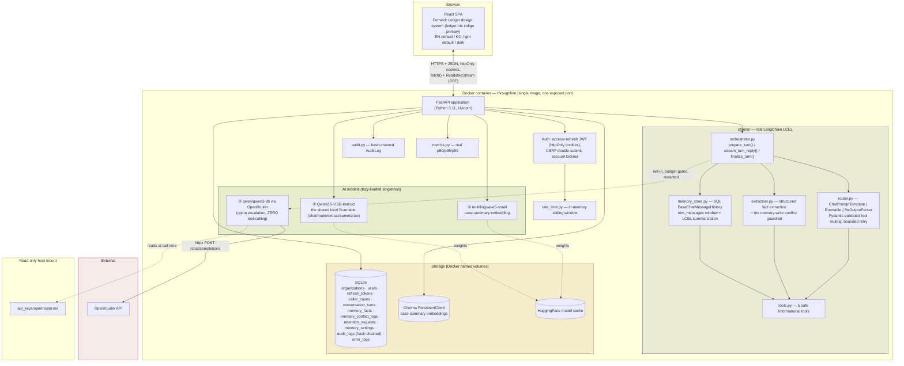
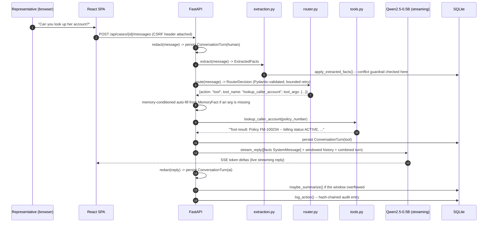

# Throughline — 아키텍처

> Week6_1 PoC · Fenwick Mutual을 위한 LangChain 대화 메모리 코파일럿
> 이 문서는 (동일한 다이어그램과 함께) [`docs/guide.html`](docs/guide.html)에도 그대로 내장되어 있습니다.

## 0. 왜 보안/관찰가능성 레이어를 세 번째로 재설계하지 않고 그대로 재사용했는가

`security.py`, `audit.py`, `rate_limit.py`, `metrics.py`, `database.py`는 Threshold에서 그대로
복사했습니다(Threshold 역시 Verity와 동일한 아키텍처를 공유합니다). 이는 지름길이 아니라 의도적인
선택입니다: 실제 회사의 사내 도구군이 각자 자기만의 것을 새로 만드는 대신 하나의 검증된 인증/감사/
관찰가능성 플랫폼 레이어를 공유하는 것 자체가 상용 등급의 신호입니다. 이 제품에서 진짜로 새로운
부분은 전적으로 `chains/`와 `models.py`의 도메인 테이블에 있습니다.

## 1. 시스템 개요

Throughline은 단일 컨테이너 풀스택 애플리케이션입니다: FastAPI 백엔드가 정적 파일로 서빙하는
React(TypeScript) SPA가 있고, 이 백엔드는 로컬 AI 모델 2개와 선택적 클라우드 에스컬레이션 모델 1개를
REST + 스트리밍 API 뒤에 두며, SQLite와 Chroma를 저장소로 사용합니다. Verity(근거 기반 리서치)나
Threshold(안전장치 내장 ReAct 도구 루프)와 달리, Throughline만의 메커니즘은 라우팅된 LCEL 턴입니다:
메시지 하나가 직접적인 LLM 응답이 되거나 실제 도구 호출이 되며, 매 턴마다 구조화된 메모리가 추출되고
영속화됩니다.



## 2. 일반적인 베이스라인 구현을 뛰어넘는 지점

동일한 LangChain 에이전트 패턴의 일반적인 베이스라인 구현은 실제로 동작하는 Streamlit 앱인 경우가
많습니다 — `agent.py`/`llm.py`/`app.py` 스타일의 모듈로 직접 만든 단순한 "LangChain 어시스턴트"입니다:

| 항목 | 일반적인 베이스라인 구현 | Throughline |
|---|---|---|
| LangChain 사용 방식 | `PromptTemplate`을 임포트만 하고 `.format()`만 호출 — 실제 `\|` 파이프는 한 번도 없음 | 전체에 걸쳐 실제 LCEL 조합(`ChatPromptTemplate \| Runnable \| StrOutputParser()`), 사용 전 실제 설치된 `langchain-core==0.3.86`으로 검증 |
| 도구 라우팅 | 정규식 매처(`_route()`) — 문서화된 오탐 사례: "12에 8을 곱하면?"은 리터럴 `*`가 없어 `calc`를 전혀 트리거하지 못함 | Pydantic 스키마 기반의 구조화된 출력 라우팅, 실측되고 정직하게 문서화된 첫 시도 성공률과 제한된 재시도(`debug/` 참고) |
| 메모리 | RAM에만 존재하는 `self.history`, 재시작 시 소실 — 그런 베이스라인이 스스로 "아직 구현 안 함"이라고 문서화한 확장 항목 | SQL에 영속화된 이중 전략(원문 그대로의 윈도우 + LCEL 롤링 요약), 재시작에도 유지 |
| 메모리 범위 | 구조화되지 않은 단순 리스트 | 근거 검증(원문 턴에 실제로 등장하는 값인지) 포함 구조화된 `MemoryFact` 추출과, 절대 조용히 덮어쓰지 않는 충돌 가드레일 |
| 계산기 | 순수 `eval()` | 실제 `ast` 화이트리스트 평가기 — §5 참고, 흔한 입문용 자료에 대한 바로잡음 포함 |
| PII 처리 | 다루지 않음 | 영속화 시점, OpenRouter 경계, 실시간 UI에서의 패턴 기반 레드액션 — 함수 1개, 호출 지점 3곳 |
| 보안 | 없음 | 액세스+리프레시 JWT 로테이션, CSRF, 계정 잠금, 레이트 리미팅, 변조 감지 감사 로그 |
| 관찰가능성 | 없음 | 실측 p50/p95/p99 지연시간, 구조화된 에러 로그, 공개 상태 페이지 |
| 타깃/포지셔닝 | 명시된 타깃 없음 | 이름이 있는 페르소나(Marcus Webb)와 회사, 공개 랜딩 페이지 |

## 3. 디자인 — Verity·Threshold와 공유하는 "Fenwick Ledger"

이번 라운드의 명시적 요청에 따라 세 Fenwick Mutual 제품은 세 개의 개별 주간 빌드가 아니라 하나의
연결된 회사의 제품군입니다 — 각자 별도의 정체성을 만드는 대신 하나의 디자인 시스템을 공유합니다.
정확한 색상 값은 이 프로젝트 시리즈의 이전 모든 정체성에 사용된 것과 동일한 Python WCAG 대비율
스크립트 방법론으로 검증했습니다: 새로운 "레저 잉크" 인디고인 `--accent`는 두 테마 모두에서 모든
배경 토큰 대비 6.9:1 이상을 확보합니다 — 아이콘/테두리/제목에 필요한 3:1과 본문 텍스트에 필요한
4.5:1을 모두 여유 있게 넘습니다.

| 요소 | Verity/Threshold와 공유 | Throughline만의 차별점 |
|---|---|---|
| 색상 | 아이보리/본(라이트) / 에스프레소-차콜(다크) 배경, 위험 상태를 위한 브릭레드 | **주 액센트로 "레저 잉크" 인디고(라이트 `#2d4a7a` / 다크 `#7fa3d6`)** — 카퍼는 Throughline의 공유 보조색이 됩니다(둘 다 직원 운영용 도구) |
| 타이포 | Fraunces(디스플레이) + IBM Plex Sans(본문) + IBM Plex Mono(데이터) | — |
| 내비게이션 | "도시에 탭 바인더" 패턴 | — |
| 콘텐츠 문법 | — | 워크스페이스 채팅 로그를 위한 **메시지 카드**(찢어진 메모지 느낌, 모노스페이스 칩으로 역할 표시)와 실시간 메모리 사이드바를 위한 **인덱스 카드**(작은 괘선 기록카드 느낌) — Verity의 브리프 카드, Threshold의 원장 항목 트레이스와 구별됨 |

## 4. Throughline의 도구 세트

| 도구 | 위험도 | 데이터 형태 | Threshold와의 차이점 |
|---|---|---|---|
| `lookup_caller_account(policy_number)` | 안전 | 청구 상태, 다음 결제 예정일, 선호 연락 방식, 최근 연락일 | Threshold의 `lookup_policy_coverage`는 보장 한도/공제액을 반환 — 완전히 다른 데이터 축이며, 이름만 바꾼 재사용이 아님 |
| `estimate_premium_adjustment(expression)` | 안전 | 실제 `ast` 화이트리스트 산술 연산(§5 참고) | 이 제품군에서 일반적인 베이스라인 구현과 Threshold가 모두 가지고 있던 `eval()` 지름길을 실제로 닫은 첫 번째 도구 |
| `lookup_billing_faq(keyword)` | 안전 | 청구/계정 관리 절차만 다룸(자동납부, 무서류 청구, 주소 변경, 미납 유예기간) | Threshold의 `lookup_claims_procedure`는 클레임 처리 절차를 다룸 — 별개 영역 |
| `check_callback_availability(department, preferred_window)` | 안전 | 결정론적 고정 슬롯 테이블, 메모리 조건부 | Threshold에는 대응 기능 없음 — 메커니즘 수준의 핵심 차별점(`README.md` §0 참고) |
| `flag_for_escalation(reason)` | 안전 | 감사 로그만 남김 | Threshold에는 대응 기능 없음 |

여기 있는 어떤 도구도 지급 권한이 없습니다 — 그 위험 영역은 전적으로 Threshold의 몫이며, Threshold는
이미 실제 자금 이동을 위한 금액 인지형 HITL 가드레일을 구현하고 있습니다. Throughline만의 가드레일
축은 (아래 섹션의) 메모리 쓰기 충돌 검사이며, 빌려온 HITL 게이트가 아닙니다.

## 5. 실제 버그 수정, 그리고 흔한 입문용 조언에 대한 바로잡음

사용자가 입력한 산술 표현식을 "안전하게" 평가하는 흔한 입문용 기법은 `eval()`의 상용 등급 대체제로
`ast.literal_eval`을 권장합니다 — 직접 검증해보면 이는 계산기 용도로는 실제로 동작하지 않습니다:
`ast.literal_eval("12 * 8")`은 `ValueError: malformed node or string`을 발생시킵니다. `literal_eval`은
리터럴 상수만(부호 있는 숫자에 대한 좁은 예외 포함) 파싱할 뿐, 곱셈 같은 `BinOp`는 전혀 처리하지
못하기 때문입니다. `ml/safe_eval.py`는 그 권장안이 미처 해결하지 못한 문제를 실제로 고칩니다: 표현식을
진짜 AST로 파싱하고(`ast.parse(expr, mode="eval")`), 이를 직접 순회하면서 숫자 상수, `+ - * /`, 단항
+/-만 허용합니다 — 입력에 대해 `eval()`, `exec()`, `literal_eval()`을 절대 호출하지 않습니다.

## 6. 데이터 흐름 — 메시지 턴 하나



## 7. 저장소 모델

```mermaid
erDiagram
    ORGANIZATIONS ||--o{ USERS : has
    ORGANIZATIONS ||--o{ CALLER_CASES : has
    USERS ||--o{ REFRESH_TOKENS : has
    CALLER_CASES ||--o{ CONVERSATION_TURNS : contains
    CALLER_CASES ||--o{ MEMORY_FACTS : has
    CALLER_CASES ||--o{ MEMORY_CONFLICT_LOGS : may_produce

    CALLER_CASES {
        int id PK
        int org_id FK
        string status "open|closed"
        text case_summary "the rolling-summary half of dual-strategy memory"
        int summarized_through_turn_id
        datetime updated_at "onupdate=utcnow"
    }
    MEMORY_FACTS {
        int id PK
        int case_id FK
        string field_name "caller_name|policy_number|preferred_callback_window|topic"
        text field_value
        string confidence "stated|inferred -- grounded against the source turn"
    }
    MEMORY_CONFLICT_LOGS {
        int id PK
        int case_id FK
        string field_name
        text old_value
        text new_value
        string resolution "pending_confirmation|kept_old|accepted_new"
    }
    RETENTION_REQUESTS {
        int id PK
        int case_id "not a FK -- the case row is gone by the time this is read"
        int turns_deleted
        int facts_deleted
        note "never stores the purged content itself"
    }
    AUDIT_LOGS {
        int id PK
        string prev_hash
        string entry_hash "sha256(prev_hash + content)"
        float latency_ms "real, measured"
    }
```

## 8. PII 및 보존 범위 — 정직한 경계

패턴 기반 레드액션(SSN 형태, 전화번호 형태, 긴 카드번호 형태의 숫자열, 이메일 주소)은 콘텐츠가 신뢰
경계를 넘는 모든 지점에 적용됩니다: 영속화 이전, OpenRouter 에스컬레이션 호출 이전, 실시간 워크스페이스
사이드바 렌더링 시점 — 함수 1개(`ml/redaction.py::redact()`), 호출 지점 3곳으로, 셋이 서로 어긋날 수
없습니다. 이는 명시적으로 인증된 PII 탐지 엔진이 **아닙니다** — 자유 텍스트 이름, 주소, 간접 식별자
등에서 알려진 오탐 누락이 있으며, 이를 숨기지 않고 그대로 명시합니다. `purge_case()`는 실제 하드
삭제 캐스케이드(대화 턴, 메모리 사실, 충돌 로그)를 수행하고 감사 항목을 정확히 1건만 남기지만
(`case_id`, 타임스탬프, 행위자 — 삭제된 내용 자체는 절대 저장하지 않음), 그 케이스의 생애주기 동안
이미 OpenRouter 에스컬레이션 경로로 전송된 내용은 되돌릴 수 없으며, 실제 데이터 보호 컴플라이언스
프로그램을 대체하지 않습니다. 앱 내에 표시되는 전체 고지는 `docs/guide.html` 참고.

## 9. 상용/클라우드 확장

Verity·Threshold의 architecture.md와 동일한 형태와 유의사항(앱 티어 복제, 매니지드 Postgres, 매니지드
벡터 DB, GPU 버스트, 다중 인스턴스 배포를 위한 공유 상태 레이트 리미터와 조율된 감사 로그 라이터) —
여기에 Throughline 고유의 항목 하나 추가: 레드액션 처리는 정규식 패턴 기반의 단일 프로세스이므로,
실제 계약자 PII를 대규모로 다루는 상용 배포라면 이를 단순히 수평 확장하는 것이 아니라 전용의 감사
가능한 PII 탐지 서비스로 교체하거나 보강해야 합니다.

### 소규모 상용 스케일에서의 월간 비용 추정
(~500 DAU, 일일 대화 턴 ~2,000건 기준; 2026년 8월 기준 참고 가격)

| 항목 | 가정 | 예상 월 비용 |
|---|---|---|
| 앱 호스팅(2 vCPU/4GB) | 1-2 인스턴스 | $70–140 |
| 매니지드 Postgres | 1 인스턴스 + 백업 | $60–90 |
| 매니지드 벡터 DB / pgvector | 사용량 기반 | $0–50 |
| GPU 버스트(로컬 LLM) | 월 ~12 GPU시간 | $8–20 |
| OpenRouter(옵트인 에스컬레이션) | 전체 턴의 ~10% | $2–6 |
| Redis(레이트 리미팅, 다중 인스턴스) | 소형 매니지드 인스턴스 | $10–20 |
| 지표/로깅 | 기본 매니지드 티어 | $10–30 |
| **합계(참고용)** | | **≈ $160 – 356/월** |

## 10. 배포 시 고려사항

Verity·Threshold의 architecture.md와 동일한 핵심 목록(실제 TLS 뒤의 `ENFORCE_SECURE_DEFAULTS`/
`COOKIE_SECURE`, 다중 인스턴스 이전의 공유 상태 레이트 리미팅/지표) — 여기에 위에서 언급한 레드액션
서비스 공백 항목 추가.
